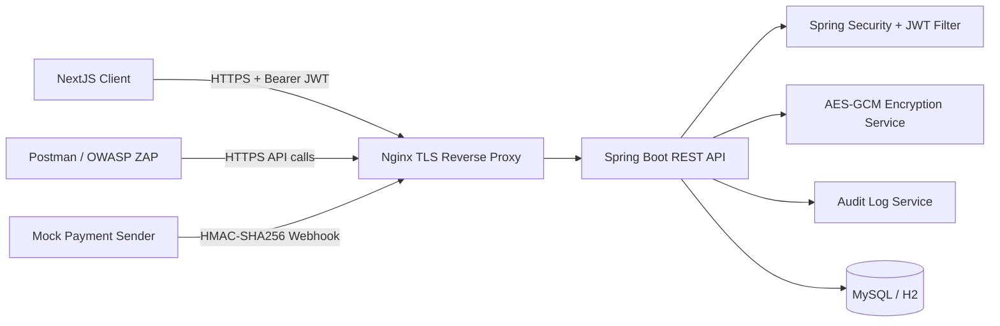

# Bảo mật hệ thống RESTful API cho dịch vụ khóa học online nhỏ

Đây là đồ án định hướng môn **Mật mã ứng dụng / Cryptography** cho sinh viên năm 2 ngành An toàn thông tin. Hệ thống mô phỏng một nền tảng khóa học online quy mô nhỏ, trong đó trọng tâm không nằm ở giao diện hay nghiệp vụ phức tạp mà tập trung vào các kỹ thuật bảo mật và mật mã ứng dụng trong môi trường RESTful API.

## 1. Mục tiêu đề tài

- Xây dựng backend RESTful API bằng Spring Boot và Spring Security.
- Xây dựng frontend NextJS tối giản để minh họa luồng sử dụng thực tế.
- Áp dụng các kỹ thuật bảo mật quan trọng: JWT, refresh token, bcrypt, AES-GCM, HMAC-SHA256, HTTPS/TLS, RBAC, audit log, rate limiting.
- Minh họa và kiểm thử được các rủi ro phổ biến trong OWASP API Security Top 10 như BOLA/IDOR, Broken Authentication, Excessive Data Exposure, Unrestricted Resource Consumption và Security Misconfiguration.
- Hỗ trợ demo, kiểm thử và chụp minh chứng bằng Swagger, Postman, OWASP ZAP và Docker.

## 2. Kiến trúc hệ thống



Luồng triển khai mặc định:

- Người dùng truy cập giao diện tại `https://localhost`
- Tất cả API đi qua Nginx, sau đó được chuyển tiếp vào Spring Boot
- Swagger/OpenAPI dùng **cùng cổng HTTPS 443** và hiện có thể truy cập công khai qua domain demo `hackerlo.online`
- Dữ liệu nhạy cảm khi lưu xuống cơ sở dữ liệu được mã hóa bằng AES-GCM
- Webhook thanh toán giả lập được xác thực bằng HMAC-SHA256

## 3. Công nghệ sử dụng

- Backend: Spring Boot 3, Spring Security, Spring Data JPA, Hibernate
- Frontend: NextJS 14
- Cơ sở dữ liệu: MySQL qua Docker, H2 dùng cho kiểm thử cục bộ
- Xác thực: JWT access token, refresh token
- Băm mật khẩu: BCryptPasswordEncoder
- Mã hóa dữ liệu lưu trữ: AES-GCM
- Chữ ký webhook: HMAC-SHA256
- Tài liệu API: Swagger / OpenAPI
- Reverse proxy HTTPS: Nginx
- Kiểm thử bảo mật: Postman, OWASP ZAP

## 4. Chức năng chính của hệ thống

### 4.1. Nhóm Auth và User

- Đăng ký tài khoản sinh viên
- Đăng nhập bằng email và mật khẩu
- Lấy thông tin người dùng hiện tại qua `GET /api/auth/me`
- Làm mới access token qua `POST /api/auth/refresh`
- Đăng xuất và thu hồi refresh token qua `POST /api/auth/logout`
- Quên mật khẩu qua `POST /api/auth/forgot-password`
- Đặt lại mật khẩu qua `POST /api/auth/reset-password`
- Xem hồ sơ người dùng theo `userId` nhưng có kiểm tra ownership ở phía server

### 4.2. Nhóm Course, Lesson và Enrollment

- Xem danh sách khóa học public
- Xem chi tiết khóa học
- Xem bài học theo khóa học
- Ghi danh thanh toán giả lập qua `POST /api/courses/{courseId}/checkout`
- Xem danh sách ghi danh của chính mình
- Xem chi tiết enrollment nhưng không thể xem enrollment của người khác

### 4.3. Nhóm Certificate và Admin

- Sinh viên xem chứng chỉ của chính mình
- Sinh viên không thể đổi `certificateId` để xem chứng chỉ của tài khoản khác
- Admin xem từng khóa học có bao nhiêu học viên và bao nhiêu yêu cầu chờ duyệt
- Admin duyệt yêu cầu ghi danh của học viên
- Admin thêm hoặc xóa học viên khỏi khóa học
- Admin xem hồ sơ học viên từ khu vực quản trị
- Admin xem audit log bảo mật

### 4.4. Nhóm Webhook

- Nhận webhook thanh toán thành công tại `POST /api/webhooks/payment-success`
- Kiểm tra chữ ký HMAC-SHA256
- Kiểm tra `X-Timestamp` để giảm replay attack
- Kiểm tra `X-Event-Id` để từ chối xử lý lặp lại

## 5. Các kỹ thuật mật mã và bảo mật đã áp dụng

### 5.1. bcrypt cho mật khẩu

- Mật khẩu được băm bằng `BCryptPasswordEncoder`
- Không lưu mật khẩu dạng plaintext
- Không trả `passwordHash` ra API response
- Không hiển thị thông tin băm mật khẩu lên giao diện người dùng

`bcrypt` là hàm băm một chiều, có salt tự động, phù hợp để lưu mật khẩu. Hệ thống chỉ dùng `passwordEncoder.matches(rawPassword, passwordHash)` khi đăng nhập, không có cơ chế giải mã ngược.

### 5.2. JWT và Bearer Token

- Sau khi đăng nhập thành công, backend trả về `accessToken` và `refreshToken`
- Access token có thời gian sống ngắn
- JWT chứa các thông tin như `sub`, `email`, `role`, `scope`, `iat`, `exp`
- Mọi request protected phải gửi header `Authorization: Bearer <token>`
- Token sai chữ ký, bị sửa payload, hết hạn hoặc sai định dạng đều bị từ chối

### 5.3. Refresh token

- Refresh token được sinh ngẫu nhiên
- Chỉ lưu bản băm trong cơ sở dữ liệu
- Có thể bị thu hồi khi logout hoặc sau khi đặt lại mật khẩu

### 5.4. AES-GCM cho dữ liệu nhạy cảm

Hệ thống mã hóa các trường sau trước khi lưu database:

- `users.phone_number_encrypted`
- `users.billing_address_encrypted`
- `enrollments.payment_reference_encrypted`
- `certificates.certificate_code_encrypted`

Đặc điểm chính:

- Dùng AES-GCM, không dùng ECB
- Mỗi lần mã hóa sinh IV ngẫu nhiên
- Có kiểm tra toàn vẹn dữ liệu
- Nếu ciphertext bị sửa, quá trình giải mã sẽ thất bại

### 5.5. HMAC-SHA256 cho webhook thanh toán

- Webhook dùng các header `X-Signature`, `X-Timestamp`, `X-Event-Id`
- Chữ ký được tạo theo công thức:

```text
hex(HMAC_SHA256(eventId + "." + timestamp + "." + rawBody, HMAC_WEBHOOK_SECRET))
```

- Nếu chữ ký sai: hệ thống từ chối
- Nếu timestamp quá cũ hoặc quá xa thời điểm hiện tại: hệ thống từ chối
- Nếu `eventId` đã xử lý trước đó: hệ thống từ chối để chống replay

### 5.6. Chống BOLA / IDOR

Các endpoint có kiểm tra ownership ở phía backend:

- `GET /api/certificates/{certificateId}`
- `GET /api/enrollments/{enrollmentId}`
- `GET /api/users/{userId}/profile`
- `GET /api/courses/{courseId}/lessons/{lessonId}`

Sinh viên chỉ xem được dữ liệu thuộc về chính mình. Nếu đổi `id` trên URL để truy cập dữ liệu của tài khoản khác, backend trả `403 Forbidden` và ghi audit log.
Tài khoản admin trong phiên bản rút gọn không dùng các endpoint riêng tư của sinh viên như `profile`, `enrollment`, `certificate` hay `lesson`.

### 5.7. Rate limiting

Đã cấu hình giới hạn tốc độ cho:

- `POST /api/auth/login`
- `POST /api/auth/register`
- `POST /api/auth/forgot-password`
- `POST /api/webhooks/payment-success`
- `GET /api/admin/**`

Khi vượt ngưỡng, backend trả `429 Too Many Requests` và ghi nhận sự kiện bất thường.

### 5.8. HTTPS/TLS và Swagger/OpenAPI

- Nginx ép `HTTP -> HTTPS`
- Ứng dụng chính chạy qua `https://localhost`
- Swagger dùng cùng cổng `443` để tránh lỗi lệch cổng khi bấm `Execute`
- Swagger có thể mở tại `https://localhost/swagger-ui.html` hoặc qua domain public đang cấu hình tunnel

Điểm này giúp tránh việc tài liệu API và endpoint thử nghiệm bị lộ ra ngoài bằng IP hoặc domain public trong lúc demo.

### 5.9. Audit log

Audit log ghi nhận các sự kiện:

- Đăng nhập thành công
- Đăng nhập thất bại
- Truy cập bị từ chối do sai quyền
- Webhook hợp lệ
- Webhook sai chữ ký
- Replay webhook
- Vượt rate limit
- Admin xem audit log

## 6. Cấu trúc thư mục

- `backend/`: mã nguồn Spring Boot
- `frontend/`: mã nguồn NextJS
- `database/`: dữ liệu khởi tạo và script liên quan database
- `deploy/nginx/`: cấu hình reverse proxy HTTPS
- `deploy/ssl/`: certificate tự ký dùng cho demo local
- `docs/`: tài liệu kiểm thử, demo tấn công/phòng thủ, HTTPS/TLS, báo cáo
- `postman/`: collection Postman
- `scripts/`: script hỗ trợ demo và rà nhanh hệ thống

Lưu ý:

- Các tài liệu kiểm thử nằm trong thư mục `docs/`
- Frontend **không hiển thị** các nội dung kỹ thuật như Swagger, OWASP ZAP, checklist bảo mật hay tài liệu demo trên màn hình người dùng

## 7. Biến môi trường

Tạo file `.env` từ `.env.example`:

```powershell
Copy-Item .env.example .env
```

Các biến quan trọng cần cấu hình:

- `LOCAL_HTTP_PORT=80`
- `LOCAL_HTTPS_PORT=443`
- `LOCAL_DB_PORT=3307`
- `DATABASE_URL`
- `DATABASE_USERNAME`
- `DATABASE_PASSWORD`
- `JWT_SECRET`
- `JWT_ACCESS_TOKEN_EXPIRE_MINUTES`
- `JWT_REFRESH_TOKEN_EXPIRE_DAYS`
- `PASSWORD_RESET_TOKEN_EXPIRE_MINUTES`
- `PASSWORD_RESET_DEMO_MODE`
- `ENCRYPTION_KEY`
- `HMAC_WEBHOOK_SECRET`
- `WEBHOOK_MAX_AGE_SECONDS`
- `CORS_ALLOWED_ORIGINS`
- `APP_API_BASE_URL`
- `PUBLIC_BASE_URL`

Không commit secret thật vào Git.

## 8. Chạy hệ thống bằng Docker và HTTPS

### 8.1. Chuẩn bị certificate local

Project đã kèm sẵn cặp file:

- `deploy/ssl/fullchain.pem`
- `deploy/ssl/privkey.pem`

Nếu muốn tạo mới:

```powershell
openssl req -x509 -nodes -days 365 -newkey rsa:2048 `
  -keyout deploy/ssl/privkey.pem `
  -out deploy/ssl/fullchain.pem `
  -subj "/CN=localhost"
```

Chi tiết thêm xem `docs/https-tls.md`.

### 8.2. Khởi động toàn bộ stack

```powershell
docker compose up --build -d
```

Các địa chỉ sau khi chạy:

- Ứng dụng frontend: `https://localhost`
- Health check: `https://localhost/api/health`
- Swagger: `https://localhost/swagger-ui.html`
- OpenAPI JSON: `https://localhost/v3/api-docs`
- Swagger public demo: `https://hackerlo.online/swagger-ui.html`
- OpenAPI public demo: `https://hackerlo.online/v3/api-docs`

Hành vi hiện tại:

- `https://localhost/swagger-ui.html` mở được trên máy host
- `https://localhost/v3/api-docs` mở được trên máy host
- `https://hackerlo.online/swagger-ui.html` mở được qua public domain
- `https://hackerlo.online/v3/api-docs` mở được qua public domain
- Nếu cần quét từ container trên cùng máy host, vẫn có thể dùng `https://host.docker.internal/swagger-ui.html`

### 8.3. Dừng và reset dữ liệu

Dừng stack:

```powershell
docker compose down
```

Xóa volume để reset dữ liệu demo:

```powershell
docker compose down -v
docker compose up --build -d
```

## 9. Bật tunnel để truy cập domain public

Project hỗ trợ thêm lớp tunnel tách riêng khỏi luồng `https://localhost`.

### 9.1. Quick tunnel ra domain public tạm thời

```powershell
.\scripts\start-public-tunnel.ps1 -Quick
docker logs -f securityapp-cloudflared-quick
```

Log sẽ trả về một domain public tạm thời dạng `trycloudflare.com`.

### 9.2. Named tunnel với domain riêng

1. Tạo tunnel và DNS trên Cloudflare
2. Copy credential JSON vào `deploy/cloudflared/credentials/`
3. Tạo `deploy/cloudflared/config.local.yml` từ file mẫu
4. Đặt `PUBLIC_BASE_URL=https://your-domain.example`
5. Chạy:

```powershell
.\scripts\start-public-tunnel.ps1
```

Hướng dẫn chi tiết nằm tại `docs/public-domain-tunnel.md`.

Lưu ý:

- Tunnel public không làm thay đổi luồng local `https://localhost`
- Khi tunnel đang bật, Swagger/OpenAPI hiện có thể truy cập qua domain public để demo từ xa
## 10. Chạy thủ công để phát triển

### 9.1. Backend

```powershell
cd backend
$env:SPRING_PROFILES_ACTIVE="local"
$env:JWT_SECRET="dev-jwt-secret-please-change"
$env:ENCRYPTION_KEY="dev-encryption-key-please-change"
$env:HMAC_WEBHOOK_SECRET="dev-hmac-secret-please-change"
mvn spring-boot:run
```

Khi chạy profile `local`, backend mặc định dùng H2 in-memory và HTTP `http://localhost:8080`.

### 9.2. Frontend

```powershell
cd frontend
$env:NEXT_PUBLIC_API_URL="http://localhost:8080"
npm install
npm run dev
```

## 11. Tài khoản mẫu để demo

- `student1@example.com / Password123!`
- `student2@example.com / Password123!`
- `admin@example.com / Admin123!`

Lưu ý:

- Luồng demo chính của đồ án rút gọn chỉ tập trung vào `STUDENT` và `ADMIN`
- Các khóa học mẫu được gắn với tài khoản quản trị nội bộ để tránh làm project nghiêng sang hướng quản lý đào tạo đầy đủ

Dữ liệu seed dùng cho demo:

- `student1` đã ghi danh khóa `Java Security Basics`
- `student2` đã ghi danh khóa `Applied Cryptography for Beginners`
- `student1` có một enrollment `PENDING` cho khóa `Secure RESTful API with Spring Boot` để demo webhook
- `admin` dùng để duyệt ghi danh, quản lý học viên theo từng khóa học và xem audit log, không tham gia luồng học viên

## 12. Các màn hình frontend tối giản

Frontend chỉ giữ các màn hình đủ để demo luồng bảo mật:

- Đăng nhập
- Đăng ký
- Quên mật khẩu
- Đặt lại mật khẩu
- Danh sách khóa học
- Chi tiết khóa học
- Bài học
- Chứng chỉ / hồ sơ cá nhân
- Quản lý ghi danh và học viên cho admin
- Audit log dành cho admin

Project đã chủ động bỏ bớt các phần dễ làm đồ án bị nghiêng sang hướng Công nghệ phần mềm như dashboard tổng quan, danh sách user quản trị, thống kê vận hành và CRUD nội dung trên giao diện.

Giao diện không hiển thị các thông tin kiểm thử nội bộ như:

- Swagger UI
- Gợi ý tấn công BOLA/IDOR
- Kịch bản kiểm thử HMAC
- Checklist OWASP ZAP

## 13. Kiểm thử nhanh bằng Swagger

Swagger chỉ dùng tại máy host hoặc container trên cùng máy host:

1. Mở `https://localhost/swagger-ui.html`
2. Gọi `POST /api/auth/login`
3. Sao chép `accessToken`
4. Chọn `Authorize`
5. Nhập `Bearer <accessToken>`
6. Thử các API:
   - `GET /api/auth/me`
   - `GET /api/certificates/me`
   - `POST /api/courses/{courseId}/checkout`
   - `GET /api/courses/{courseId}/lessons/{lessonId}`
   - `GET /api/admin/courses` với tài khoản admin
   - `GET /api/admin/audit-logs` với tài khoản admin

## 14. Kiểm thử bằng Postman

- Collection: `postman/online-course-security.postman_collection.json`
- Hướng dẫn chi tiết: `docs/postman-testing.md`

Collection đã có sẵn các request:

- Register
- Login Student 1
- Login Student 2
- Login Admin
- Admin Get Courses
- Admin Get Course Roster
- Admin Approve Pending Enrollment
- Admin Add Student To Course
- Admin Get Student Profile
- Admin Remove Enrollment
- Get Courses
- Checkout Course
- Get Lesson With Token
- Get My Certificate
- BOLA Attack Attempt
- Admin Audit Logs
- Webhook Valid HMAC
- Webhook Invalid HMAC
- Rate Limit Test - Wrong Login

## 15. Kiểm thử bằng OWASP ZAP

Hướng dẫn chi tiết xem `docs/owasp-zap-testing.md`.

Các mục tiêu quét chính:

- `https://localhost`
- `https://localhost/swagger-ui.html` nếu quét trên chính máy host
- `https://host.docker.internal/swagger-ui.html` nếu quét bằng container ZAP trên cùng máy host

## 16. Bộ tài liệu demo tấn công và phòng thủ

- `docs/demo-runbook.md`
- `docs/demo-01-password-bcrypt.md`
- `docs/demo-02-jwt.md`
- `docs/demo-03-aes-encryption.md`
- `docs/demo-04-bola-idor.md`
- `docs/demo-05-webhook-hmac.md`
- `docs/demo-06-rate-limit.md`
- `docs/demo-07-https-tls.md`
- `docs/public-domain-tunnel.md`

## 17. Mapping với OWASP API Security Top 10

- `API1: Broken Object Level Authorization`
  - Ownership check cho certificate, enrollment, profile và lesson
- `API2: Broken Authentication`
  - JWT có kiểm tra chữ ký và thời hạn
  - bcrypt cho mật khẩu
  - refresh token có thể bị thu hồi
- `API3: Broken Object Property Level Authorization / Excessive Data Exposure`
  - Dùng DTO response, không lộ `passwordHash` hay ciphertext nội bộ
- `API4: Unrestricted Resource Consumption`
  - Rate limit cho login, register, forgot-password, webhook, admin API
- `API8: Security Misconfiguration`
  - CORS cấu hình rõ
  - HTTPS/TLS
  - Không hard-code secret
  - Swagger/OpenAPI chạy sau HTTPS và chỉ nên mở public khi cần demo

## 18. Kiểm thử và xác nhận đã chạy

Đã có các bước kiểm tra phù hợp trong project:

- Backend test: `mvn test`
- Frontend build: `npm run build`
- Demo script: `.\scripts\demo-security.ps1`
- Tài liệu kết quả và hướng dẫn nằm trong `docs/`

## 19. Giới hạn hiện tại

- Frontend đang lưu token theo hướng đơn giản để phục vụ demo học phần, chưa phải phương án tối ưu cho production.
- Chức năng webhook là mô phỏng cổng thanh toán nội bộ, không kết nối nhà cung cấp thanh toán thật.
- TLS local đang dùng self-signed certificate; khi triển khai Internet nên dùng reverse proxy với chứng chỉ hợp lệ, ví dụ Let's Encrypt.
- Nếu bật public tunnel, ứng dụng sẽ truy cập được từ Internet; chỉ nên mở trong thời gian cần demo và nên tắt tunnel sau khi sử dụng.
- Chức năng quên mật khẩu trong chế độ demo có thể trả về `demoResetToken` để thuận tiện kiểm thử. Khi triển khai thực tế cần tắt `PASSWORD_RESET_DEMO_MODE` và gửi token qua email thay vì trả về API.

## 20. Tài liệu liên quan

- `docs/bao-cao-chuong-1-2-3.md`
- `docs/report-image-captions.md`
- `docs/https-tls.md`
- `docs/postman-testing.md`
- `docs/owasp-zap-testing.md`
- `docs/demo-runbook.md`
- `docs/security-testing/README.md`
