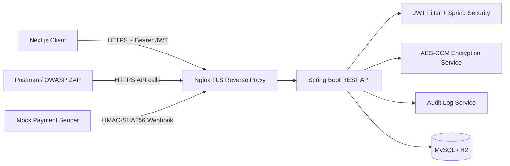

# Bao mat he thong RESTful API cho dich vu khoa hoc online nho

Do an dinh huong mon Mat ma ung dung / Cryptography cho sinh vien nam 2 An toan thong tin.

## 1. Muc tieu

- Xay dung RESTful API bang Spring Boot va Spring Security.
- Xay dung frontend demo toi gian bang Next.js.
- Ap dung JWT, refresh token, bcrypt, AES-GCM, HMAC-SHA256, HTTPS/TLS.
- Demo duoc BOLA/IDOR, Broken Authentication, Excessive Data Exposure, Rate Limiting va Security Misconfiguration.
- Ho tro test bang Swagger, Postman va OWASP ZAP.
- Dockerize de co the chay local qua HTTPS va de mo rong deploy sau nay.

## 2. Cong nghe chinh

- Backend: Spring Boot 3, Spring Security, Spring Data JPA, Hibernate
- Frontend: Next.js 14
- Database: MySQL qua Docker, H2 cho local test
- Authentication: JWT access token + refresh token hash trong database
- Password hashing: BCryptPasswordEncoder
- Encryption at rest: AES-GCM
- Webhook signing: HMAC-SHA256
- API docs: Swagger / OpenAPI
- Reverse proxy TLS: Nginx

## 3. Kien truc he thong



## 4. Tinh nang chinh

- Auth: register, login, current user, refresh token, logout/revoke refresh token
- Courses: danh sach khoa hoc public, chi tiet khoa hoc, CRUD course cho instructor/admin
- Lessons: preview public, full lesson chi cho user da enroll hoac course owner
- Enrollment: checkout mock de tao enrollment pending
- Certificates: student chi xem certificate cua chinh minh, admin co the audit
- Admin: xem users, summary, audit logs
- Payment webhook: webhook thanh toan thanh cong duoc ky HMAC-SHA256

## 5. Tinh nang bao mat

- `bcrypt`: hash password khi register, khong luu plaintext, khong tra hash ra API
- `JWT`: access token ngan han, co `sub`, `email`, `role`, `scope`, `iat`, `exp`
- `Refresh token`: token ngau nhien, luu hash SHA-256 trong database, revoke khi logout
- `AES-GCM`: ma hoa `phoneNumber`, `billingAddress`, `paymentReference`, `certificateCode`
- `HMAC-SHA256`: bao ve webhook thanh toan, kiem tra signature, timestamp va replay event
- `BOLA/IDOR defense`: ownership check cho profile, enrollment, certificate, lesson
- `Rate limiting`: login, register, webhook, admin APIs tra `429` khi vuot nguong
- `Audit log`: ghi nhan login success/failed, access denied, token rejected, webhook accepted/rejected
- `HTTPS/TLS`: Nginx terminate TLS, HTTP -> HTTPS redirect
- `Swagger`: ho tro Bearer JWT de test protected APIs, chi mo tren may chu local

## 6. Cau truc thu muc

- `backend/`: Spring Boot source code
- `frontend/`: Next.js source code
- `database/`: schema MySQL
- `deploy/nginx/`: Nginx reverse proxy + TLS config
- `deploy/ssl/`: self-signed certificate local
- `docs/`: huong dan test, demo attack/defense, HTTPS/TLS
- `postman/`: Postman collection

## 7. Bien moi truong

Tao file `.env` tu `.env.example`.

```powershell
Copy-Item .env.example .env
```

Can dien it nhat:

- `MYSQL_ROOT_PASSWORD`
- `MYSQL_APP_PASSWORD`
- `DATABASE_PASSWORD`
- `JWT_SECRET`
- `ENCRYPTION_KEY`
- `HMAC_WEBHOOK_SECRET`

Luu y:

- `DATABASE_USERNAME` mac dinh la `securityapp`
- `DATABASE_PASSWORD` phai khop voi `MYSQL_APP_PASSWORD`
- Khong nen cho backend dang nhap MySQL bang `root` trong compose demo

Khong commit secret that vao git.

## 8. Cach chay khuyen nghi: Docker + HTTPS

### 8.1. Tao / cap nhat cert local

Project da kem `deploy/ssl/fullchain.pem` va `deploy/ssl/privkey.pem` de demo local.

Neu muon tao cert moi:

```powershell
openssl req -x509 -nodes -days 365 -newkey rsa:2048 `
  -keyout deploy/ssl/privkey.pem `
  -out deploy/ssl/fullchain.pem `
  -subj "/CN=localhost"
```

Chi tiet them xem `docs/https-tls.md`.

### 8.2. Khoi dong stack

```powershell
docker compose up --build
```

URL sau khi len:

- Frontend: `https://localhost`
- Swagger local-only: `https://localhost:8444/swagger-ui.html`
- OpenAPI JSON local-only: `https://localhost:8444/v3/api-docs`
- Health: `https://localhost/api/health`

Mac dinh:

- Nginx nghe `80` va `443` tren host
- Swagger chi bind vao `127.0.0.1:8444` tren host, khong di ra cong public `443`
- MySQL nghe `3307` tren host

Neu `80` / `443` dang bi Apache, XAMPP hoac IIS chiem, co the doi trong `.env`:

- `LOCAL_HTTP_PORT=<port-http-khac>`
- `LOCAL_HTTPS_PORT=<port-https-khac>`
- `LOCAL_SWAGGER_HTTPS_PORT=<port-swagger-local-khac>`
- `APP_API_BASE_URL=https://localhost:<port-https-khac>`
- `CORS_ALLOWED_ORIGINS=https://localhost:<port-https-khac>,http://localhost:3000`

### 8.3. Dung stack

```powershell
docker compose down
```

Reset data:

```powershell
docker compose down -v
docker compose up --build
```

## 9. Cach chay thu cong de lap trinh

### Backend

```powershell
cd backend
$env:SPRING_PROFILES_ACTIVE="local"
$env:JWT_SECRET="dev-jwt-secret-please-change"
$env:ENCRYPTION_KEY="dev-encryption-key-please-change"
$env:HMAC_WEBHOOK_SECRET="dev-hmac-secret-please-change"
mvn spring-boot:run
```

Khi chay profile `local`, backend dung H2 in-memory va HTTP `http://localhost:8080`.

### Frontend

```powershell
cd frontend
$env:NEXT_PUBLIC_API_URL="http://localhost:8080"
npm install
npm run dev
```

## 10. Tai khoan seed de demo

- `student1@example.com / Password123!`
- `student2@example.com / Password123!`
- `instructor@example.com / Password123!`
- `admin@example.com / Admin123!`

Du lieu seed:

- `student1` da enroll `Java Security Basics`
- `student2` da enroll `Applied Cryptography for Beginners`
- `student1` co mot enrollment `PENDING` cho `Secure RESTful API with Spring Boot` de demo webhook

## 11. Huong dan test nhanh bang Swagger

1. Mo `https://localhost:8444/swagger-ui.html` tren chinh may chu
2. Goi `POST /api/auth/login`
3. Copy `accessToken`
4. Bam `Authorize`
5. Nhap `Bearer <accessToken>`
6. Test:
   - `GET /api/auth/me`
   - `GET /api/certificates/me`
   - `GET /api/admin/audit-logs` voi tai khoan admin
   - `POST /api/courses/{courseId}/checkout`
   - `GET /api/courses/{courseId}/lessons/{lessonId}`

## 12. Test bang Postman

- Collection: `postman/online-course-security.postman_collection.json`
- Huong dan chi tiet: `docs/postman-testing.md`

Collection co cac request:

- Register
- Login Student
- Login Admin
- Get Courses
- Checkout Course
- Get Lesson With Token
- Get My Certificate
- BOLA Attack Attempt
- Admin Audit Logs
- Webhook Valid HMAC
- Webhook Invalid HMAC
- Rate Limit Test - Wrong Login

## 13. Test bang OWASP ZAP

- Huong dan: `docs/owasp-zap-testing.md`
- Muc tieu de scan:
  - `https://localhost`
  - `https://localhost:8444/swagger-ui.html` neu scan tren chinh may host

## 14. Demo attack / defense

- `docs/demo-runbook.md`
- `docs/demo-01-password-bcrypt.md`
- `docs/demo-02-jwt.md`
- `docs/demo-03-aes-encryption.md`
- `docs/demo-04-bola-idor.md`
- `docs/demo-05-webhook-hmac.md`
- `docs/demo-06-rate-limit.md`
- `docs/demo-07-https-tls.md`

## 15. Mapping toi OWASP API Security Top 10

- `API1: Broken Object Level Authorization`
  - `GET /api/certificates/{id}`
  - `GET /api/enrollments/{id}`
  - `GET /api/users/{userId}/profile`
  - `GET /api/courses/{courseId}/lessons/{lessonId}`
- `API2: Broken Authentication`
  - JWT signature / expiry validation
  - bcrypt password hashing
  - refresh token revoke
- `API3: Broken Object Property Level Authorization / Excessive Data Exposure`
  - DTO responses, khong tra `passwordHash`, khong tra ciphertext khong can thiet
- `API4: Unrestricted Resource Consumption`
  - rate limit login/register/webhook/admin APIs
- `API8: Security Misconfiguration`
  - CORS ro rang, TLS, khong hard-code secret, stacktrace an o production profile

## 16. Kiem tra va xac nhan da chay

Da chay thanh cong:

- `backend`: `mvn clean test`
- `frontend`: `npm run build`
- `demo script`: `& .\scripts\demo-security.ps1`
- `ZAP baseline`: artifact moi nhat trong `docs/security/` ngay `2026-06-25`

## 17. Luu y / gioi han

- Frontend luu token trong `localStorage` de phuc vu demo mon hoc. Day khong phai cach tot nhat cho production.
- Webhook HMAC la mo phong payment gateway noi bo, khong ket noi cong thanh toan that.
- TLS local dung self-signed certificate. Khi deploy public nen dung reverse proxy va cert hop le, vi du Let's Encrypt.

## 18. Tai lieu lien quan

- `docs/https-tls.md`
- `docs/postman-testing.md`
- `docs/owasp-zap-testing.md`
- `docs/demo-runbook.md`
- `docs/security-testing/README.md`
- `docs/demo-05-webhook-hmac.md`
- `docs/bao-cao-chuong-1-2-3.md`
- `docs/report-image-captions.md`
