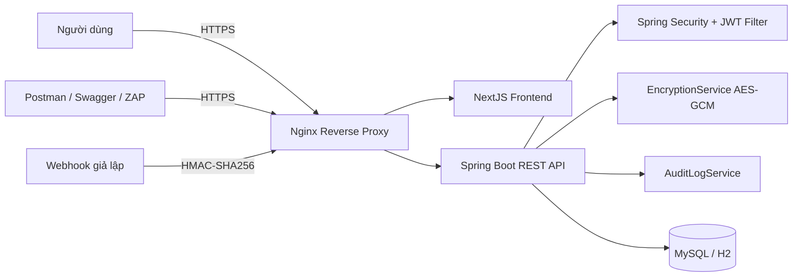

# BÁO CÁO THEO CHƯƠNG

## Chương 1. Tổng quan đề tài

### 1.1. Đặt vấn đề

Trong các hệ thống phần mềm hiện đại, RESTful API đóng vai trò là lớp giao tiếp trung tâm giữa frontend, backend, ứng dụng di động và các dịch vụ bên thứ ba. Khi API trở thành “cửa ngõ” của hệ thống, các yêu cầu về an toàn thông tin không còn là phần bổ sung mà trở thành điều kiện bắt buộc. Nếu lớp API không được thiết kế và bảo vệ đúng cách, kẻ tấn công có thể:

- Đăng nhập trái phép bằng tài khoản đánh cắp hoặc brute-force mật khẩu.
- Sửa token hoặc giả mạo thông tin trong token để leo thang đặc quyền.
- Thay đổi định danh tài nguyên trên URL để xem dữ liệu của người khác.
- Đọc được dữ liệu nhạy cảm nếu dữ liệu trong cơ sở dữ liệu bị lộ ở dạng rõ.
- Giả mạo webhook thanh toán để mở khóa tài nguyên học tập mà không thực sự trả phí.
- Gây nghẽn dịch vụ bằng cách gửi số lượng lớn request tới các endpoint nhạy cảm.

Trong bối cảnh đó, nhóm lựa chọn xây dựng một hệ thống khóa học online nhỏ theo định hướng “Mật mã ứng dụng và bảo mật API”. Trọng tâm của đề tài không phải là xây dựng một nền tảng học trực tuyến hoàn chỉnh như sản phẩm thương mại, mà là hiện thực hóa các kỹ thuật mật mã và cơ chế bảo mật có thể giải thích, kiểm thử và demo trực tiếp. Đây là hướng tiếp cận phù hợp với đặc thù của môn học, vì người học không chỉ nắm lý thuyết mà còn phải chứng minh khả năng áp dụng vào một hệ thống chạy thật.

### 1.2. Bối cảnh thực tiễn của bài toán

Hệ thống được đặt trong bối cảnh một doanh nghiệp nhỏ cung cấp các khóa học online. Do quy mô nhỏ, hệ thống không cần có đầy đủ các tính năng phức tạp như recommendation engine, livestream, thanh toán đa cổng hay phân tích dữ liệu lớn. Tuy nhiên, những thành phần cốt lõi liên quan đến bảo mật vẫn phải được bảo vệ chặt chẽ.

Các tài sản quan trọng của hệ thống gồm:

| Tài sản | Ý nghĩa | Rủi ro nếu không bảo vệ |
| --- | --- | --- |
| Tài khoản người dùng | Dùng để xác thực và phân quyền | Bị chiếm đoạt, truy cập trái phép |
| Mật khẩu | Bí mật đăng nhập | Bị lộ nếu lưu plaintext hoặc hash yếu |
| JWT access token | Chứng thực cho các request API | Bị sửa payload, giả mạo chữ ký, dùng token hết hạn |
| Refresh token | Cấp lại access token | Bị tái sử dụng nếu không hash hoặc không revoke |
| Dữ liệu cá nhân | Số điện thoại, địa chỉ thanh toán | Bị lộ nếu database rò rỉ |
| Nội dung bài học | Tài nguyên có giá trị thương mại | Người chưa mua vẫn xem được nếu thiếu kiểm soát truy cập |
| Enrollment và certificate | Chứng minh quyền học và kết quả học tập | Bị truy cập chéo giữa các sinh viên |
| Payment webhook | Tín hiệu xác nhận thanh toán | Bị giả mạo hoặc replay để mở khóa trái phép |
| Audit log | Dữ liệu giám sát an ninh | Mất dấu vết nếu hệ thống không ghi log |

Bài toán đặt ra là: làm thế nào để thiết kế một hệ thống đủ nhỏ để phù hợp đồ án sinh viên năm 2, nhưng vẫn thể hiện rõ các kỹ thuật mật mã ứng dụng và các lớp bảo vệ API theo hướng thực chiến.

### 1.3. Lý do chọn đề tài

Đề tài được lựa chọn vì ba lý do chính.

Thứ nhất, đây là đề tài bám sát định hướng môn Mật mã ứng dụng. Các cơ chế như bcrypt, AES-GCM, JWT ký HMAC-SHA, HMAC-SHA256 cho webhook, HTTPS/TLS đều là những nội dung có tính nền tảng nhưng lại thường khó hình dung nếu chỉ học lý thuyết. Khi đặt chúng vào một hệ thống cụ thể, người học sẽ thấy rõ mục đích, đầu vào, đầu ra và giới hạn của từng kỹ thuật.

Thứ hai, API Security là một chủ đề có tính thời sự và thực tiễn cao. Nhiều hệ thống hiện nay xây dựng theo kiến trúc frontend tách rời backend, các ứng dụng giao tiếp với nhau chủ yếu qua API. Điều đó khiến các lỗi như Broken Authentication, BOLA/IDOR, Excessive Data Exposure hay Security Misconfiguration trở nên phổ biến. Xây dựng một đồ án tập trung vào bảo vệ API sẽ giúp nội dung báo cáo sát với nhu cầu thực tế của ngành An toàn thông tin.

Thứ ba, đề tài phù hợp với khả năng triển khai của sinh viên năm 2. Hệ thống được giới hạn nghiệp vụ vừa đủ để dễ hoàn thành, nhưng vẫn có đủ chiều sâu để báo cáo trước giảng viên, trình bày demo tấn công/phòng thủ, kiểm thử bằng Postman và OWASP ZAP, đồng thời có thể triển khai bằng Docker.

### 1.4. Mục tiêu của đề tài

#### 1.4.1. Mục tiêu tổng quát

Xây dựng một hệ thống RESTful API cho dịch vụ khóa học online nhỏ và tích hợp các kỹ thuật mật mã ứng dụng, trong đó nhấn mạnh việc bảo vệ xác thực, bảo vệ dữ liệu nhạy cảm, bảo vệ quyền truy cập tài nguyên, bảo vệ webhook, bảo vệ đường truyền và hỗ trợ kiểm thử bảo mật.

#### 1.4.2. Mục tiêu cụ thể

Các mục tiêu cụ thể của đề tài gồm:

- Xây dựng backend bằng `Spring Boot` và `Spring Security`.
- Xây dựng frontend tối giản bằng `NextJS` để phục vụ trình diễn.
- Sử dụng `JWT` làm access token theo mô hình `Authorization: Bearer <token>`.
- Cung cấp `refresh token`, lưu trong database dưới dạng hash để giảm rủi ro lộ token.
- Bổ sung luồng quên mật khẩu và đặt lại mật khẩu để hoàn thiện vòng đời xác thực tài khoản.
- Băm mật khẩu bằng `BCryptPasswordEncoder`, không lưu plaintext password.
- Mã hóa dữ liệu nhạy cảm bằng `AES-GCM`.
- Xác thực webhook thanh toán giả lập bằng `HMAC-SHA256`.
- Tổ chức quyền tối giản, tập trung vào hai vai trò demo chính là `STUDENT` và `ADMIN`.
- Chặn `BOLA/IDOR` bằng kiểm tra ownership ở phía backend.
- Giới hạn tần suất truy cập với các endpoint nhạy cảm để chống brute-force và spam.
- Ghi `audit log` cho các sự kiện bảo mật quan trọng.
- Cấu hình `HTTPS/TLS` cục bộ qua `Nginx`.
- Tích hợp `Swagger/OpenAPI`, `Postman`, `OWASP ZAP` để kiểm thử.
- Dockerize hệ thống để chạy được trên môi trường local nhất quán.

### 1.5. Câu hỏi nghiên cứu và định hướng giải quyết

Đề tài tập trung trả lời các câu hỏi sau:

1. Làm thế nào để sử dụng JWT trong RESTful API sao cho token bị sửa payload hoặc sai chữ ký sẽ bị từ chối?
2. Làm thế nào để lưu mật khẩu người dùng an toàn bằng cơ chế băm một chiều thay vì mã hóa?
3. Làm thế nào để bảo vệ dữ liệu nhạy cảm trong cơ sở dữ liệu ngay cả khi tầng lưu trữ bị lộ?
4. Làm thế nào để phân biệt rõ xác thực, phân quyền theo vai trò và kiểm tra quyền sở hữu tài nguyên?
5. Làm thế nào để chứng minh hệ thống đã xử lý được các lỗi phổ biến trong OWASP API Security Top 10?
6. Làm thế nào để tạo ra một kịch bản webhook có tính mật mã học rõ ràng, có thể demo chữ ký, timestamp và chống replay attack?

Định hướng giải quyết của nhóm là không dàn trải quá nhiều nghiệp vụ, mà ưu tiên làm rõ từng lớp bảo vệ bằng mã nguồn đơn giản, dễ đọc, dễ demo và dễ giải thích.

### 1.6. Đối tượng và phạm vi nghiên cứu

#### 1.6.1. Đối tượng nghiên cứu

Đối tượng nghiên cứu của đề tài là các cơ chế bảo mật trong hệ thống API web hiện đại, đặc biệt là:

- Cơ chế xác thực bằng token.
- Cơ chế phân quyền và kiểm soát truy cập tài nguyên.
- Kỹ thuật băm mật khẩu.
- Kỹ thuật mã hóa đối xứng dữ liệu khi lưu trữ.
- Kỹ thuật xác thực thông điệp bằng HMAC.
- Kiểm thử bảo mật cho API.

#### 1.6.2. Phạm vi triển khai

| Nội dung | Trong phạm vi | Ngoài phạm vi |
| --- | --- | --- |
| Xác thực người dùng | Đăng ký, đăng nhập, access token, refresh token, logout | Social login, SSO, OAuth2 với Google/Facebook |
| Nghiệp vụ khóa học | Danh sách khóa học, chi tiết khóa học, lesson, enrollment, certificate | LMS đầy đủ, video streaming, bài tập nâng cao |
| Bảo mật dữ liệu | bcrypt, AES-GCM, HMAC-SHA256, TLS | KMS, HSM, key rotation production-grade |
| Kiểm thử | Swagger, Postman, OWASP ZAP, integration test | Pentest chuyên sâu, bug bounty, red team |
| Triển khai | Docker Compose local, Nginx HTTPS | Kubernetes, CI/CD production, auto scaling |

Phạm vi trên được lựa chọn để đảm bảo cân bằng giữa chiều sâu kỹ thuật và khả năng hoàn thành đồ án trong phạm vi môn học.

### 1.7. Phương pháp thực hiện

Đề tài được triển khai theo phương pháp kết hợp giữa nghiên cứu lý thuyết và thực nghiệm hệ thống.

#### 1.7.1. Nghiên cứu lý thuyết

Nhóm nghiên cứu các nội dung nền tảng gồm:

- RESTful API và các phương thức HTTP.
- JWT, Bearer Token, refresh token.
- bcrypt và nguyên tắc băm mật khẩu.
- AES-GCM và tính bảo mật kèm toàn vẹn.
- HMAC-SHA256 cho xác thực webhook.
- HTTPS/TLS và reverse proxy.
- OWASP API Security Top 10.

#### 1.7.2. Khảo sát source code hiện có

Sau khi kiểm tra toàn bộ source code ban đầu, nhóm ghi nhận:

- Backend nằm tại thư mục `backend/`.
- Frontend nằm tại thư mục `frontend/`.
- Dự án đã có nền tảng `Spring Security`, `JWT`, `bcrypt`, `AES`.
- Source code ban đầu vẫn còn mang tính generic, chưa bám sát domain khóa học online.
- Thiếu các module cần thiết cho mục tiêu đồ án như `Course`, `Lesson`, `Enrollment`, `Certificate`, webhook HMAC và tài liệu demo theo hướng Mật mã ứng dụng.

Từ kết quả khảo sát này, nhóm quyết định giữ lại hạ tầng kỹ thuật phù hợp, đồng thời refactor domain và bổ sung các thành phần bảo mật còn thiếu.

#### 1.7.3. Thiết kế và hiện thực

Sau khi xác định yêu cầu, nhóm tiến hành:

- Thiết kế lại domain theo mô hình khóa học online tối giản.
- Viết entity, repository, service, controller cho các module mới.
- Tích hợp các cơ chế mật mã vào luồng nghiệp vụ thật.
- Tổ chức tài liệu, script demo và kịch bản kiểm thử.

#### 1.7.4. Kiểm thử và đánh giá

Hệ thống được đánh giá bằng nhiều lớp:

- Test backend bằng Maven.
- Kiểm thử thủ công bằng Swagger.
- Kiểm thử tình huống bằng Postman.
- Chạy script demo tự động.
- Quét baseline bằng OWASP ZAP.

### 1.8. Công cụ và môi trường sử dụng

| Thành phần | Công nghệ sử dụng | Vai trò |
| --- | --- | --- |
| Backend | Java, Spring Boot, Spring Security | Xây dựng REST API và xử lý bảo mật |
| Frontend | NextJS | Giao diện demo luồng bảo mật |
| Database | MySQL, H2 | Lưu trữ dữ liệu hệ thống và test local |
| API Docs | Springdoc OpenAPI / Swagger UI | Tài liệu và thử nghiệm API |
| Reverse proxy | Nginx | TLS termination, HTTP to HTTPS redirect |
| Kiểm thử | Postman, OWASP ZAP | Kiểm thử thủ công và quét bảo mật |
| Triển khai | Docker, Docker Compose | Chạy đồng bộ toàn stack |
| Hệ điều hành thực nghiệm | Windows + Docker Desktop | Môi trường demo local |

### 1.9. Kết quả mong đợi của đề tài

Sau khi hoàn thành, hệ thống cần đạt các kết quả sau:

- Chạy được frontend và backend qua `https://localhost`.
- Người dùng có thể đăng ký, đăng nhập, làm mới token, đăng xuất, quên mật khẩu và đặt lại mật khẩu.
- Password lưu trong database ở dạng bcrypt hash.
- Các trường nhạy cảm lưu ở dạng ciphertext AES-GCM.
- Sinh viên không thể xem dữ liệu của sinh viên khác bằng cách sửa ID trên URL.
- Webhook thanh toán chỉ được chấp nhận khi HMAC hợp lệ.
- Hệ thống có audit log và rate limiting.
- Swagger có thể test API protected bằng Bearer JWT.
- Có tài liệu phục vụ báo cáo, Postman và OWASP ZAP.

### 1.10. Ý nghĩa khoa học và thực tiễn

Về mặt khoa học, đề tài thể hiện được sự khác nhau giữa các cơ chế mật mã:

- `bcrypt` dùng cho băm mật khẩu một chiều.
- `AES-GCM` dùng cho mã hóa dữ liệu cần giải mã lại.
- `HMAC-SHA256` dùng cho xác thực và kiểm tra toàn vẹn thông điệp.
- `JWT` dùng để đóng gói claims và xác minh bằng chữ ký số đối xứng.

Về mặt thực tiễn, đề tài có thể được dùng như một mô hình mẫu cho các hệ thống API quy mô nhỏ cần:

- Bảo vệ xác thực người dùng.
- Bảo vệ dữ liệu cá nhân.
- Bảo vệ tài nguyên số có giá trị.
- Ghi nhận và giám sát hành vi bất thường.

### 1.11. Bố cục báo cáo

Báo cáo được tổ chức thành ba chương:

- Chương 1 trình bày tổng quan đề tài, bối cảnh, mục tiêu, phạm vi và phương pháp thực hiện.
- Chương 2 trình bày cơ sở lý thuyết và các công nghệ bảo mật làm nền tảng cho đề tài.
- Chương 3 trình bày quá trình phân tích, thiết kế, hiện thực và kiểm thử hệ thống.

### 1.12. Kết luận chương

Chương 1 đã nêu rõ bối cảnh, lý do chọn đề tài, tài sản cần bảo vệ, các mục tiêu bảo mật và định hướng triển khai. Từ nền tảng này, báo cáo chuyển sang Chương 2 để trình bày những cơ sở lý thuyết cần thiết trước khi đi vào phần thiết kế và cài đặt hệ thống.

## Chương 2. Cơ sở lý thuyết và công nghệ sử dụng

### 2.1. Một số khái niệm nền tảng trong an toàn thông tin

Khi bảo vệ một hệ thống API, cần xuất phát từ ba thuộc tính cơ bản của an toàn thông tin:

- **Tính bí mật**: dữ liệu chỉ được xem bởi đối tượng hợp lệ.
- **Tính toàn vẹn**: dữ liệu không bị sửa đổi trái phép.
- **Tính sẵn sàng**: hệ thống duy trì khả năng phục vụ hợp lệ.

Đề tài này đồng thời cũng gắn với mô hình `AAA` trong bảo mật:

- `Authentication`: xác thực người dùng.
- `Authorization`: phân quyền truy cập.
- `Accounting/Auditing`: ghi nhận và giám sát hành động.

Mỗi kỹ thuật được dùng trong đồ án sẽ phục vụ một hoặc nhiều mục tiêu ở trên.

### 2.2. Phân biệt các cơ chế mật mã sử dụng trong đề tài

Để tránh nhầm lẫn giữa băm, mã hóa và xác thực thông điệp, Bảng 2.1 tóm tắt vai trò của từng cơ chế.

| Cơ chế | Bản chất | Có giải mã ngược không | Mục đích trong đề tài |
| --- | --- | --- | --- |
| bcrypt | Băm một chiều có salt | Không | Lưu mật khẩu |
| AES-GCM | Mã hóa đối xứng | Có | Bảo vệ dữ liệu nhạy cảm trong database |
| HMAC-SHA256 | Mã xác thực thông điệp | Không phải cơ chế giải mã | Xác thực webhook và kiểm tra toàn vẹn |
| JWT ký HMAC | Token có chữ ký | Không mã hóa payload | Xác thực request API |

Điểm quan trọng là không sử dụng sai mục đích:

- Không dùng AES để “mã hóa mật khẩu”.
- Không dùng bcrypt để lưu dữ liệu cần đọc lại.
- Không coi JWT là dữ liệu bí mật tuyệt đối vì payload có thể được giải mã base64.

### 2.3. Tổng quan về RESTful API

RESTful API là phong cách thiết kế dịch vụ web trong đó tài nguyên được biểu diễn qua URL và thao tác bằng HTTP method. Một số đặc điểm chính:

- `GET`: đọc tài nguyên.
- `POST`: tạo tài nguyên hoặc kích hoạt hành động.
- `PUT`: cập nhật tài nguyên.
- `DELETE`: xóa tài nguyên.

Ưu điểm của RESTful API là:

- Đơn giản, dễ tích hợp.
- Phù hợp với frontend web, mobile và bên thứ ba.
- Dễ mô tả, tài liệu hóa và kiểm thử.

Tuy nhiên, chính vì API mở ra bề mặt giao tiếp trực tiếp nên đây cũng là bề mặt tấn công phổ biến. Trong nhiều trường hợp, kẻ tấn công không cần truy cập giao diện người dùng mà có thể trực tiếp sửa request HTTP để thử token, đổi ID tài nguyên hoặc gửi lượng lớn request bất thường.

### 2.4. Xác thực và phân quyền trong hệ thống API

Trong một hệ thống API, cần phân biệt rõ:

- **Xác thực**: người dùng là ai?
- **Phân quyền**: người dùng được phép làm gì?
- **Kiểm tra ownership**: người dùng có quyền với đúng đối tượng dữ liệu đó không?

Ví dụ:

- Một request có JWT hợp lệ nghĩa là người dùng đã được xác thực.
- Tuy nhiên, cùng là người dùng đã xác thực, `STUDENT` không thể xem `audit log`.
- Ngay cả khi đều là `STUDENT`, sinh viên A cũng không được xem certificate của sinh viên B.

Đây là điểm rất quan trọng trong đề tài, vì nhiều hệ thống sai ở chỗ dừng lại ở mức “đã đăng nhập” mà không kiểm tra ownership ở phía server.

### 2.5. JWT và Bearer Token

#### 2.5.1. Cấu trúc JWT

JWT gồm ba phần:

1. `Header`
2. `Payload`
3. `Signature`

Hai phần đầu thường được mã hóa `Base64Url`, còn phần thứ ba là chữ ký dùng secret key. Trong đồ án, access token chứa các claim quan trọng:

- `sub`: mã người dùng.
- `email`: email người dùng.
- `role`: vai trò.
- `scope`: tập quyền.
- `token_type`: loại token.
- `iat`: thời điểm phát hành.
- `exp`: thời điểm hết hạn.

#### 2.5.2. Vai trò của Bearer Token

Sau khi đăng nhập thành công, client nhận được access token và gửi trong header:

```http
Authorization: Bearer <access_token>
```

Backend sẽ đọc token, kiểm tra chữ ký, kiểm tra thời hạn, kiểm tra role và sau đó gắn danh tính người dùng vào security context.

#### 2.5.3. Các rủi ro cần kiểm soát

JWT chỉ an toàn khi backend thực hiện đầy đủ các bước kiểm tra:

- Từ chối token sai định dạng.
- Từ chối token không có chữ ký hợp lệ.
- Từ chối token hết hạn.
- Từ chối token thiếu claim bắt buộc.
- Từ chối token có `token_type` không đúng.

Trong dự án này, secret ký JWT không được hard-code mà lấy từ biến môi trường `JWT_SECRET`. Access token có thời gian sống ngắn mặc định `15 phút`, còn refresh token mặc định `7 ngày`.

#### 2.5.4. Refresh token

Refresh token trong dự án được sinh ngẫu nhiên, trả về cho client nhưng lưu trong database ở dạng `SHA-256 hash`. Cách làm này giúp:

- Không lưu token gốc trong database.
- Có thể revoke token khi logout hoặc khi cấp token mới.
- Giảm rủi ro nếu bảng `refresh_tokens` bị truy cập trái phép.

### 2.6. Băm mật khẩu bằng bcrypt

bcrypt là thuật toán băm một chiều được thiết kế cho mật khẩu. Khác với các hàm băm nhanh như SHA-256, bcrypt có cơ chế salt và cost factor để làm chậm quá trình bẻ khóa.

Các đặc điểm chính của bcrypt:

- Là băm một chiều, không thể “giải mã”.
- Tự sinh salt cho từng mật khẩu.
- Kết quả cùng một mật khẩu ở hai lần băm có thể khác nhau.
- Thích hợp để chống brute-force và rainbow table tốt hơn so với băm nhanh.

Trong dự án:

- Khi đăng ký, backend gọi `passwordEncoder.encode(rawPassword)`.
- Khi đăng nhập, backend gọi `passwordEncoder.matches(rawPassword, passwordHash)`.
- API response không bao giờ trả về `passwordHash`.
- Log hệ thống không in ra mật khẩu gốc.

### 2.7. Mã hóa dữ liệu nhạy cảm bằng AES-GCM

#### 2.7.1. Vì sao cần mã hóa dữ liệu lưu trữ

Không phải dữ liệu nào cũng phù hợp để băm. Với những trường cần hiển thị lại cho người dùng hợp lệ, hệ thống phải có khả năng giải mã. Ví dụ:

- `phoneNumber`
- `billingAddress`
- `paymentReference`
- `certificateCode`

Nếu lưu những trường này ở dạng plaintext, khi database bị lộ, dữ liệu cá nhân và dữ liệu nghiệp vụ cũng bị lộ trực tiếp.

#### 2.7.2. Đặc điểm của AES-GCM

AES-GCM là chế độ mã hóa đối xứng có xác thực, mang lại hai thuộc tính cùng lúc:

- Mã hóa để đảm bảo tính bí mật.
- Authentication tag để phát hiện dữ liệu bị chỉnh sửa.

Trong dự án, `EncryptionService`:

- Dẫn xuất khóa từ biến môi trường `ENCRYPTION_KEY` bằng `SHA-256`.
- Sinh `IV` ngẫu nhiên với kích thước `12 byte`.
- Dùng `tag` dài `16 byte`.
- Lưu kết quả theo định dạng:

```text
Base64(iv):Base64(ciphertext):Base64(tag)
```

#### 2.7.3. AAD trong AES-GCM

Một điểm quan trọng của dự án là ngoài ciphertext, hệ thống còn gắn `AAD` (Additional Authenticated Data) theo ngữ cảnh:

```text
contextType | contextReference | fieldName
```

Ví dụ:

- `user | email | phoneNumber`
- `enrollment | studentId|courseId | paymentReference`
- `certificate | studentId|courseId | certificateCode`

Cách làm này giúp ràng buộc dữ liệu với đúng ngữ cảnh nghiệp vụ. Nếu một ciphertext bị tráo sang bản ghi khác hoặc đổi field, quá trình giải mã sẽ thất bại.

### 2.8. HMAC-SHA256

HMAC là cơ chế xác thực thông điệp sử dụng secret key kết hợp với hàm băm mật mã. Trong đề tài, HMAC-SHA256 được dùng để xác thực webhook thanh toán giả lập.

Webhook được ký theo công thức:

```text
signature = HMAC_SHA256(eventId + "." + timestamp + "." + rawBody, secret)
```

Ý nghĩa:

- `eventId`: định danh duy nhất của sự kiện.
- `timestamp`: chống phát lại request cũ quá lâu.
- `rawBody`: đảm bảo nội dung webhook không bị sửa sau khi ký.

Ưu điểm của HMAC:

- Bên nhận không cần lưu toàn bộ bản gốc để kiểm tra.
- Phát hiện được việc sửa đổi message.
- Dễ triển khai cho callback giữa hai hệ thống.

### 2.9. HTTPS/TLS

HTTPS là HTTP chạy trên TLS. Trong đề tài, TLS được dùng để bảo vệ:

- Thông tin đăng nhập khi người dùng gửi email và mật khẩu.
- JWT access token khi frontend gọi API.
- Dữ liệu nhạy cảm trao đổi giữa các thành phần của hệ thống.

Nginx được dùng làm reverse proxy để:

- Lắng nghe cổng `80` và `443`.
- Chuyển toàn bộ HTTP sang HTTPS bằng `301`.
- Phục vụ frontend và proxy request API tới backend.
- Thêm một số security header cơ bản như:
  - `Strict-Transport-Security`
  - `Content-Security-Policy`
  - `X-Content-Type-Options`
  - `X-Frame-Options`
  - `Referrer-Policy`
  - `Permissions-Policy`

### 2.10. RBAC, ownership check và chống BOLA/IDOR

RBAC là mô hình phân quyền theo vai trò. Tuy nhiên, chỉ dùng RBAC là chưa đủ đối với các tài nguyên cá nhân. Đề tài kết hợp hai lớp:

- **Role-based access control**: giới hạn theo vai trò.
- **Ownership check**: giới hạn theo quyền sở hữu tài nguyên.

Ví dụ:

- `ADMIN` được xem audit log.
- `STUDENT` chỉ được xem enrollment, certificate và profile của chính mình.
- Hệ thống chỉ trình diễn hai vai trò chính là `STUDENT` và `ADMIN` để giữ đúng trọng tâm mật mã ứng dụng và bảo mật API.

Lỗi BOLA/IDOR xảy ra khi backend chỉ dựa vào ID trên URL mà không kiểm tra ID đó có thuộc về người dùng hiện tại hay không. Đây là một trong những nội dung được nhấn mạnh nhất trong dự án.

### 2.11. Excessive Data Exposure và DTO response

Một API có thể xác thực đúng nhưng vẫn không an toàn nếu trả ra quá nhiều thông tin. Ví dụ:

- Trả cả `passwordHash`.
- Trả trực tiếp ciphertext nội bộ.
- Trả các field chỉ dành cho admin.

Để tránh lỗi này, hệ thống sử dụng `DTO` cho response. Ví dụ:

- `UserResponse` chỉ chứa `id`, `fullName`, `email`, `role`, `phoneNumber`, `billingAddress`, `createdAt`.
- `CourseDetailResponse` chỉ trả thông tin cần thiết của khóa học và preview lesson.
- `LessonDetailResponse` chỉ trả `content` khi người dùng đủ quyền.

### 2.12. Rate limiting và audit logging

#### 2.12.1. Rate limiting

Rate limiting là cơ chế giới hạn số lượng request trong một khoảng thời gian. Trong đề tài, rate limit được áp dụng cho:

- `POST /api/auth/login`
- `POST /api/auth/register`
- `POST /api/webhooks/payment-success`
- `GET /api/admin/**`

Mục tiêu là:

- Giảm brute-force mật khẩu.
- Giảm spam đăng ký.
- Giảm flood webhook.
- Giảm việc lạm dụng API quản trị.

#### 2.12.2. Audit log

Audit log là lớp ghi nhận các hành vi quan trọng phục vụ giám sát và truy vết. Dự án ghi log cho:

- Đăng ký thành công.
- Đăng nhập thành công.
- Đăng nhập thất bại.
- Token bị từ chối.
- Truy cập bị chặn `403`.
- Webhook hợp lệ hoặc không hợp lệ.
- Replay webhook.
- Vượt ngưỡng rate limit.
- Admin xem audit log.

### 2.13. Swagger/OpenAPI

Swagger/OpenAPI là công cụ tài liệu hóa và kiểm thử API rất phù hợp với đồ án. Hệ thống hiện tại:

- Công bố Swagger UI tại `https://localhost/swagger-ui.html`.
- Công bố OpenAPI JSON tại `https://localhost/v3/api-docs`.
- Hỗ trợ nhập `Bearer JWT`.
- Giúp giảng viên và người kiểm thử dễ quan sát endpoint, request, response, status code.

### 2.14. OWASP API Security Top 10

OWASP API Security Top 10 là bộ tham chiếu quan trọng để đánh giá an toàn cho API. Dự án tập trung vào các nhóm lỗi dễ trình bày và sát với bài toán:

| Nhóm lỗi | Ý nghĩa | Biện pháp xử lý trong dự án |
| --- | --- | --- |
| API1: BOLA | Đổi ID tài nguyên để xem dữ liệu người khác | Ownership check cho profile, enrollment, certificate, lesson |
| API2: Broken Authentication | Token sai, token hết hạn, mật khẩu yếu | JWT validation, bcrypt, refresh token hash, revoke |
| API3: Excessive Data Exposure | Trả dư field nhạy cảm | DTO response, không trả password hash/ciphertext |
| API4: Unrestricted Resource Consumption | Spam request gây quá tải | Rate limiting và trả `429` |
| API8: Security Misconfiguration | Cấu hình sai, lộ stack trace, CORS mở quá mức | CORS rõ ràng, TLS, ẩn stack trace, không hard-code secret |

### 2.15. Docker và triển khai đóng gói

Docker giúp dự án tránh tình trạng “chạy được trên máy em nhưng không chạy được trên máy khác”. Nhờ Docker Compose, toàn bộ stack gồm:

- `frontend`
- `backend`
- `database`
- `nginx`

được khởi động theo một cấu hình nhất quán. Điều này rất hữu ích cho đồ án vì:

- Dễ chạy demo trên máy khác.
- Dễ chụp minh chứng.
- Dễ giữ nguyên môi trường khi kiểm thử.

### 2.16. Kết luận chương

Chương 2 đã trình bày nền tảng lý thuyết cho toàn bộ đồ án, từ RESTful API, JWT, bcrypt, AES-GCM, HMAC-SHA256, RBAC, BOLA/IDOR cho tới rate limiting, audit log, TLS, Swagger và Docker. Đây là cơ sở để bước sang Chương 3, nơi các kỹ thuật này được gắn vào kiến trúc và mã nguồn cụ thể của hệ thống.

## Chương 3. Phân tích, thiết kế và triển khai hệ thống

### 3.1. Khảo sát source code và định hướng cải tiến

Sau khi đọc toàn bộ source code hiện có, nhóm xác định:

- Backend nằm trong thư mục `backend/`.
- Frontend nằm trong thư mục `frontend/`.
- Dự án đã có một số nền tảng về xác thực và bảo mật như `Spring Security`, `JWT`, `bcrypt`, `AES`.
- Domain cũ chưa tập trung đúng vào bài toán “khóa học online và bảo mật API”.
- Tài liệu báo cáo, tài liệu demo và một số file phụ trợ chưa đồng nhất, còn rải rác theo nhiều hướng khác nhau.

Bảng 3.1 trình bày tóm tắt kết quả khảo sát và hướng xử lý.

| Nội dung khảo sát | Thực trạng ban đầu | Hướng xử lý |
| --- | --- | --- |
| Kiến trúc backend/frontend | Đã tách rõ ràng | Giữ nguyên cấu trúc thư mục |
| Security framework | Có Spring Security và JWT | Kế thừa, chuẩn hóa lại theo domain mới |
| Password hashing | Đã có nền tảng bcrypt | Chuẩn hóa register/login |
| Encryption | Đã có service mã hóa | Mở rộng cho user, enrollment, certificate |
| Domain nghiệp vụ | Chưa bám bài toán khóa học online | Refactor sang Course, Lesson, Enrollment, Certificate |
| Webhook | Chưa thể hiện rõ tính mật mã học | Bổ sung webhook HMAC-SHA256 |
| Demo security | Chưa đủ kịch bản | Bổ sung docs, script, Postman, ZAP |
| Triển khai local | Đã có Docker | Chuẩn hóa về `https://localhost` qua Nginx |

### 3.2. Mô tả bài toán nghiệp vụ

Hệ thống mô phỏng một dịch vụ khóa học online nhỏ. Các tác nhân chính gồm:

- `STUDENT`: đăng ký, đăng nhập, xem khóa học, checkout, xem bài học đã mở khóa, xem certificate của chính mình.
- `ADMIN`: duyệt ghi danh học viên, quản lý học viên theo khóa học và xem audit log.
- Các khóa học mẫu được gắn với tài khoản quản trị nội bộ để cắt bỏ phần nghiệp vụ quản lý giảng viên không cần thiết.
- `Payment Gateway (giả lập)`: gửi webhook xác nhận thanh toán thành công.

Mục tiêu của hệ thống không phải làm nghiệp vụ nhiều, mà là tạo ra các điểm minh họa rõ ràng cho các cơ chế:

- Xác thực bằng JWT.
- Phân quyền role-based.
- Kiểm tra ownership.
- Mã hóa dữ liệu khi lưu trữ.
- Xác thực webhook bằng HMAC.

### 3.3. Yêu cầu hệ thống

#### 3.3.1. Yêu cầu chức năng

Hệ thống cần đáp ứng các nhóm chức năng sau:

**Nhóm Auth**

- Đăng ký tài khoản sinh viên.
- Đăng nhập.
- Lấy thông tin người dùng hiện tại.
- Làm mới access token bằng refresh token.
- Đăng xuất và revoke refresh token.

**Nhóm Course**

- Xem danh sách khóa học công khai.
- Xem chi tiết khóa học.

**Nhóm Lesson**

- Xem bài học cụ thể trong một khóa học.
- Chỉ sinh viên đã enroll mới xem được nội dung đầy đủ.

**Nhóm Enrollment**

- Checkout khóa học.
- Xem enrollment của chính mình.
- Xem chi tiết một enrollment.

**Nhóm Certificate**

- Xem danh sách certificate của chính mình.
- Xem một certificate cụ thể.

**Nhóm Admin**

- Xem danh sách khóa học để kiểm duyệt.
- Duyệt công khai hoặc ẩn khóa học.
- Xem audit log.

**Nhóm System**

- Health check.
- Webhook thanh toán.

#### 3.3.2. Yêu cầu phi chức năng

- Giao diện đủ rõ để demo, không yêu cầu đẹp.
- Mã nguồn dễ đọc, dễ giải thích với giảng viên.
- Secret không hard-code trong source code.
- Hỗ trợ chạy bằng Docker Compose.
- Hỗ trợ test bằng Swagger, Postman, ZAP.

#### 3.3.3. Yêu cầu bảo mật

- Mật khẩu phải được bcrypt hash.
- Access token phải là JWT có kiểm tra chữ ký và thời hạn.
- Dữ liệu nhạy cảm phải được AES-GCM mã hóa.
- Webhook phải kiểm tra HMAC, timestamp và replay.
- BOLA/IDOR phải bị chặn bằng `403`.
- Có audit log cho các sự kiện an ninh.
- Có rate limiting cho endpoint nhạy cảm.
- Có HTTPS/TLS.

### 3.4. Thiết kế tác nhân và use case

#### 3.4.1. Tác nhân

| Tác nhân | Vai trò |
| --- | --- |
| Student | Học viên sử dụng hệ thống để đăng ký, mua khóa học, xem bài học và chứng chỉ |
| Admin | Quản trị hệ thống, duyệt ghi danh học viên, quản lý học viên theo khóa học và xem dữ liệu giám sát an ninh |
| Payment Gateway giả lập | Gửi webhook xác nhận thanh toán |

#### 3.4.2. Use case chính

| Use case | Student | Admin | Gateway |
| --- | --- | --- | --- |
| Đăng ký tài khoản | Có | Không | Không |
| Đăng nhập | Có | Có | Không |
| Xem khóa học public | Có | Có | Không |
| Checkout khóa học | Có | Không | Không |
| Xem lesson đã mở khóa | Có | Không | Không |
| Xem certificate của mình | Có | Không | Không |
| Duyệt yêu cầu ghi danh | Không | Có | Không |
| Thêm hoặc xóa học viên khỏi khóa học | Không | Có | Không |
| Xem audit log | Không | Có | Không |
| Gửi webhook thanh toán | Không | Không | Có |

### 3.5. Kiến trúc tổng thể của hệ thống

Hệ thống được triển khai theo mô hình nhiều lớp. Kiến trúc tổng quát như sau:



#### 3.5.1. Frontend NextJS

Frontend cung cấp các màn hình:

- Đăng nhập.
- Đăng ký.
- Danh sách khóa học.
- Chi tiết khóa học.
- Hồ sơ người dùng.
- Khu vực admin duyệt khóa học.
- Khu vực admin xem audit log.

Frontend chỉ đóng vai trò minh họa luồng sử dụng, còn các kiểm tra bảo mật bắt buộc được đặt ở backend.

#### 3.5.2. Backend Spring Boot

Backend tổ chức theo mô hình quen thuộc:

- `controller`: nhận request và trả response.
- `service`: xử lý nghiệp vụ.
- `repository`: truy cập dữ liệu.
- `entity`: ánh xạ bảng dữ liệu.
- `security/config`: cấu hình JWT, security filter chain, CORS, Swagger.

#### 3.5.3. Reverse proxy Nginx

Nginx lắng nghe:

- `80`: chuyển sang HTTPS bằng `301`.
- `443`: phục vụ TLS cho toàn hệ thống.

Nginx proxy:

- `/` sang frontend.
- `/api/*` sang backend.
- cùng cổng `443`, nhưng chỉ cho `/swagger-ui/*` và `/v3/api-docs/*` phản hồi khi truy cập bằng hostname local như `localhost`, `127.0.0.1` hoặc `host.docker.internal`.

### 3.6. Thiết kế phân quyền và scope

Phiên bản rút gọn của đồ án tập trung hai vai trò demo chính là `STUDENT` và `ADMIN`. Các khóa học mẫu được gắn với tài khoản quản trị nội bộ để tránh làm hệ thống mang dáng dấp của một nền tảng đào tạo hoàn chỉnh.

#### 3.6.1. Role và phạm vi quyền

| Role | Quyền chính |
| --- | --- |
| STUDENT | `course:read`, `lesson:read`, `enrollment:read`, `certificate:read`, `profile:read`, `checkout:create` |
| ADMIN | `course:read`, `course:moderate`, `admin:read`, `audit:read` |

#### 3.6.2. Kiểm tra ở SecurityConfig

Tại lớp cấu hình bảo mật:

- `GET /api/courses` và `GET /api/courses/{id}` được mở public.
- `POST /api/auth/register`, `POST /api/auth/login`, `POST /api/auth/refresh` được phép truy cập công khai.
- `POST /api/webhooks/payment-success` được mở nhưng có xác thực HMAC riêng.
- `POST /api/courses/{courseId}/checkout` chỉ dành cho `STUDENT`.
- `GET /api/users/{userId}/profile`, `GET /api/enrollments/{enrollmentId}`, `GET /api/certificates/{certificateId}` và `GET /api/courses/{courseId}/lessons/{lessonId}` chỉ dành cho `STUDENT`.
- `/api/admin/**` chỉ dành cho `ADMIN`.

#### 3.6.3. Kiểm tra ownership ở AuthorizationService

Ngoài role, hệ thống còn kiểm tra ownership cho:

- `profile`
- `enrollment`
- `certificate`
- `lesson`

Nếu không đủ quyền, service sẽ:

- Ghi `ACCESS_DENIED` vào audit log.
- Trả `403 Forbidden`.

### 3.7. Thiết kế cơ sở dữ liệu

Các bảng chính của hệ thống gồm:

- `users`
- `courses`
- `lessons`
- `enrollments`
- `certificates`
- `refresh_tokens`
- `webhook_events`
- `audit_logs`

#### 3.7.1. Bảng users

Lưu thông tin tài khoản người dùng:

- `id`
- `full_name`
- `email`
- `password_hash`
- `role`
- `phone_number_encrypted`
- `billing_address_encrypted`
- `created_at`
- `updated_at`

Điểm cần chú ý:

- `email` là duy nhất.
- `password_hash` lưu bcrypt hash.
- `phone_number_encrypted` và `billing_address_encrypted` lưu ciphertext AES-GCM.

#### 3.7.2. Bảng courses

Lưu thông tin khóa học:

- `title`
- `summary`
- `description`
- `price`
- `published`
- `instructor_id`

#### 3.7.3. Bảng lessons

Lưu từng bài học:

- `course_id`
- `title`
- `preview_text`
- `content`
- `sort_order`

`preview_text` được dùng để hiển thị cho người chưa có quyền truy cập toàn phần.

#### 3.7.4. Bảng enrollments

Lưu quan hệ sinh viên và khóa học:

- `student_id`
- `course_id`
- `status`
- `payment_reference_encrypted`
- `created_at`
- `activated_at`

Ràng buộc `uk_enrollments_student_course` đảm bảo một sinh viên không enroll trùng cùng một khóa học.

#### 3.7.5. Bảng certificates

Lưu thông tin chứng chỉ:

- `student_id`
- `course_id`
- `enrollment_id`
- `certificate_code_encrypted`
- `score`
- `issued_at`

#### 3.7.6. Bảng refresh_tokens

Lưu refresh token ở dạng hash:

- `user_id`
- `token_hash`
- `expires_at`
- `revoked_at`
- `created_at`

#### 3.7.7. Bảng webhook_events

Lưu dấu vết webhook đã xử lý:

- `event_id`
- `event_type`
- `status`
- `message`
- `created_at`

Ràng buộc `uk_webhook_events_event_id` giúp chống replay attack.

#### 3.7.8. Bảng audit_logs

Lưu lịch sử sự kiện an ninh:

- `actor_user_id`
- `actor_email`
- `action`
- `target_type`
- `target_id`
- `ip_address`
- `user_agent`
- `status`
- `message`
- `created_at`

### 3.8. Thiết kế nhóm API chính

#### 3.8.1. Nhóm Auth API

| Method | Endpoint | Mục đích | Quyền |
| --- | --- | --- | --- |
| POST | `/api/auth/register` | Đăng ký tài khoản student | Public |
| POST | `/api/auth/login` | Đăng nhập | Public |
| POST | `/api/auth/refresh` | Đổi refresh token lấy access token mới | Public |
| POST | `/api/auth/forgot-password` | Yêu cầu cấp token đặt lại mật khẩu | Public |
| POST | `/api/auth/reset-password` | Đặt lại mật khẩu bằng reset token hợp lệ | Public |
| POST | `/api/auth/logout` | Revoke refresh token | Đã đăng nhập |
| GET | `/api/auth/me` | Xem hồ sơ hiện tại | Đã đăng nhập |
| GET | `/api/users/{userId}/profile` | Xem hồ sơ theo ID | Chủ sở hữu |

#### 3.8.2. Nhóm Course API

| Method | Endpoint | Mục đích | Quyền |
| --- | --- | --- | --- |
| GET | `/api/courses` | Danh sách khóa học public | Public |
| GET | `/api/courses/{courseId}` | Chi tiết khóa học | Public |

#### 3.8.3. Nhóm Lesson API

| Method | Endpoint | Mục đích | Quyền |
| --- | --- | --- | --- |
| GET | `/api/courses/{courseId}/lessons/{lessonId}` | Xem bài học | Student đã enroll |

#### 3.8.4. Nhóm Enrollment API

| Method | Endpoint | Mục đích | Quyền |
| --- | --- | --- | --- |
| POST | `/api/courses/{courseId}/checkout` | Tạo enrollment `PENDING` | Student |
| GET | `/api/enrollments/me` | Xem enrollments của mình | Student |
| GET | `/api/enrollments/{enrollmentId}` | Xem chi tiết enrollment | Chủ sở hữu |

#### 3.8.5. Nhóm Certificate API

| Method | Endpoint | Mục đích | Quyền |
| --- | --- | --- | --- |
| GET | `/api/certificates/me` | Xem certificate của mình | Student |
| GET | `/api/certificates/{certificateId}` | Xem một certificate | Chủ sở hữu |

#### 3.8.6. Nhóm Admin API

| Method | Endpoint | Mục đích | Quyền |
| --- | --- | --- | --- |
| GET | `/api/admin/courses` | Xem danh sách khóa học kèm số học viên và số yêu cầu chờ duyệt | Admin |
| GET | `/api/admin/courses/{courseId}/enrollments` | Xem danh sách học viên và yêu cầu ghi danh của một khóa học | Admin |
| POST | `/api/admin/enrollments/{enrollmentId}/approve` | Duyệt yêu cầu ghi danh | Admin |
| POST | `/api/admin/courses/{courseId}/students` | Thêm trực tiếp học viên vào khóa học | Admin |
| DELETE | `/api/admin/enrollments/{enrollmentId}` | Xóa học viên khỏi khóa học hoặc từ chối yêu cầu chờ duyệt | Admin |
| GET | `/api/admin/users/{userId}` | Xem hồ sơ học viên trong khu vực quản trị | Admin |
| GET | `/api/admin/audit-logs` | Xem audit log | Admin |

#### 3.8.7. Nhóm Webhook và System API

| Method | Endpoint | Mục đích | Quyền |
| --- | --- | --- | --- |
| POST | `/api/webhooks/payment-success` | Webhook xác nhận thanh toán | Public nhưng phải đúng HMAC |
| GET | `/api/health` | Kiểm tra trạng thái hệ thống | Public |

### 3.9. Thiết kế các luồng nghiệp vụ và bảo mật

#### 3.9.1. Luồng đăng ký và lưu mật khẩu

Khi người dùng đăng ký:

1. Frontend gửi `fullName`, `email`, `password`, `phoneNumber`, `billingAddress`.
2. Backend kiểm tra email đã tồn tại chưa.
3. Mật khẩu được băm bằng `BCryptPasswordEncoder`.
4. `phoneNumber` và `billingAddress` được mã hóa bằng `EncryptionService`.
5. User được lưu với role mặc định `STUDENT`.
6. Audit log ghi `REGISTER_SUCCESS`.
7. Hệ thống phát hành access token và refresh token.

Luồng này minh họa rõ việc kết hợp cả hashing và encryption trong cùng một request.

#### 3.9.2. Luồng đăng nhập và phát hành JWT

Khi người dùng đăng nhập:

1. Backend tìm user theo email.
2. Gọi `passwordEncoder.matches()` để kiểm tra mật khẩu.
3. Nếu sai, ghi `LOGIN_FAILED` vào audit log và trả `401`.
4. Nếu đúng, hệ thống sinh access token JWT.
5. JWT chứa:
   - `sub`
   - `email`
   - `role`
   - `scope`
   - `token_type`
   - `iat`
   - `exp`
6. Hệ thống sinh refresh token ngẫu nhiên.
7. Refresh token được băm `SHA-256` trước khi lưu vào bảng `refresh_tokens`.

#### 3.9.3. Luồng xác thực request protected

`JwtAuthenticationFilter` đọc header `Authorization` và thực hiện:

1. Kiểm tra prefix `Bearer`.
2. Parse JWT.
3. Kiểm tra chữ ký bằng secret key.
4. Kiểm tra `token_type = access`.
5. Kiểm tra `sub`, `email`, `role`.
6. Nếu hợp lệ, tạo `Authentication` cho Spring Security.
7. Nếu không hợp lệ, từ chối request và ghi sự kiện phù hợp.

#### 3.9.4. Luồng refresh token

Khi client gọi refresh:

1. Backend hash refresh token nhận được.
2. Tìm token hash trong database.
3. Kiểm tra token chưa bị revoke.
4. Kiểm tra token chưa hết hạn.
5. Revoke token cũ.
6. Cấp cặp token mới.
7. Ghi `TOKEN_REFRESHED` vào audit log.

Luồng này giúp hạn chế việc một refresh token bị tái sử dụng nhiều lần.

#### 3.9.5. Luồng quên mật khẩu và đặt lại mật khẩu

Khi người dùng quên mật khẩu:

1. Người dùng gửi email tới `POST /api/auth/forgot-password`.
2. Backend áp dụng rate limit cho endpoint này để tránh spam.
3. Hệ thống tìm tài khoản theo email.
4. Nếu tài khoản tồn tại, backend sinh một reset token ngẫu nhiên.
5. Reset token được băm `SHA-256` trước khi lưu vào bảng `password_reset_tokens`.
6. Ở chế độ demo local, hệ thống trả thêm `demoResetToken` để thuận tiện kiểm thử; ở môi trường production, token này cần được gửi qua email thay vì trả thẳng ra API.
7. Audit log ghi sự kiện `PASSWORD_RESET_REQUESTED`.

Khi người dùng đặt lại mật khẩu:

1. Frontend gửi `token` và `newPassword` tới `POST /api/auth/reset-password`.
2. Backend băm lại token nhận được và tìm trong bảng `password_reset_tokens`.
3. Hệ thống kiểm tra token còn hạn, chưa bị dùng và chưa bị thu hồi.
4. Mật khẩu mới được băm bằng `BCryptPasswordEncoder`.
5. Các refresh token đang còn hiệu lực của tài khoản đó bị revoke để tránh tiếp tục sử dụng phiên cũ.
6. Reset token được đánh dấu đã dùng.
7. Audit log ghi `PASSWORD_RESET_CONFIRMED`; nếu token sai hoặc hết hạn thì ghi `PASSWORD_RESET_FAILED`.

Luồng này giúp hoàn thiện vòng đời quản lý tài khoản và cũng là một phần dễ kiểm thử trong đồ án vì kết hợp cả token ngẫu nhiên, hashing, revoke token và audit log.

#### 3.9.6. Luồng checkout và webhook thanh toán

Khi sinh viên checkout khóa học:

1. Backend tạo `enrollment` ở trạng thái `PENDING`.
2. Sinh `paymentReference`.
3. Mã hóa `paymentReference` bằng AES-GCM trước khi lưu.
4. Trả thông tin cần thiết để mô phỏng webhook.

Khi webhook thanh toán đến:

1. Kiểm tra đủ các header `X-Signature`, `X-Timestamp`, `X-Event-Id`.
2. Kiểm tra timestamp không quá cũ hoặc quá xa tương lai.
3. Kiểm tra `eventId` chưa từng xuất hiện.
4. Tính lại HMAC-SHA256 từ `eventId.timestamp.rawBody`.
5. So sánh chữ ký nhận được với chữ ký kỳ vọng.
6. Kiểm tra nội dung body hợp lệ.
7. Kiểm tra số tiền khớp giá khóa học.
8. Chuyển enrollment sang `ACTIVE`.
9. Phát hành certificate.
10. Lưu sự kiện vào `webhook_events`.
11. Ghi `WEBHOOK_ACCEPTED` vào audit log.

Nếu một trong các bước trên thất bại, request bị từ chối và ghi `WEBHOOK_REJECTED` hoặc `WEBHOOK_REPLAY_REJECTED`.

#### 3.9.7. Luồng chống BOLA/IDOR

Ví dụ với `GET /api/certificates/{certificateId}`:

1. Người dùng đã đăng nhập gửi request với `certificateId`.
2. Backend lấy certificate theo ID.
3. `AuthorizationService.assertCanViewCertificate()` kiểm tra `certificate.student.id == currentUser.id`.
4. Nếu không thỏa, ghi `ACCESS_DENIED`.
5. Trả `403 Forbidden`.

Luồng tương tự được áp dụng cho:

- `profile`
- `enrollment`
- `lesson`

#### 3.9.8. Luồng xem bài học

Đối với endpoint lesson:

1. Backend xác định bài học thuộc khóa học nào.
2. Kiểm tra người dùng hiện tại đã có enrollment `ACTIVE` hay chưa.
3. Nếu chưa đủ quyền, chỉ cho phép xem preview ở chi tiết khóa học, còn truy cập trực tiếp lesson sẽ bị từ chối `403`.
4. Nếu đủ quyền, trả đầy đủ `content`.

Đây là điểm minh họa tốt cho việc liên kết bảo mật với nghiệp vụ thật.

### 3.10. Triển khai các kỹ thuật mật mã trong mã nguồn

#### 3.10.1. Triển khai JWT trong `JwtService`

`JwtService` thực hiện:

- Dẫn xuất khóa ký từ `JWT_SECRET` bằng `SHA-256`.
- Phát hành access token bằng thư viện `jjwt`.
- Parse và validate token.
- Từ chối:
  - token hết hạn,
  - token sai chữ ký,
  - token malformed,
  - token thiếu `subject`, `email`, `role`,
  - token có `token_type` khác `access`.

#### 3.10.2. Triển khai bcrypt trong `SecurityConfig` và `AuthService`

`SecurityConfig` khai báo `PasswordEncoder` là `BCryptPasswordEncoder`.  
`AuthService` dùng encoder này trong:

- `register()`: encode password trước khi lưu.
- `login()`: matches giữa password người dùng nhập và hash đã lưu.

#### 3.10.3. Triển khai AES-GCM trong `EncryptionService`

`EncryptionService` được tách thành service độc lập để tái sử dụng cho nhiều loại dữ liệu. Service này cung cấp các hàm riêng cho:

- dữ liệu user,
- dữ liệu enrollment,
- dữ liệu certificate,
- dữ liệu demo.

Việc phân tách theo ngữ cảnh giúp mã nguồn rõ ràng và dễ chứng minh trong báo cáo.

#### 3.10.4. Triển khai HMAC-SHA256 trong `WebhookService`

`WebhookService`:

- đọc raw body,
- lấy secret từ `HMAC_WEBHOOK_SECRET`,
- tính HMAC-SHA256,
- so sánh chữ ký bằng `MessageDigest.isEqual()` để tránh so sánh chuỗi kiểu đơn giản,
- kiểm tra `maxAgeSeconds`,
- kiểm tra `eventId` trùng lặp.

Đây là một phần thể hiện rất rõ tính “mật mã ứng dụng” của đồ án.

### 3.11. Triển khai rate limiting và audit log

#### 3.11.1. Rate limiting

`RateLimitService` trong dự án sử dụng chiến lược cửa sổ cố định một phút (`fixed window`), lưu bộ đếm trong `ConcurrentHashMap`. Dù đây chưa phải kiến trúc phân tán production-grade, nhưng rất phù hợp với đồ án vì:

- Dễ đọc.
- Dễ kiểm chứng.
- Dễ demo `429 Too Many Requests`.

Các giá trị mặc định được lấy từ cấu hình:

- `RATE_LIMIT_LOGIN_PER_MINUTE = 5`
- `RATE_LIMIT_REGISTER_PER_MINUTE = 3`
- `RATE_LIMIT_WEBHOOK_PER_MINUTE = 10`
- `RATE_LIMIT_ADMIN_PER_MINUTE = 30`

#### 3.11.2. Audit log

`AuditLogService` được gọi xuyên suốt từ nhiều nơi:

- `AuthService`
- `AuthorizationService`
- `SecurityConfig`
- `WebhookService`
- `RateLimitService`

Nhờ đó, hệ thống có thể ghi lại cả:

- sự kiện thành công,
- sự kiện thất bại,
- hành vi bất thường,
- hành vi bị chặn.

### 3.12. Cấu hình bảo mật bổ sung

#### 3.12.1. CORS

`CorsConfig` đọc các origin được phép từ biến môi trường `CORS_ALLOWED_ORIGINS`. Mặc định:

```text
https://localhost,http://localhost:3000
```

Hệ thống không mở `*` bừa bãi khi dùng credentials.

#### 3.12.2. Error handling

Trong `application.properties`, hệ thống cấu hình:

- `server.error.include-stacktrace=never`
- `server.error.include-message=never`

Mục tiêu là giảm rò rỉ thông tin nội bộ ở môi trường runtime.

#### 3.12.3. Security headers

Ngoài các header trong Spring Security, Nginx còn bổ sung:

- `Strict-Transport-Security`
- `Content-Security-Policy`
- `X-Content-Type-Options`
- `X-Frame-Options`
- `Referrer-Policy`

Các header này góp phần xử lý nhóm lỗi Security Misconfiguration.

### 3.13. Thiết kế giao diện frontend phục vụ demo

Frontend được xây dựng tối giản để tập trung vào việc trình diễn luồng bảo mật. Các trang chính gồm:

- `Home page`
- `Login page`
- `Register page`
- `Forgot password page`
- `Reset password page`
- `Courses page`
- `Course detail page`
- `Lesson detail page`
- `Profile / Certificate page`
- `Admin Course Moderation page`
- `Admin Audit Logs page`

Một số điểm thiết kế:

- Token được lưu ở mức demo để dễ kiểm thử.
- Các request đi qua cùng origin `https://localhost`.
- Giao diện ưu tiên thông báo dễ hiểu cho người dùng thay vì phơi bày trực tiếp các mã lỗi kỹ thuật như `401`, `403`, `429`.
- Frontend không hiển thị các nội dung kiểm thử nội bộ như Swagger, checklist OWASP ZAP, gợi ý BOLA/IDOR, HMAC hay các nhãn kỹ thuật chỉ phục vụ demo bảo mật.

Tuy nhiên, báo cáo cần nhấn mạnh rằng frontend không phải lớp bảo vệ chính. Các kiểm tra quan trọng đều đặt ở backend.

### 3.14. Docker hóa và mô hình triển khai

Stack được tổ chức qua `docker-compose.yml` với các thành phần:

- `backend`
- `frontend`
- `database`
- `nginx`

#### 3.14.1. Cổng và truy cập

Theo cấu hình hiện tại:

- HTTP local: `80`
- HTTPS local: `443`
- Frontend truy cập qua: `https://localhost`
- Swagger truy cập qua: `https://localhost/swagger-ui.html`
- MySQL host port: `3307`

#### 3.14.2. Biến môi trường chính

Các biến môi trường quan trọng:

- `JWT_SECRET`
- `JWT_ACCESS_TOKEN_EXPIRE_MINUTES`
- `JWT_REFRESH_TOKEN_EXPIRE_DAYS`
- `ENCRYPTION_KEY`
- `HMAC_WEBHOOK_SECRET`
- `CORS_ALLOWED_ORIGINS`
- `APP_API_BASE_URL`

Việc tách secret ra khỏi source code là yêu cầu quan trọng của đồ án.

### 3.15. Dữ liệu mẫu phục vụ demo

Hệ thống có dữ liệu seed để tiết kiệm thời gian trình bày:

| Tài khoản | Vai trò | Mật khẩu |
| --- | --- | --- |
| `student1@example.com` | STUDENT | `Password123!` |
| `student2@example.com` | STUDENT | `Password123!` |
| `admin@example.com` | ADMIN | `Admin123!` |

Nguồn seed hiện chỉ giữ các tài khoản `STUDENT` và `ADMIN`. Các khóa học mẫu được gắn trực tiếp với tài khoản quản trị nội bộ để mô hình dữ liệu gọn hơn và đúng trọng tâm bảo mật.

Dữ liệu nghiệp vụ seed:

- `student1` đã enroll khóa `Java Security Basics`.
- `student2` đã enroll khóa `Applied Cryptography for Beginners`.
- `student1` có một enrollment `PENDING` cho khóa `Secure RESTful API with Spring Boot` để demo webhook.

### 3.16. Kiểm thử hệ thống

#### 3.16.1. Kiểm thử bằng Maven và integration test

Backend đã được tổ chức test để kiểm chứng các nhóm chức năng quan trọng như:

- bảo mật xác thực,
- quên mật khẩu và đặt lại mật khẩu,
- AES encryption,
- BOLA/IDOR,
- webhook HMAC.

Điều này giúp xác nhận logic trước khi chạy demo thủ công.

#### 3.16.2. Kiểm thử bằng Swagger

Swagger UI rất hữu ích trong lúc báo cáo khi mở ngay trên máy chủ vì:

- Có thể mở tại `https://localhost/swagger-ui.html`.
- Có thể đăng nhập để lấy JWT.
- Có thể nhập Bearer token trực tiếp.
- Có thể cho giảng viên thấy request/response và status code.

#### 3.16.3. Kiểm thử bằng Postman

Postman collection của dự án bao phủ các tình huống:

- Register.
- Login.
- Forgot password và reset password thủ công.
- Gọi protected API bằng Bearer token.
- Sửa token để kiểm tra bị từ chối.
- Tấn công BOLA/IDOR.
- Gửi webhook hợp lệ.
- Gửi webhook sai chữ ký.
- Gửi webhook replay.
- Spam login để kiểm tra `429`.

#### 3.16.4. Kiểm thử bằng script demo tự động

Script `scripts/demo-security.ps1` được dùng để chạy hàng loạt các kịch bản và đối chiếu kết quả. Các kịch bản nổi bật gồm:

- bcrypt hashing.
- AES-GCM encryption.
- JWT invalid/expired.
- forgot/reset password.
- BOLA blocked.
- webhook invalid signature.
- webhook replay.
- rate limiting.

#### 3.16.5. Kiểm thử bằng OWASP ZAP

OWASP ZAP baseline trong các artifact hiện có được chạy trên bề mặt `Swagger UI` qua reverse proxy HTTPS. Ở cấu hình hiện tại, nhóm phát triển ưu tiên quét bằng hostname local để ổn định hơn, đồng thời vẫn có thể mở Swagger public khi cần demo từ xa. Kết quả artifact gần nhất:

- `FAIL = 0`
- `WARN = 2`
- `PASS = 59`

Điều này cho thấy bề mặt hệ thống không xuất hiện lỗi thất bại nghiêm trọng trong baseline scan, dù vẫn còn một số cảnh báo liên quan tới đặc thù của Swagger UI và CSP.

### 3.17. Bảng tổng hợp một số kịch bản demo tấn công/phòng thủ

| Kịch bản | Mục tiêu | Kết quả mong đợi |
| --- | --- | --- |
| Xem password trong database | Chứng minh không lưu plaintext | Thấy bcrypt hash |
| Sửa payload JWT | Kiểm tra tính toàn vẹn token | Backend trả `401` |
| Dùng JWT hết hạn | Kiểm tra expiry | Backend trả `401` |
| Yêu cầu quên mật khẩu và đặt lại bằng token hợp lệ | Hoàn thiện vòng đời tài khoản | Mật khẩu mới có hiệu lực, refresh token cũ bị revoke |
| Đổi `certificateId` sang dữ liệu người khác | Demo BOLA/IDOR | Backend trả `403` và ghi audit log |
| Gửi webhook sai HMAC | Demo xác thực message | Backend trả `401` hoặc `400` |
| Gửi lại cùng `eventId` | Demo chống replay | Backend trả `409` |
| Spam login sai nhiều lần | Demo rate limiting | Backend trả `429` |
| Dùng student gọi `/api/admin/audit-logs` | Demo RBAC | Backend trả `403` |

### 3.18. Kết quả đạt được

Qua quá trình phân tích, thiết kế và triển khai, hệ thống đã đạt được các kết quả chính:

- Hoàn thiện domain khóa học online tối giản, phù hợp đề tài.
- Tích hợp JWT access token và refresh token hash.
- Bổ sung luồng quên mật khẩu và đặt lại mật khẩu với reset token hash và revoke phiên cũ.
- Áp dụng bcrypt đúng mục đích cho mật khẩu.
- Áp dụng AES-GCM cho nhiều loại dữ liệu nhạy cảm.
- Áp dụng HMAC-SHA256 cho webhook thanh toán mô phỏng.
- Kiểm soát truy cập theo role và ownership.
- Ghi audit log cho các hành vi quan trọng.
- Áp dụng rate limiting cho các endpoint nhạy cảm.
- Hoàn thiện Docker + Nginx TLS để chạy local qua HTTPS.
- Cung cấp đầy đủ tài liệu Postman, ZAP và kịch bản demo.

### 3.19. Hạn chế của hệ thống

Mặc dù đạt mục tiêu môn học, hệ thống vẫn còn một số hạn chế:

- Rate limit hiện dùng bộ nhớ trong tiến trình, chưa phù hợp hệ phân tán nhiều node.
- TLS local đang dùng self-signed certificate.
- Frontend lưu token theo cách thuận tiện cho demo, chưa phải mô hình tối ưu production.
- Chế độ `PASSWORD_RESET_DEMO_MODE` trả `demoResetToken` trong môi trường local để tiện kiểm thử, chưa phù hợp khi triển khai production.
- Chưa tích hợp cổng thanh toán thật.
- Chưa có key rotation cho JWT và AES.
- Chưa có hệ thống giám sát thời gian thực hoặc SIEM.

### 3.20. Hướng phát triển

Nếu tiếp tục mở rộng, hệ thống có thể phát triển theo các hướng:

- Chuyển rate limiting sang Redis.
- Dùng HTTP-only cookies hoặc cơ chế lưu token an toàn hơn.
- Triển khai key rotation cho secret.
- Tích hợp cổng thanh toán thật.
- Bổ sung cơ chế tổng hợp và trực quan hóa audit log ở tầng giám sát riêng nếu cần mở rộng sau này.
- Tích hợp pipeline CI/CD có SAST và DAST.

### 3.21. Kết luận chương

Chương 3 đã trình bày toàn bộ quá trình khảo sát, phân tích yêu cầu, thiết kế kiến trúc, thiết kế dữ liệu, thiết kế API và tích hợp các kỹ thuật mật mã vào hệ thống khóa học online. Các kỹ thuật như JWT, bcrypt, AES-GCM, HMAC-SHA256, HTTPS/TLS, rate limiting, RBAC, ownership check và audit log không chỉ được mô tả ở mức lý thuyết mà đã được cài đặt vào mã nguồn, kiểm thử và trình diễn bằng các kịch bản cụ thể. Điều này cho thấy đề tài đáp ứng tốt mục tiêu của môn Mật mã ứng dụng: hiểu đúng kỹ thuật, dùng đúng ngữ cảnh và chứng minh được hiệu quả bảo vệ trong một hệ thống thực tế thu gọn.
