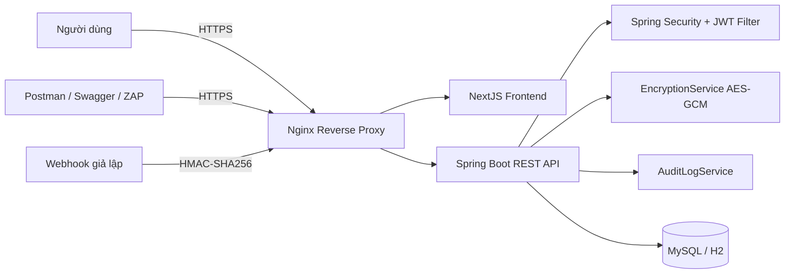

# BÁO CÁO THEO CHƯƠNG

## Tóm tắt

Đề tài “Bảo mật hệ thống RESTful API cho dịch vụ khóa học online nhỏ” được thực hiện với mục tiêu xây dựng một hệ thống đủ gọn để phù hợp phạm vi môn Mật mã ứng dụng, nhưng vẫn thể hiện rõ các kỹ thuật bảo mật cốt lõi trong môi trường API hiện đại. Hệ thống được xây dựng với backend `Spring Boot`, `Spring Security`, frontend `NextJS`, cơ sở dữ liệu `MySQL`, reverse proxy `Nginx` và đóng gói bằng `Docker Compose`.

Trọng tâm kỹ thuật của đề tài không nằm ở việc mở rộng nhiều nghiệp vụ, mà tập trung vào việc áp dụng đúng các cơ chế mật mã và bảo mật API vào các tình huống có thể kiểm thử được. Cụ thể, hệ thống sử dụng `bcrypt` để băm mật khẩu, `JWT` để xác thực request, `refresh token` để quay vòng phiên đăng nhập, `AES-GCM` để mã hóa dữ liệu nhạy cảm trong cơ sở dữ liệu, `HMAC-SHA256` để xác thực webhook thanh toán mô phỏng, `HTTPS/TLS` để bảo vệ dữ liệu khi truyền trên mạng, đồng thời bổ sung `rate limiting`, `audit log`, `RBAC` và `ownership check` để chống các rủi ro phổ biến như brute-force, BOLA/IDOR, replay attack và truy cập trái phép.

Kết quả thực nghiệm cho thấy hệ thống đáp ứng tốt các mục tiêu đề ra. Mật khẩu không được lưu dưới dạng rõ; token bị sửa payload hoặc hết hạn bị từ chối; sinh viên không thể truy cập tài nguyên của sinh viên khác; webhook sai chữ ký hoặc gửi lặp lại cùng `eventId` đều bị chặn; dữ liệu nhạy cảm trong database được lưu dưới dạng ciphertext; các hành vi bất thường được ghi nhận qua audit log; các endpoint nhạy cảm bị giới hạn tốc độ truy cập; toàn bộ hệ thống chạy ổn định qua `https://localhost` và có thể kiểm thử bằng Swagger, Postman, OWASP ZAP.

Từ kết quả trên có thể khẳng định rằng đề tài đã đạt được yêu cầu cốt lõi của môn học: hiểu đúng kỹ thuật mật mã, sử dụng đúng ngữ cảnh và chứng minh được hiệu quả bảo vệ trong một hệ thống RESTful API thu gọn nhưng vận hành được.

**Từ khóa:** Mật mã ứng dụng, RESTful API, Spring Boot, JWT, bcrypt, AES-GCM, HMAC-SHA256, HTTPS/TLS, BOLA/IDOR, audit log, rate limiting.

## Lời mở đầu

Trong bối cảnh hiện nay, phần lớn các hệ thống web hiện đại đều tách frontend và backend, giao tiếp với nhau chủ yếu qua API. Điều đó khiến RESTful API trở thành bề mặt tấn công rất quan trọng. Khi API không được bảo vệ đúng cách, kẻ tấn công có thể bỏ qua giao diện người dùng và tác động trực tiếp vào request HTTP để brute-force mật khẩu, giả mạo token, thay đổi định danh tài nguyên hoặc gọi trái phép các endpoint nhạy cảm.

Với sinh viên ngành An toàn thông tin, việc chỉ học lý thuyết về mật mã là chưa đủ. Điều quan trọng hơn là phải hiểu mỗi kỹ thuật mật mã được dùng để bảo vệ loại dữ liệu nào, đặt ở lớp nào trong hệ thống và chứng minh được hiệu quả của nó thông qua mã nguồn và thực nghiệm. Từ yêu cầu đó, nhóm lựa chọn xây dựng một hệ thống khóa học online nhỏ theo hướng bảo mật API, trong đó mọi thành phần đều được thu gọn vừa đủ để dễ cài đặt, dễ demo và dễ giải thích trước giảng viên.

Điểm đặc biệt của đề tài là không sa đà vào việc làm một sản phẩm công nghệ phần mềm hoàn chỉnh với quá nhiều nghiệp vụ. Thay vào đó, nhóm tập trung vào các nội dung có tính “Mật mã ứng dụng” rõ rệt như băm mật khẩu bằng bcrypt, mã hóa dữ liệu nhạy cảm bằng AES-GCM, xác thực webhook bằng HMAC-SHA256, xác thực request bằng JWT, bảo vệ kênh truyền bằng TLS, kiểm tra quyền sở hữu tài nguyên để chống BOLA/IDOR, giới hạn tần suất truy cập và ghi nhận audit log để hỗ trợ giám sát.

Báo cáo này được xây dựng với định hướng vừa mang tính học thuật, vừa mang tính thực hành. Ngoài phần cơ sở lý thuyết, báo cáo còn trình bày cách thiết kế hệ thống, tổ chức mã nguồn, mô hình dữ liệu, quy trình kiểm thử và các kịch bản demo tấn công/phòng thủ. Mục tiêu cuối cùng là chứng minh rằng các kỹ thuật mật mã không chỉ tồn tại ở mức khái niệm, mà có thể được tích hợp đúng cách vào một hệ thống chạy thật, có thể quan sát, đo kiểm và đánh giá.

## Chương 1. Tổng quan đề tài

### 1.1. Đặt vấn đề

Trong các hệ thống phần mềm hiện đại, RESTful API đóng vai trò là lớp giao tiếp trung tâm giữa frontend, backend, ứng dụng di động và các dịch vụ bên thứ ba. Khi API trở thành “cửa ngõ” của hệ thống, các yêu cầu về an toàn thông tin không còn là phần bổ sung mà trở thành điều kiện bắt buộc. Nếu lớp API không được thiết kế và bảo vệ đúng cách, kẻ tấn công có thể:

- Đăng nhập trái phép bằng tài khoản đánh cắp hoặc brute-force mật khẩu.
- Sửa token hoặc giả mạo thông tin trong token để leo thang đặc quyền.
- Thay đổi định danh tài nguyên trên URL để xem dữ liệu của người khác.
- Đọc được dữ liệu nhạy cảm nếu dữ liệu trong cơ sở dữ liệu bị lộ ở dạng rõ.
- Giả mạo webhook thanh toán để mở khóa tài nguyên học tập mà không thực sự trả phí.
- Gây nghẽn dịch vụ bằng cách gửi số lượng lớn request tới các endpoint nhạy cảm.

Trong bối cảnh đó, nhóm lựa chọn xây dựng một hệ thống khóa học online nhỏ theo định hướng “Mật mã ứng dụng và bảo mật API”. Trọng tâm của đề tài không phải là xây dựng một nền tảng học trực tuyến hoàn chỉnh như sản phẩm thương mại, mà là hiện thực hóa các kỹ thuật mật mã và cơ chế bảo mật có thể giải thích, kiểm thử và demo trực tiếp. Đây là hướng tiếp cận phù hợp với đặc thù của môn học, vì người học không chỉ nắm lý thuyết mà còn phải chứng minh khả năng áp dụng vào một hệ thống chạy thật.

### 1.2. Bối cảnh thực tiễn của bài toán

Hệ thống được đặt trong bối cảnh một doanh nghiệp nhỏ cung cấp các khóa học online. Do quy mô nhỏ, hệ thống không cần có đầy đủ các tính năng phức tạp như recommendation engine, livestream, thanh toán đa cổng hay phân tích dữ liệu lớn. Tuy nhiên, những thành phần cốt lõi liên quan đến bảo mật vẫn phải được bảo vệ chặt chẽ.

Các tài sản quan trọng của hệ thống gồm:

| Tài sản | Ý nghĩa | Rủi ro nếu không bảo vệ |
| --- | --- | --- |
| Tài khoản người dùng | Dùng để xác thực và phân quyền | Bị chiếm đoạt, truy cập trái phép |
| Mật khẩu | Bí mật đăng nhập | Bị lộ nếu lưu plaintext hoặc hash yếu |
| JWT access token | Chứng thực cho các request API | Bị sửa payload, giả mạo chữ ký, dùng token hết hạn |
| Refresh token | Cấp lại access token | Bị tái sử dụng nếu không hash hoặc không revoke |
| Dữ liệu cá nhân | Số điện thoại, địa chỉ thanh toán | Bị lộ nếu database rò rỉ |
| Nội dung bài học | Tài nguyên có giá trị thương mại | Người chưa mua vẫn xem được nếu thiếu kiểm soát truy cập |
| Enrollment và certificate | Chứng minh quyền học và kết quả học tập | Bị truy cập chéo giữa các sinh viên |
| Payment webhook | Tín hiệu xác nhận thanh toán | Bị giả mạo hoặc replay để mở khóa trái phép |
| Audit log | Dữ liệu giám sát an ninh | Mất dấu vết nếu hệ thống không ghi log |

Bài toán đặt ra là: làm thế nào để thiết kế một hệ thống đủ nhỏ để phù hợp đồ án sinh viên năm 2, nhưng vẫn thể hiện rõ các kỹ thuật mật mã ứng dụng và các lớp bảo vệ API theo hướng thực chiến.

### 1.3. Lý do chọn đề tài

Đề tài được lựa chọn vì ba lý do chính.

Thứ nhất, đây là đề tài bám sát định hướng môn Mật mã ứng dụng. Các cơ chế như bcrypt, AES-GCM, JWT ký HMAC-SHA, HMAC-SHA256 cho webhook, HTTPS/TLS đều là những nội dung có tính nền tảng nhưng lại thường khó hình dung nếu chỉ học lý thuyết. Khi đặt chúng vào một hệ thống cụ thể, người học sẽ thấy rõ mục đích, đầu vào, đầu ra và giới hạn của từng kỹ thuật.

Thứ hai, API Security là một chủ đề có tính thời sự và thực tiễn cao. Nhiều hệ thống hiện nay xây dựng theo kiến trúc frontend tách rời backend, các ứng dụng giao tiếp với nhau chủ yếu qua API. Điều đó khiến các lỗi như Broken Authentication, BOLA/IDOR, Excessive Data Exposure hay Security Misconfiguration trở nên phổ biến. Xây dựng một đồ án tập trung vào bảo vệ API sẽ giúp nội dung báo cáo sát với nhu cầu thực tế của ngành An toàn thông tin.

Thứ ba, đề tài phù hợp với khả năng triển khai của sinh viên năm 2. Hệ thống được giới hạn nghiệp vụ vừa đủ để dễ hoàn thành, nhưng vẫn có đủ chiều sâu để báo cáo trước giảng viên, trình bày demo tấn công/phòng thủ, kiểm thử bằng Postman và OWASP ZAP, đồng thời có thể triển khai bằng Docker.

### 1.4. Mục tiêu của đề tài

#### 1.4.1. Mục tiêu tổng quát

Xây dựng một hệ thống RESTful API cho dịch vụ khóa học online nhỏ và tích hợp các kỹ thuật mật mã ứng dụng, trong đó nhấn mạnh việc bảo vệ xác thực, bảo vệ dữ liệu nhạy cảm, bảo vệ quyền truy cập tài nguyên, bảo vệ webhook, bảo vệ đường truyền và hỗ trợ kiểm thử bảo mật.

#### 1.4.2. Mục tiêu cụ thể

Các mục tiêu cụ thể của đề tài gồm:

- Xây dựng backend bằng `Spring Boot` và `Spring Security`.
- Xây dựng frontend tối giản bằng `NextJS` để phục vụ trình diễn.
- Sử dụng `JWT` làm access token theo mô hình `Authorization: Bearer <token>`.
- Cung cấp `refresh token`, lưu trong database dưới dạng hash để giảm rủi ro lộ token.
- Bổ sung luồng quên mật khẩu và đặt lại mật khẩu để hoàn thiện vòng đời xác thực tài khoản.
- Băm mật khẩu bằng `BCryptPasswordEncoder`, không lưu plaintext password.
- Mã hóa dữ liệu nhạy cảm bằng `AES-GCM`.
- Xác thực webhook thanh toán giả lập bằng `HMAC-SHA256`.
- Tổ chức quyền tối giản, tập trung vào hai vai trò demo chính là `STUDENT` và `ADMIN`.
- Chặn `BOLA/IDOR` bằng kiểm tra ownership ở phía backend.
- Giới hạn tần suất truy cập với các endpoint nhạy cảm để chống brute-force và spam.
- Ghi `audit log` cho các sự kiện bảo mật quan trọng.
- Cấu hình `HTTPS/TLS` cục bộ qua `Nginx`.
- Tích hợp `Swagger/OpenAPI`, `Postman`, `OWASP ZAP` để kiểm thử.
- Dockerize hệ thống để chạy được trên môi trường local nhất quán.

### 1.5. Câu hỏi nghiên cứu và định hướng giải quyết

Đề tài tập trung trả lời các câu hỏi sau:

1. Làm thế nào để sử dụng JWT trong RESTful API sao cho token bị sửa payload hoặc sai chữ ký sẽ bị từ chối?
2. Làm thế nào để lưu mật khẩu người dùng an toàn bằng cơ chế băm một chiều thay vì mã hóa?
3. Làm thế nào để bảo vệ dữ liệu nhạy cảm trong cơ sở dữ liệu ngay cả khi tầng lưu trữ bị lộ?
4. Làm thế nào để phân biệt rõ xác thực, phân quyền theo vai trò và kiểm tra quyền sở hữu tài nguyên?
5. Làm thế nào để chứng minh hệ thống đã xử lý được các lỗi phổ biến trong OWASP API Security Top 10?
6. Làm thế nào để tạo ra một kịch bản webhook có tính mật mã học rõ ràng, có thể demo chữ ký, timestamp và chống replay attack?

Định hướng giải quyết của nhóm là không dàn trải quá nhiều nghiệp vụ, mà ưu tiên làm rõ từng lớp bảo vệ bằng mã nguồn đơn giản, dễ đọc, dễ demo và dễ giải thích.

### 1.6. Đối tượng và phạm vi nghiên cứu

#### 1.6.1. Đối tượng nghiên cứu

Đối tượng nghiên cứu của đề tài là các cơ chế bảo mật trong hệ thống API web hiện đại, đặc biệt là:

- Cơ chế xác thực bằng token.
- Cơ chế phân quyền và kiểm soát truy cập tài nguyên.
- Kỹ thuật băm mật khẩu.
- Kỹ thuật mã hóa đối xứng dữ liệu khi lưu trữ.
- Kỹ thuật xác thực thông điệp bằng HMAC.
- Kiểm thử bảo mật cho API.

#### 1.6.2. Phạm vi triển khai

| Nội dung | Trong phạm vi | Ngoài phạm vi |
| --- | --- | --- |
| Xác thực người dùng | Đăng ký, đăng nhập, access token, refresh token, logout | Social login, SSO, OAuth2 với Google/Facebook |
| Nghiệp vụ khóa học | Danh sách khóa học, chi tiết khóa học, lesson, enrollment, certificate | LMS đầy đủ, video streaming, bài tập nâng cao |
| Bảo mật dữ liệu | bcrypt, AES-GCM, HMAC-SHA256, TLS | KMS, HSM, key rotation production-grade |
| Kiểm thử | Swagger, Postman, OWASP ZAP, integration test | Pentest chuyên sâu, bug bounty, red team |
| Triển khai | Docker Compose local, Nginx HTTPS | Kubernetes, CI/CD production, auto scaling |

Phạm vi trên được lựa chọn để đảm bảo cân bằng giữa chiều sâu kỹ thuật và khả năng hoàn thành đồ án trong phạm vi môn học.

### 1.7. Phương pháp thực hiện

Đề tài được triển khai theo phương pháp kết hợp giữa nghiên cứu lý thuyết và thực nghiệm hệ thống.

#### 1.7.1. Nghiên cứu lý thuyết

Nhóm nghiên cứu các nội dung nền tảng gồm:

- RESTful API và các phương thức HTTP.
- JWT, Bearer Token, refresh token.
- bcrypt và nguyên tắc băm mật khẩu.
- AES-GCM và tính bảo mật kèm toàn vẹn.
- HMAC-SHA256 cho xác thực webhook.
- HTTPS/TLS và reverse proxy.
- OWASP API Security Top 10.

#### 1.7.2. Khảo sát source code hiện có

Sau khi kiểm tra toàn bộ source code ban đầu, nhóm ghi nhận:

- Backend nằm tại thư mục `backend/`.
- Frontend nằm tại thư mục `frontend/`.
- Dự án đã có nền tảng `Spring Security`, `JWT`, `bcrypt`, `AES`.
- Source code ban đầu vẫn còn mang tính generic, chưa bám sát domain khóa học online.
- Thiếu các module cần thiết cho mục tiêu đồ án như `Course`, `Lesson`, `Enrollment`, `Certificate`, webhook HMAC và tài liệu demo theo hướng Mật mã ứng dụng.

Từ kết quả khảo sát này, nhóm quyết định giữ lại hạ tầng kỹ thuật phù hợp, đồng thời refactor domain và bổ sung các thành phần bảo mật còn thiếu.

#### 1.7.3. Thiết kế và hiện thực

Sau khi xác định yêu cầu, nhóm tiến hành:

- Thiết kế lại domain theo mô hình khóa học online tối giản.
- Viết entity, repository, service, controller cho các module mới.
- Tích hợp các cơ chế mật mã vào luồng nghiệp vụ thật.
- Tổ chức tài liệu, script demo và kịch bản kiểm thử.

#### 1.7.4. Kiểm thử và đánh giá

Hệ thống được đánh giá bằng nhiều lớp:

- Test backend bằng Maven.
- Kiểm thử thủ công bằng Swagger.
- Kiểm thử tình huống bằng Postman.
- Chạy script demo tự động.
- Quét baseline bằng OWASP ZAP.

### 1.8. Công cụ và môi trường sử dụng

| Thành phần | Công nghệ sử dụng | Vai trò |
| --- | --- | --- |
| Backend | Java, Spring Boot, Spring Security | Xây dựng REST API và xử lý bảo mật |
| Frontend | NextJS | Giao diện demo luồng bảo mật |
| Database | MySQL, H2 | Lưu trữ dữ liệu hệ thống và test local |
| API Docs | Springdoc OpenAPI / Swagger UI | Tài liệu và thử nghiệm API |
| Reverse proxy | Nginx | TLS termination, HTTP to HTTPS redirect |
| Kiểm thử | Postman, OWASP ZAP | Kiểm thử thủ công và quét bảo mật |
| Triển khai | Docker, Docker Compose | Chạy đồng bộ toàn stack |
| Hệ điều hành thực nghiệm | Windows + Docker Desktop | Môi trường demo local |

### 1.9. Kết quả mong đợi của đề tài

Sau khi hoàn thành, hệ thống cần đạt các kết quả sau:

- Chạy được frontend và backend qua `https://localhost`.
- Người dùng có thể đăng ký, đăng nhập, làm mới token, đăng xuất, quên mật khẩu và đặt lại mật khẩu.
- Password lưu trong database ở dạng bcrypt hash.
- Các trường nhạy cảm lưu ở dạng ciphertext AES-GCM.
- Sinh viên không thể xem dữ liệu của sinh viên khác bằng cách sửa ID trên URL.
- Webhook thanh toán chỉ được chấp nhận khi HMAC hợp lệ.
- Hệ thống có audit log và rate limiting.
- Swagger có thể test API protected bằng Bearer JWT.
- Có tài liệu phục vụ báo cáo, Postman và OWASP ZAP.

### 1.10. Ý nghĩa khoa học và thực tiễn

Về mặt khoa học, đề tài thể hiện được sự khác nhau giữa các cơ chế mật mã:

- `bcrypt` dùng cho băm mật khẩu một chiều.
- `AES-GCM` dùng cho mã hóa dữ liệu cần giải mã lại.
- `HMAC-SHA256` dùng cho xác thực và kiểm tra toàn vẹn thông điệp.
- `JWT` dùng để đóng gói claims và xác minh bằng chữ ký số đối xứng.

Về mặt thực tiễn, đề tài có thể được dùng như một mô hình mẫu cho các hệ thống API quy mô nhỏ cần:

- Bảo vệ xác thực người dùng.
- Bảo vệ dữ liệu cá nhân.
- Bảo vệ tài nguyên số có giá trị.
- Ghi nhận và giám sát hành vi bất thường.

### 1.11. Bố cục báo cáo

Báo cáo được tổ chức thành năm chương:

- Chương 1 trình bày tổng quan đề tài, bối cảnh, mục tiêu, phạm vi và phương pháp thực hiện.
- Chương 2 trình bày cơ sở lý thuyết và các công nghệ bảo mật làm nền tảng cho đề tài.
- Chương 3 trình bày quá trình phân tích, thiết kế, hiện thực và kiểm thử hệ thống.
- Chương 4 trình bày quá trình thực nghiệm, demo tấn công/phòng thủ và đánh giá mức độ đáp ứng các tiêu chí bảo mật.
- Chương 5 tổng kết kết quả đạt được, nêu hạn chế, hướng phát triển và kết luận chung của đề tài.

### 1.12. Kết luận chương

Chương 1 đã nêu rõ bối cảnh, lý do chọn đề tài, tài sản cần bảo vệ, các mục tiêu bảo mật và định hướng triển khai. Từ nền tảng này, báo cáo chuyển sang Chương 2 để trình bày những cơ sở lý thuyết cần thiết trước khi đi vào phần thiết kế và cài đặt hệ thống.

## Chương 2. Cơ sở lý thuyết và công nghệ sử dụng

### 2.1. Một số khái niệm nền tảng trong an toàn thông tin

Khi bảo vệ một hệ thống API, cần xuất phát từ ba thuộc tính cơ bản của an toàn thông tin:

- **Tính bí mật**: dữ liệu chỉ được xem bởi đối tượng hợp lệ.
- **Tính toàn vẹn**: dữ liệu không bị sửa đổi trái phép.
- **Tính sẵn sàng**: hệ thống duy trì khả năng phục vụ hợp lệ.

Đề tài này đồng thời cũng gắn với mô hình `AAA` trong bảo mật:

- `Authentication`: xác thực người dùng.
- `Authorization`: phân quyền truy cập.
- `Accounting/Auditing`: ghi nhận và giám sát hành động.

Mỗi kỹ thuật được dùng trong đồ án sẽ phục vụ một hoặc nhiều mục tiêu ở trên.

### 2.2. Phân biệt các cơ chế mật mã sử dụng trong đề tài

Để tránh nhầm lẫn giữa băm, mã hóa và xác thực thông điệp, Bảng 2.1 tóm tắt vai trò của từng cơ chế.

| Cơ chế | Bản chất | Có giải mã ngược không | Mục đích trong đề tài |
| --- | --- | --- | --- |
| bcrypt | Băm một chiều có salt | Không | Lưu mật khẩu |
| AES-GCM | Mã hóa đối xứng | Có | Bảo vệ dữ liệu nhạy cảm trong database |
| HMAC-SHA256 | Mã xác thực thông điệp | Không phải cơ chế giải mã | Xác thực webhook và kiểm tra toàn vẹn |
| JWT ký HMAC | Token có chữ ký | Không mã hóa payload | Xác thực request API |

Điểm quan trọng là không sử dụng sai mục đích:

- Không dùng AES để “mã hóa mật khẩu”.
- Không dùng bcrypt để lưu dữ liệu cần đọc lại.
- Không coi JWT là dữ liệu bí mật tuyệt đối vì payload có thể được giải mã base64.

### 2.3. Tổng quan về RESTful API

RESTful API là phong cách thiết kế dịch vụ web trong đó tài nguyên được biểu diễn qua URL và thao tác bằng HTTP method. Một số đặc điểm chính:

- `GET`: đọc tài nguyên.
- `POST`: tạo tài nguyên hoặc kích hoạt hành động.
- `PUT`: cập nhật tài nguyên.
- `DELETE`: xóa tài nguyên.

Ưu điểm của RESTful API là:

- Đơn giản, dễ tích hợp.
- Phù hợp với frontend web, mobile và bên thứ ba.
- Dễ mô tả, tài liệu hóa và kiểm thử.

Tuy nhiên, chính vì API mở ra bề mặt giao tiếp trực tiếp nên đây cũng là bề mặt tấn công phổ biến. Trong nhiều trường hợp, kẻ tấn công không cần truy cập giao diện người dùng mà có thể trực tiếp sửa request HTTP để thử token, đổi ID tài nguyên hoặc gửi lượng lớn request bất thường.

### 2.4. Xác thực và phân quyền trong hệ thống API

Trong một hệ thống API, cần phân biệt rõ:

- **Xác thực**: người dùng là ai?
- **Phân quyền**: người dùng được phép làm gì?
- **Kiểm tra ownership**: người dùng có quyền với đúng đối tượng dữ liệu đó không?

Ví dụ:

- Một request có JWT hợp lệ nghĩa là người dùng đã được xác thực.
- Tuy nhiên, cùng là người dùng đã xác thực, `STUDENT` không thể xem `audit log`.
- Ngay cả khi đều là `STUDENT`, sinh viên A cũng không được xem certificate của sinh viên B.

Đây là điểm rất quan trọng trong đề tài, vì nhiều hệ thống sai ở chỗ dừng lại ở mức “đã đăng nhập” mà không kiểm tra ownership ở phía server.

### 2.5. JWT và Bearer Token

#### 2.5.1. Cấu trúc JWT

JWT gồm ba phần:

1. `Header`
2. `Payload`
3. `Signature`

Hai phần đầu thường được mã hóa `Base64Url`, còn phần thứ ba là chữ ký dùng secret key. Trong đồ án, access token chứa các claim quan trọng:

- `sub`: mã người dùng.
- `email`: email người dùng.
- `role`: vai trò.
- `scope`: tập quyền.
- `token_type`: loại token.
- `iat`: thời điểm phát hành.
- `exp`: thời điểm hết hạn.

#### 2.5.2. Vai trò của Bearer Token

Sau khi đăng nhập thành công, client nhận được access token và gửi trong header:

```http
Authorization: Bearer <access_token>
```

Backend sẽ đọc token, kiểm tra chữ ký, kiểm tra thời hạn, kiểm tra role và sau đó gắn danh tính người dùng vào security context.

#### 2.5.3. Các rủi ro cần kiểm soát

JWT chỉ an toàn khi backend thực hiện đầy đủ các bước kiểm tra:

- Từ chối token sai định dạng.
- Từ chối token không có chữ ký hợp lệ.
- Từ chối token hết hạn.
- Từ chối token thiếu claim bắt buộc.
- Từ chối token có `token_type` không đúng.

Trong dự án này, secret ký JWT không được hard-code mà lấy từ biến môi trường `JWT_SECRET`. Access token có thời gian sống ngắn mặc định `15 phút`, còn refresh token mặc định `7 ngày`.

#### 2.5.4. Refresh token

Refresh token trong dự án được sinh ngẫu nhiên, trả về cho client nhưng lưu trong database ở dạng `SHA-256 hash`. Cách làm này giúp:

- Không lưu token gốc trong database.
- Có thể revoke token khi logout hoặc khi cấp token mới.
- Giảm rủi ro nếu bảng `refresh_tokens` bị truy cập trái phép.

### 2.6. Băm mật khẩu bằng bcrypt

bcrypt là thuật toán băm một chiều được thiết kế cho mật khẩu. Khác với các hàm băm nhanh như SHA-256, bcrypt có cơ chế salt và cost factor để làm chậm quá trình bẻ khóa.

Các đặc điểm chính của bcrypt:

- Là băm một chiều, không thể “giải mã”.
- Tự sinh salt cho từng mật khẩu.
- Kết quả cùng một mật khẩu ở hai lần băm có thể khác nhau.
- Thích hợp để chống brute-force và rainbow table tốt hơn so với băm nhanh.

Trong dự án:

- Khi đăng ký, backend gọi `passwordEncoder.encode(rawPassword)`.
- Khi đăng nhập, backend gọi `passwordEncoder.matches(rawPassword, passwordHash)`.
- API response không bao giờ trả về `passwordHash`.
- Log hệ thống không in ra mật khẩu gốc.

### 2.7. Mã hóa dữ liệu nhạy cảm bằng AES-GCM

#### 2.7.1. Vì sao cần mã hóa dữ liệu lưu trữ

Không phải dữ liệu nào cũng phù hợp để băm. Với những trường cần hiển thị lại cho người dùng hợp lệ, hệ thống phải có khả năng giải mã. Ví dụ:

- `phoneNumber`
- `billingAddress`
- `paymentReference`
- `certificateCode`

Nếu lưu những trường này ở dạng plaintext, khi database bị lộ, dữ liệu cá nhân và dữ liệu nghiệp vụ cũng bị lộ trực tiếp.

#### 2.7.2. Đặc điểm của AES-GCM

AES-GCM là chế độ mã hóa đối xứng có xác thực, mang lại hai thuộc tính cùng lúc:

- Mã hóa để đảm bảo tính bí mật.
- Authentication tag để phát hiện dữ liệu bị chỉnh sửa.

Trong dự án, `EncryptionService`:

- Dẫn xuất khóa từ biến môi trường `ENCRYPTION_KEY` bằng `SHA-256`.
- Sinh `IV` ngẫu nhiên với kích thước `12 byte`.
- Dùng `tag` dài `16 byte`.
- Lưu kết quả theo định dạng:

```text
Base64(iv):Base64(ciphertext):Base64(tag)
```

#### 2.7.3. AAD trong AES-GCM

Một điểm quan trọng của dự án là ngoài ciphertext, hệ thống còn gắn `AAD` (Additional Authenticated Data) theo ngữ cảnh:

```text
contextType | contextReference | fieldName
```

Ví dụ:

- `user | email | phoneNumber`
- `enrollment | studentId|courseId | paymentReference`
- `certificate | studentId|courseId | certificateCode`

Cách làm này giúp ràng buộc dữ liệu với đúng ngữ cảnh nghiệp vụ. Nếu một ciphertext bị tráo sang bản ghi khác hoặc đổi field, quá trình giải mã sẽ thất bại.

### 2.8. HMAC-SHA256

HMAC là cơ chế xác thực thông điệp sử dụng secret key kết hợp với hàm băm mật mã. Trong đề tài, HMAC-SHA256 được dùng để xác thực webhook thanh toán giả lập.

Webhook được ký theo công thức:

```text
signature = HMAC_SHA256(eventId + "." + timestamp + "." + rawBody, secret)
```

Ý nghĩa:

- `eventId`: định danh duy nhất của sự kiện.
- `timestamp`: chống phát lại request cũ quá lâu.
- `rawBody`: đảm bảo nội dung webhook không bị sửa sau khi ký.

Ưu điểm của HMAC:

- Bên nhận không cần lưu toàn bộ bản gốc để kiểm tra.
- Phát hiện được việc sửa đổi message.
- Dễ triển khai cho callback giữa hai hệ thống.

### 2.9. HTTPS/TLS

HTTPS là HTTP chạy trên TLS. Trong đề tài, TLS được dùng để bảo vệ:

- Thông tin đăng nhập khi người dùng gửi email và mật khẩu.
- JWT access token khi frontend gọi API.
- Dữ liệu nhạy cảm trao đổi giữa các thành phần của hệ thống.

Nginx được dùng làm reverse proxy để:

- Lắng nghe cổng `80` và `443`.
- Chuyển toàn bộ HTTP sang HTTPS bằng `301`.
- Phục vụ frontend và proxy request API tới backend.
- Thêm một số security header cơ bản như:
  - `Strict-Transport-Security`
  - `Content-Security-Policy`
  - `X-Content-Type-Options`
  - `X-Frame-Options`
  - `Referrer-Policy`
  - `Permissions-Policy`

### 2.10. RBAC, ownership check và chống BOLA/IDOR

RBAC là mô hình phân quyền theo vai trò. Tuy nhiên, chỉ dùng RBAC là chưa đủ đối với các tài nguyên cá nhân. Đề tài kết hợp hai lớp:

- **Role-based access control**: giới hạn theo vai trò.
- **Ownership check**: giới hạn theo quyền sở hữu tài nguyên.

Ví dụ:

- `ADMIN` được xem audit log.
- `STUDENT` chỉ được xem enrollment, certificate và profile của chính mình.
- Hệ thống chỉ trình diễn hai vai trò chính là `STUDENT` và `ADMIN` để giữ đúng trọng tâm mật mã ứng dụng và bảo mật API.

Lỗi BOLA/IDOR xảy ra khi backend chỉ dựa vào ID trên URL mà không kiểm tra ID đó có thuộc về người dùng hiện tại hay không. Đây là một trong những nội dung được nhấn mạnh nhất trong dự án.

### 2.11. Excessive Data Exposure và DTO response

Một API có thể xác thực đúng nhưng vẫn không an toàn nếu trả ra quá nhiều thông tin. Ví dụ:

- Trả cả `passwordHash`.
- Trả trực tiếp ciphertext nội bộ.
- Trả các field chỉ dành cho admin.

Để tránh lỗi này, hệ thống sử dụng `DTO` cho response. Ví dụ:

- `UserResponse` chỉ chứa `id`, `fullName`, `email`, `role`, `phoneNumber`, `billingAddress`, `createdAt`.
- `CourseDetailResponse` chỉ trả thông tin cần thiết của khóa học và preview lesson.
- `LessonDetailResponse` chỉ trả `content` khi người dùng đủ quyền.

### 2.12. Rate limiting và audit logging

#### 2.12.1. Rate limiting

Rate limiting là cơ chế giới hạn số lượng request trong một khoảng thời gian. Trong đề tài, rate limit được áp dụng cho:

- `POST /api/auth/login`
- `POST /api/auth/register`
- `POST /api/webhooks/payment-success`
- `GET /api/admin/**`

Mục tiêu là:

- Giảm brute-force mật khẩu.
- Giảm spam đăng ký.
- Giảm flood webhook.
- Giảm việc lạm dụng API quản trị.

#### 2.12.2. Audit log

Audit log là lớp ghi nhận các hành vi quan trọng phục vụ giám sát và truy vết. Dự án ghi log cho:

- Đăng ký thành công.
- Đăng nhập thành công.
- Đăng nhập thất bại.
- Token bị từ chối.
- Truy cập bị chặn `403`.
- Webhook hợp lệ hoặc không hợp lệ.
- Replay webhook.
- Vượt ngưỡng rate limit.
- Admin xem audit log.

### 2.13. Swagger/OpenAPI

Swagger/OpenAPI là công cụ tài liệu hóa và kiểm thử API rất phù hợp với đồ án. Hệ thống hiện tại:

- Công bố Swagger UI tại `https://localhost/swagger-ui.html`.
- Công bố OpenAPI JSON tại `https://localhost/v3/api-docs`.
- Hỗ trợ nhập `Bearer JWT`.
- Giúp giảng viên và người kiểm thử dễ quan sát endpoint, request, response, status code.

### 2.14. OWASP API Security Top 10

OWASP API Security Top 10 là bộ tham chiếu quan trọng để đánh giá an toàn cho API. Dự án tập trung vào các nhóm lỗi dễ trình bày và sát với bài toán:

| Nhóm lỗi | Ý nghĩa | Biện pháp xử lý trong dự án |
| --- | --- | --- |
| API1: BOLA | Đổi ID tài nguyên để xem dữ liệu người khác | Ownership check cho profile, enrollment, certificate, lesson |
| API2: Broken Authentication | Token sai, token hết hạn, mật khẩu yếu | JWT validation, bcrypt, refresh token hash, revoke |
| API3: Excessive Data Exposure | Trả dư field nhạy cảm | DTO response, không trả password hash/ciphertext |
| API4: Unrestricted Resource Consumption | Spam request gây quá tải | Rate limiting và trả `429` |
| API8: Security Misconfiguration | Cấu hình sai, lộ stack trace, CORS mở quá mức | CORS rõ ràng, TLS, ẩn stack trace, không hard-code secret |

### 2.15. Docker và triển khai đóng gói

Docker giúp dự án tránh tình trạng “chạy được trên máy em nhưng không chạy được trên máy khác”. Nhờ Docker Compose, toàn bộ stack gồm:

- `frontend`
- `backend`
- `database`
- `nginx`

được khởi động theo một cấu hình nhất quán. Điều này rất hữu ích cho đồ án vì:

- Dễ chạy demo trên máy khác.
- Dễ chụp minh chứng.
- Dễ giữ nguyên môi trường khi kiểm thử.

### 2.16. Kết luận chương

Chương 2 đã trình bày nền tảng lý thuyết cho toàn bộ đồ án, từ RESTful API, JWT, bcrypt, AES-GCM, HMAC-SHA256, RBAC, BOLA/IDOR cho tới rate limiting, audit log, TLS, Swagger và Docker. Đây là cơ sở để bước sang Chương 3, nơi các kỹ thuật này được gắn vào kiến trúc và mã nguồn cụ thể của hệ thống.

## Chương 3. Phân tích, thiết kế và triển khai hệ thống

### 3.1. Khảo sát source code và định hướng cải tiến

Sau khi đọc toàn bộ source code hiện có, nhóm xác định:

- Backend nằm trong thư mục `backend/`.
- Frontend nằm trong thư mục `frontend/`.
- Dự án đã có một số nền tảng về xác thực và bảo mật như `Spring Security`, `JWT`, `bcrypt`, `AES`.
- Domain cũ chưa tập trung đúng vào bài toán “khóa học online và bảo mật API”.
- Tài liệu báo cáo, tài liệu demo và một số file phụ trợ chưa đồng nhất, còn rải rác theo nhiều hướng khác nhau.

Bảng 3.1 trình bày tóm tắt kết quả khảo sát và hướng xử lý.

| Nội dung khảo sát | Thực trạng ban đầu | Hướng xử lý |
| --- | --- | --- |
| Kiến trúc backend/frontend | Đã tách rõ ràng | Giữ nguyên cấu trúc thư mục |
| Security framework | Có Spring Security và JWT | Kế thừa, chuẩn hóa lại theo domain mới |
| Password hashing | Đã có nền tảng bcrypt | Chuẩn hóa register/login |
| Encryption | Đã có service mã hóa | Mở rộng cho user, enrollment, certificate |
| Domain nghiệp vụ | Chưa bám bài toán khóa học online | Refactor sang Course, Lesson, Enrollment, Certificate |
| Webhook | Chưa thể hiện rõ tính mật mã học | Bổ sung webhook HMAC-SHA256 |
| Demo security | Chưa đủ kịch bản | Bổ sung docs, script, Postman, ZAP |
| Triển khai local | Đã có Docker | Chuẩn hóa về `https://localhost` qua Nginx |

### 3.2. Mô tả bài toán nghiệp vụ

Hệ thống mô phỏng một dịch vụ khóa học online nhỏ. Các tác nhân chính gồm:

- `STUDENT`: đăng ký, đăng nhập, xem khóa học, checkout, xem bài học đã mở khóa, xem certificate của chính mình.
- `ADMIN`: duyệt ghi danh học viên, quản lý học viên theo khóa học và xem audit log.
- Các khóa học mẫu được gắn với tài khoản quản trị nội bộ để cắt bỏ phần nghiệp vụ quản lý giảng viên không cần thiết.
- `Payment Gateway (giả lập)`: gửi webhook xác nhận thanh toán thành công.

Mục tiêu của hệ thống không phải làm nghiệp vụ nhiều, mà là tạo ra các điểm minh họa rõ ràng cho các cơ chế:

- Xác thực bằng JWT.
- Phân quyền role-based.
- Kiểm tra ownership.
- Mã hóa dữ liệu khi lưu trữ.
- Xác thực webhook bằng HMAC.

### 3.3. Yêu cầu hệ thống

#### 3.3.1. Yêu cầu chức năng

Hệ thống cần đáp ứng các nhóm chức năng sau:

**Nhóm Auth**

- Đăng ký tài khoản sinh viên.
- Đăng nhập.
- Lấy thông tin người dùng hiện tại.
- Làm mới access token bằng refresh token.
- Đăng xuất và revoke refresh token.

**Nhóm Course**

- Xem danh sách khóa học công khai.
- Xem chi tiết khóa học.

**Nhóm Lesson**

- Xem bài học cụ thể trong một khóa học.
- Chỉ sinh viên đã enroll mới xem được nội dung đầy đủ.

**Nhóm Enrollment**

- Checkout khóa học.
- Xem enrollment của chính mình.
- Xem chi tiết một enrollment.

**Nhóm Certificate**

- Xem danh sách certificate của chính mình.
- Xem một certificate cụ thể.

**Nhóm Admin**

- Xem danh sách khóa học để kiểm duyệt.
- Duyệt công khai hoặc ẩn khóa học.
- Xem audit log.

**Nhóm System**

- Health check.
- Webhook thanh toán.

#### 3.3.2. Yêu cầu phi chức năng

- Giao diện đủ rõ để demo, không yêu cầu đẹp.
- Mã nguồn dễ đọc, dễ giải thích với giảng viên.
- Secret không hard-code trong source code.
- Hỗ trợ chạy bằng Docker Compose.
- Hỗ trợ test bằng Swagger, Postman, ZAP.

#### 3.3.3. Yêu cầu bảo mật

- Mật khẩu phải được bcrypt hash.
- Access token phải là JWT có kiểm tra chữ ký và thời hạn.
- Dữ liệu nhạy cảm phải được AES-GCM mã hóa.
- Webhook phải kiểm tra HMAC, timestamp và replay.
- BOLA/IDOR phải bị chặn bằng `403`.
- Có audit log cho các sự kiện an ninh.
- Có rate limiting cho endpoint nhạy cảm.
- Có HTTPS/TLS.

### 3.4. Thiết kế tác nhân và use case

#### 3.4.1. Tác nhân

| Tác nhân | Vai trò |
| --- | --- |
| Student | Học viên sử dụng hệ thống để đăng ký, mua khóa học, xem bài học và chứng chỉ |
| Admin | Quản trị hệ thống, duyệt ghi danh học viên, quản lý học viên theo khóa học và xem dữ liệu giám sát an ninh |
| Payment Gateway giả lập | Gửi webhook xác nhận thanh toán |

#### 3.4.2. Use case chính

| Use case | Student | Admin | Gateway |
| --- | --- | --- | --- |
| Đăng ký tài khoản | Có | Không | Không |
| Đăng nhập | Có | Có | Không |
| Xem khóa học public | Có | Có | Không |
| Checkout khóa học | Có | Không | Không |
| Xem lesson đã mở khóa | Có | Không | Không |
| Xem certificate của mình | Có | Không | Không |
| Duyệt yêu cầu ghi danh | Không | Có | Không |
| Thêm hoặc xóa học viên khỏi khóa học | Không | Có | Không |
| Xem audit log | Không | Có | Không |
| Gửi webhook thanh toán | Không | Không | Có |

### 3.5. Kiến trúc tổng thể của hệ thống

Hệ thống được triển khai theo mô hình nhiều lớp. Kiến trúc tổng quát như sau:



#### 3.5.1. Frontend NextJS

Frontend cung cấp các màn hình:

- Đăng nhập.
- Đăng ký.
- Danh sách khóa học.
- Chi tiết khóa học.
- Hồ sơ người dùng.
- Khu vực admin duyệt khóa học.
- Khu vực admin xem audit log.

Frontend chỉ đóng vai trò minh họa luồng sử dụng, còn các kiểm tra bảo mật bắt buộc được đặt ở backend.

#### 3.5.2. Backend Spring Boot

Backend tổ chức theo mô hình quen thuộc:

- `controller`: nhận request và trả response.
- `service`: xử lý nghiệp vụ.
- `repository`: truy cập dữ liệu.
- `entity`: ánh xạ bảng dữ liệu.
- `security/config`: cấu hình JWT, security filter chain, CORS, Swagger.

#### 3.5.3. Reverse proxy Nginx

Nginx lắng nghe:

- `80`: chuyển sang HTTPS bằng `301`.
- `443`: phục vụ TLS cho toàn hệ thống.

Nginx proxy:

- `/` sang frontend.
- `/api/*` sang backend.
- cùng cổng `443`, nhưng chỉ cho `/swagger-ui/*` và `/v3/api-docs/*` phản hồi khi truy cập bằng hostname local như `localhost`, `127.0.0.1` hoặc `host.docker.internal`.

### 3.6. Thiết kế phân quyền và scope

Phiên bản rút gọn của đồ án tập trung hai vai trò demo chính là `STUDENT` và `ADMIN`. Các khóa học mẫu được gắn với tài khoản quản trị nội bộ để tránh làm hệ thống mang dáng dấp của một nền tảng đào tạo hoàn chỉnh.

#### 3.6.1. Role và phạm vi quyền

| Role | Quyền chính |
| --- | --- |
| STUDENT | `course:read`, `lesson:read`, `enrollment:read`, `certificate:read`, `profile:read`, `checkout:create` |
| ADMIN | `course:read`, `course:moderate`, `admin:read`, `audit:read` |

#### 3.6.2. Kiểm tra ở SecurityConfig

Tại lớp cấu hình bảo mật:

- `GET /api/courses` và `GET /api/courses/{id}` được mở public.
- `POST /api/auth/register`, `POST /api/auth/login`, `POST /api/auth/refresh` được phép truy cập công khai.
- `POST /api/webhooks/payment-success` được mở nhưng có xác thực HMAC riêng.
- `POST /api/courses/{courseId}/checkout` chỉ dành cho `STUDENT`.
- `GET /api/users/{userId}/profile`, `GET /api/enrollments/{enrollmentId}`, `GET /api/certificates/{certificateId}` và `GET /api/courses/{courseId}/lessons/{lessonId}` chỉ dành cho `STUDENT`.
- `/api/admin/**` chỉ dành cho `ADMIN`.

#### 3.6.3. Kiểm tra ownership ở AuthorizationService

Ngoài role, hệ thống còn kiểm tra ownership cho:

- `profile`
- `enrollment`
- `certificate`
- `lesson`

Nếu không đủ quyền, service sẽ:

- Ghi `ACCESS_DENIED` vào audit log.
- Trả `403 Forbidden`.

### 3.7. Thiết kế cơ sở dữ liệu

Các bảng chính của hệ thống gồm:

- `users`
- `courses`
- `lessons`
- `enrollments`
- `certificates`
- `refresh_tokens`
- `webhook_events`
- `audit_logs`

#### 3.7.1. Bảng users

Lưu thông tin tài khoản người dùng:

- `id`
- `full_name`
- `email`
- `password_hash`
- `role`
- `phone_number_encrypted`
- `billing_address_encrypted`
- `created_at`
- `updated_at`

Điểm cần chú ý:

- `email` là duy nhất.
- `password_hash` lưu bcrypt hash.
- `phone_number_encrypted` và `billing_address_encrypted` lưu ciphertext AES-GCM.

#### 3.7.2. Bảng courses

Lưu thông tin khóa học:

- `title`
- `summary`
- `description`
- `price`
- `published`
- `instructor_id`

#### 3.7.3. Bảng lessons

Lưu từng bài học:

- `course_id`
- `title`
- `preview_text`
- `content`
- `sort_order`

`preview_text` được dùng để hiển thị cho người chưa có quyền truy cập toàn phần.

#### 3.7.4. Bảng enrollments

Lưu quan hệ sinh viên và khóa học:

- `student_id`
- `course_id`
- `status`
- `payment_reference_encrypted`
- `created_at`
- `activated_at`

Ràng buộc `uk_enrollments_student_course` đảm bảo một sinh viên không enroll trùng cùng một khóa học.

#### 3.7.5. Bảng certificates

Lưu thông tin chứng chỉ:

- `student_id`
- `course_id`
- `enrollment_id`
- `certificate_code_encrypted`
- `score`
- `issued_at`

#### 3.7.6. Bảng refresh_tokens

Lưu refresh token ở dạng hash:

- `user_id`
- `token_hash`
- `expires_at`
- `revoked_at`
- `created_at`

#### 3.7.7. Bảng webhook_events

Lưu dấu vết webhook đã xử lý:

- `event_id`
- `event_type`
- `status`
- `message`
- `created_at`

Ràng buộc `uk_webhook_events_event_id` giúp chống replay attack.

#### 3.7.8. Bảng audit_logs

Lưu lịch sử sự kiện an ninh:

- `actor_user_id`
- `actor_email`
- `action`
- `target_type`
- `target_id`
- `ip_address`
- `user_agent`
- `status`
- `message`
- `created_at`

### 3.8. Thiết kế nhóm API chính

#### 3.8.1. Nhóm Auth API

| Method | Endpoint | Mục đích | Quyền |
| --- | --- | --- | --- |
| POST | `/api/auth/register` | Đăng ký tài khoản student | Public |
| POST | `/api/auth/login` | Đăng nhập | Public |
| POST | `/api/auth/refresh` | Đổi refresh token lấy access token mới | Public |
| POST | `/api/auth/forgot-password` | Yêu cầu cấp token đặt lại mật khẩu | Public |
| POST | `/api/auth/reset-password` | Đặt lại mật khẩu bằng reset token hợp lệ | Public |
| POST | `/api/auth/logout` | Revoke refresh token | Đã đăng nhập |
| GET | `/api/auth/me` | Xem hồ sơ hiện tại | Đã đăng nhập |
| GET | `/api/users/{userId}/profile` | Xem hồ sơ theo ID | Chủ sở hữu |

#### 3.8.2. Nhóm Course API

| Method | Endpoint | Mục đích | Quyền |
| --- | --- | --- | --- |
| GET | `/api/courses` | Danh sách khóa học public | Public |
| GET | `/api/courses/{courseId}` | Chi tiết khóa học | Public |

#### 3.8.3. Nhóm Lesson API

| Method | Endpoint | Mục đích | Quyền |
| --- | --- | --- | --- |
| GET | `/api/courses/{courseId}/lessons/{lessonId}` | Xem bài học | Student đã enroll |

#### 3.8.4. Nhóm Enrollment API

| Method | Endpoint | Mục đích | Quyền |
| --- | --- | --- | --- |
| POST | `/api/courses/{courseId}/checkout` | Tạo enrollment `PENDING` | Student |
| GET | `/api/enrollments/me` | Xem enrollments của mình | Student |
| GET | `/api/enrollments/{enrollmentId}` | Xem chi tiết enrollment | Chủ sở hữu |

#### 3.8.5. Nhóm Certificate API

| Method | Endpoint | Mục đích | Quyền |
| --- | --- | --- | --- |
| GET | `/api/certificates/me` | Xem certificate của mình | Student |
| GET | `/api/certificates/{certificateId}` | Xem một certificate | Chủ sở hữu |

#### 3.8.6. Nhóm Admin API

| Method | Endpoint | Mục đích | Quyền |
| --- | --- | --- | --- |
| GET | `/api/admin/courses` | Xem danh sách khóa học kèm số học viên và số yêu cầu chờ duyệt | Admin |
| GET | `/api/admin/courses/{courseId}/enrollments` | Xem danh sách học viên và yêu cầu ghi danh của một khóa học | Admin |
| POST | `/api/admin/enrollments/{enrollmentId}/approve` | Duyệt yêu cầu ghi danh | Admin |
| POST | `/api/admin/courses/{courseId}/students` | Thêm trực tiếp học viên vào khóa học | Admin |
| DELETE | `/api/admin/enrollments/{enrollmentId}` | Xóa học viên khỏi khóa học hoặc từ chối yêu cầu chờ duyệt | Admin |
| GET | `/api/admin/users/{userId}` | Xem hồ sơ học viên trong khu vực quản trị | Admin |
| GET | `/api/admin/audit-logs` | Xem audit log | Admin |

#### 3.8.7. Nhóm Webhook và System API

| Method | Endpoint | Mục đích | Quyền |
| --- | --- | --- | --- |
| POST | `/api/webhooks/payment-success` | Webhook xác nhận thanh toán | Public nhưng phải đúng HMAC |
| GET | `/api/health` | Kiểm tra trạng thái hệ thống | Public |

### 3.9. Thiết kế các luồng nghiệp vụ và bảo mật

#### 3.9.1. Luồng đăng ký và lưu mật khẩu

Khi người dùng đăng ký:

1. Frontend gửi `fullName`, `email`, `password`, `phoneNumber`, `billingAddress`.
2. Backend kiểm tra email đã tồn tại chưa.
3. Mật khẩu được băm bằng `BCryptPasswordEncoder`.
4. `phoneNumber` và `billingAddress` được mã hóa bằng `EncryptionService`.
5. User được lưu với role mặc định `STUDENT`.
6. Audit log ghi `REGISTER_SUCCESS`.
7. Hệ thống phát hành access token và refresh token.

Luồng này minh họa rõ việc kết hợp cả hashing và encryption trong cùng một request.

#### 3.9.2. Luồng đăng nhập và phát hành JWT

Khi người dùng đăng nhập:

1. Backend tìm user theo email.
2. Gọi `passwordEncoder.matches()` để kiểm tra mật khẩu.
3. Nếu sai, ghi `LOGIN_FAILED` vào audit log và trả `401`.
4. Nếu đúng, hệ thống sinh access token JWT.
5. JWT chứa:
   - `sub`
   - `email`
   - `role`
   - `scope`
   - `token_type`
   - `iat`
   - `exp`
6. Hệ thống sinh refresh token ngẫu nhiên.
7. Refresh token được băm `SHA-256` trước khi lưu vào bảng `refresh_tokens`.

#### 3.9.3. Luồng xác thực request protected

`JwtAuthenticationFilter` đọc header `Authorization` và thực hiện:

1. Kiểm tra prefix `Bearer`.
2. Parse JWT.
3. Kiểm tra chữ ký bằng secret key.
4. Kiểm tra `token_type = access`.
5. Kiểm tra `sub`, `email`, `role`.
6. Nếu hợp lệ, tạo `Authentication` cho Spring Security.
7. Nếu không hợp lệ, từ chối request và ghi sự kiện phù hợp.

#### 3.9.4. Luồng refresh token

Khi client gọi refresh:

1. Backend hash refresh token nhận được.
2. Tìm token hash trong database.
3. Kiểm tra token chưa bị revoke.
4. Kiểm tra token chưa hết hạn.
5. Revoke token cũ.
6. Cấp cặp token mới.
7. Ghi `TOKEN_REFRESHED` vào audit log.

Luồng này giúp hạn chế việc một refresh token bị tái sử dụng nhiều lần.

#### 3.9.5. Luồng quên mật khẩu và đặt lại mật khẩu

Khi người dùng quên mật khẩu:

1. Người dùng gửi email tới `POST /api/auth/forgot-password`.
2. Backend áp dụng rate limit cho endpoint này để tránh spam.
3. Hệ thống tìm tài khoản theo email.
4. Nếu tài khoản tồn tại, backend sinh một reset token ngẫu nhiên.
5. Reset token được băm `SHA-256` trước khi lưu vào bảng `password_reset_tokens`.
6. Ở chế độ demo local, hệ thống trả thêm `demoResetToken` để thuận tiện kiểm thử; ở môi trường production, token này cần được gửi qua email thay vì trả thẳng ra API.
7. Audit log ghi sự kiện `PASSWORD_RESET_REQUESTED`.

Khi người dùng đặt lại mật khẩu:

1. Frontend gửi `token` và `newPassword` tới `POST /api/auth/reset-password`.
2. Backend băm lại token nhận được và tìm trong bảng `password_reset_tokens`.
3. Hệ thống kiểm tra token còn hạn, chưa bị dùng và chưa bị thu hồi.
4. Mật khẩu mới được băm bằng `BCryptPasswordEncoder`.
5. Các refresh token đang còn hiệu lực của tài khoản đó bị revoke để tránh tiếp tục sử dụng phiên cũ.
6. Reset token được đánh dấu đã dùng.
7. Audit log ghi `PASSWORD_RESET_CONFIRMED`; nếu token sai hoặc hết hạn thì ghi `PASSWORD_RESET_FAILED`.

Luồng này giúp hoàn thiện vòng đời quản lý tài khoản và cũng là một phần dễ kiểm thử trong đồ án vì kết hợp cả token ngẫu nhiên, hashing, revoke token và audit log.

#### 3.9.6. Luồng checkout và webhook thanh toán

Khi sinh viên checkout khóa học:

1. Backend tạo `enrollment` ở trạng thái `PENDING`.
2. Sinh `paymentReference`.
3. Mã hóa `paymentReference` bằng AES-GCM trước khi lưu.
4. Trả thông tin cần thiết để mô phỏng webhook.

Khi webhook thanh toán đến:

1. Kiểm tra đủ các header `X-Signature`, `X-Timestamp`, `X-Event-Id`.
2. Kiểm tra timestamp không quá cũ hoặc quá xa tương lai.
3. Kiểm tra `eventId` chưa từng xuất hiện.
4. Tính lại HMAC-SHA256 từ `eventId.timestamp.rawBody`.
5. So sánh chữ ký nhận được với chữ ký kỳ vọng.
6. Kiểm tra nội dung body hợp lệ.
7. Kiểm tra số tiền khớp giá khóa học.
8. Chuyển enrollment sang `ACTIVE`.
9. Phát hành certificate.
10. Lưu sự kiện vào `webhook_events`.
11. Ghi `WEBHOOK_ACCEPTED` vào audit log.

Nếu một trong các bước trên thất bại, request bị từ chối và ghi `WEBHOOK_REJECTED` hoặc `WEBHOOK_REPLAY_REJECTED`.

#### 3.9.7. Luồng chống BOLA/IDOR

Ví dụ với `GET /api/certificates/{certificateId}`:

1. Người dùng đã đăng nhập gửi request với `certificateId`.
2. Backend lấy certificate theo ID.
3. `AuthorizationService.assertCanViewCertificate()` kiểm tra `certificate.student.id == currentUser.id`.
4. Nếu không thỏa, ghi `ACCESS_DENIED`.
5. Trả `403 Forbidden`.

Luồng tương tự được áp dụng cho:

- `profile`
- `enrollment`
- `lesson`

#### 3.9.8. Luồng xem bài học

Đối với endpoint lesson:

1. Backend xác định bài học thuộc khóa học nào.
2. Kiểm tra người dùng hiện tại đã có enrollment `ACTIVE` hay chưa.
3. Nếu chưa đủ quyền, chỉ cho phép xem preview ở chi tiết khóa học, còn truy cập trực tiếp lesson sẽ bị từ chối `403`.
4. Nếu đủ quyền, trả đầy đủ `content`.

Đây là điểm minh họa tốt cho việc liên kết bảo mật với nghiệp vụ thật.

### 3.10. Triển khai các kỹ thuật mật mã trong mã nguồn

#### 3.10.1. Triển khai JWT trong `JwtService`

`JwtService` thực hiện:

- Dẫn xuất khóa ký từ `JWT_SECRET` bằng `SHA-256`.
- Phát hành access token bằng thư viện `jjwt`.
- Parse và validate token.
- Từ chối:
  - token hết hạn,
  - token sai chữ ký,
  - token malformed,
  - token thiếu `subject`, `email`, `role`,
  - token có `token_type` khác `access`.

#### 3.10.2. Triển khai bcrypt trong `SecurityConfig` và `AuthService`

`SecurityConfig` khai báo `PasswordEncoder` là `BCryptPasswordEncoder`.  
`AuthService` dùng encoder này trong:

- `register()`: encode password trước khi lưu.
- `login()`: matches giữa password người dùng nhập và hash đã lưu.

#### 3.10.3. Triển khai AES-GCM trong `EncryptionService`

`EncryptionService` được tách thành service độc lập để tái sử dụng cho nhiều loại dữ liệu. Service này cung cấp các hàm riêng cho:

- dữ liệu user,
- dữ liệu enrollment,
- dữ liệu certificate,
- dữ liệu demo.

Việc phân tách theo ngữ cảnh giúp mã nguồn rõ ràng và dễ chứng minh trong báo cáo.

#### 3.10.4. Triển khai HMAC-SHA256 trong `WebhookService`

`WebhookService`:

- đọc raw body,
- lấy secret từ `HMAC_WEBHOOK_SECRET`,
- tính HMAC-SHA256,
- so sánh chữ ký bằng `MessageDigest.isEqual()` để tránh so sánh chuỗi kiểu đơn giản,
- kiểm tra `maxAgeSeconds`,
- kiểm tra `eventId` trùng lặp.

Đây là một phần thể hiện rất rõ tính “mật mã ứng dụng” của đồ án.

### 3.11. Triển khai rate limiting và audit log

#### 3.11.1. Rate limiting

`RateLimitService` trong dự án sử dụng chiến lược cửa sổ cố định một phút (`fixed window`), lưu bộ đếm trong `ConcurrentHashMap`. Dù đây chưa phải kiến trúc phân tán production-grade, nhưng rất phù hợp với đồ án vì:

- Dễ đọc.
- Dễ kiểm chứng.
- Dễ demo `429 Too Many Requests`.

Các giá trị mặc định được lấy từ cấu hình:

- `RATE_LIMIT_LOGIN_PER_MINUTE = 5`
- `RATE_LIMIT_REGISTER_PER_MINUTE = 3`
- `RATE_LIMIT_WEBHOOK_PER_MINUTE = 10`
- `RATE_LIMIT_ADMIN_PER_MINUTE = 30`

#### 3.11.2. Audit log

`AuditLogService` được gọi xuyên suốt từ nhiều nơi:

- `AuthService`
- `AuthorizationService`
- `SecurityConfig`
- `WebhookService`
- `RateLimitService`

Nhờ đó, hệ thống có thể ghi lại cả:

- sự kiện thành công,
- sự kiện thất bại,
- hành vi bất thường,
- hành vi bị chặn.

### 3.12. Cấu hình bảo mật bổ sung

#### 3.12.1. CORS

`CorsConfig` đọc các origin được phép từ biến môi trường `CORS_ALLOWED_ORIGINS`. Mặc định:

```text
https://localhost,http://localhost:3000
```

Hệ thống không mở `*` bừa bãi khi dùng credentials.

#### 3.12.2. Error handling

Trong `application.properties`, hệ thống cấu hình:

- `server.error.include-stacktrace=never`
- `server.error.include-message=never`

Mục tiêu là giảm rò rỉ thông tin nội bộ ở môi trường runtime.

#### 3.12.3. Security headers

Ngoài các header trong Spring Security, Nginx còn bổ sung:

- `Strict-Transport-Security`
- `Content-Security-Policy`
- `X-Content-Type-Options`
- `X-Frame-Options`
- `Referrer-Policy`

Các header này góp phần xử lý nhóm lỗi Security Misconfiguration.

### 3.13. Thiết kế giao diện frontend phục vụ demo

Frontend được xây dựng tối giản để tập trung vào việc trình diễn luồng bảo mật. Các trang chính gồm:

- `Home page`
- `Login page`
- `Register page`
- `Forgot password page`
- `Reset password page`
- `Courses page`
- `Course detail page`
- `Lesson detail page`
- `Profile / Certificate page`
- `Admin Course Moderation page`
- `Admin Audit Logs page`

Một số điểm thiết kế:

- Token được lưu ở mức demo để dễ kiểm thử.
- Các request đi qua cùng origin `https://localhost`.
- Giao diện ưu tiên thông báo dễ hiểu cho người dùng thay vì phơi bày trực tiếp các mã lỗi kỹ thuật như `401`, `403`, `429`.
- Frontend không hiển thị các nội dung kiểm thử nội bộ như Swagger, checklist OWASP ZAP, gợi ý BOLA/IDOR, HMAC hay các nhãn kỹ thuật chỉ phục vụ demo bảo mật.

Tuy nhiên, báo cáo cần nhấn mạnh rằng frontend không phải lớp bảo vệ chính. Các kiểm tra quan trọng đều đặt ở backend.

### 3.14. Docker hóa và mô hình triển khai

Stack được tổ chức qua `docker-compose.yml` với các thành phần:

- `backend`
- `frontend`
- `database`
- `nginx`

#### 3.14.1. Cổng và truy cập

Theo cấu hình hiện tại:

- HTTP local: `80`
- HTTPS local: `443`
- Frontend truy cập qua: `https://localhost`
- Swagger truy cập qua: `https://localhost/swagger-ui.html`
- MySQL host port: `3307`

#### 3.14.2. Biến môi trường chính

Các biến môi trường quan trọng:

- `JWT_SECRET`
- `JWT_ACCESS_TOKEN_EXPIRE_MINUTES`
- `JWT_REFRESH_TOKEN_EXPIRE_DAYS`
- `ENCRYPTION_KEY`
- `HMAC_WEBHOOK_SECRET`
- `CORS_ALLOWED_ORIGINS`
- `APP_API_BASE_URL`

Việc tách secret ra khỏi source code là yêu cầu quan trọng của đồ án.

### 3.15. Dữ liệu mẫu phục vụ demo

Hệ thống có dữ liệu seed để tiết kiệm thời gian trình bày:

| Tài khoản | Vai trò | Mật khẩu |
| --- | --- | --- |
| `student1@example.com` | STUDENT | `Password123!` |
| `student2@example.com` | STUDENT | `Password123!` |
| `admin@example.com` | ADMIN | `Admin123!` |

Nguồn seed hiện chỉ giữ các tài khoản `STUDENT` và `ADMIN`. Các khóa học mẫu được gắn trực tiếp với tài khoản quản trị nội bộ để mô hình dữ liệu gọn hơn và đúng trọng tâm bảo mật.

Dữ liệu nghiệp vụ seed:

- `student1` đã enroll khóa `Java Security Basics`.
- `student2` đã enroll khóa `Applied Cryptography for Beginners`.
- `student1` có một enrollment `PENDING` cho khóa `Secure RESTful API with Spring Boot` để demo webhook.

### 3.16. Kiểm thử hệ thống

#### 3.16.1. Kiểm thử bằng Maven và integration test

Backend đã được tổ chức test để kiểm chứng các nhóm chức năng quan trọng như:

- bảo mật xác thực,
- quên mật khẩu và đặt lại mật khẩu,
- AES encryption,
- BOLA/IDOR,
- webhook HMAC.

Điều này giúp xác nhận logic trước khi chạy demo thủ công.

#### 3.16.2. Kiểm thử bằng Swagger

Swagger UI rất hữu ích trong lúc báo cáo khi mở ngay trên máy chủ vì:

- Có thể mở tại `https://localhost/swagger-ui.html`.
- Có thể đăng nhập để lấy JWT.
- Có thể nhập Bearer token trực tiếp.
- Có thể cho giảng viên thấy request/response và status code.

#### 3.16.3. Kiểm thử bằng Postman

Postman collection của dự án bao phủ các tình huống:

- Register.
- Login.
- Forgot password và reset password thủ công.
- Gọi protected API bằng Bearer token.
- Sửa token để kiểm tra bị từ chối.
- Tấn công BOLA/IDOR.
- Gửi webhook hợp lệ.
- Gửi webhook sai chữ ký.
- Gửi webhook replay.
- Spam login để kiểm tra `429`.

#### 3.16.4. Kiểm thử bằng script demo tự động

Script `scripts/demo-security.ps1` được dùng để chạy hàng loạt các kịch bản và đối chiếu kết quả. Các kịch bản nổi bật gồm:

- bcrypt hashing.
- AES-GCM encryption.
- JWT invalid/expired.
- forgot/reset password.
- BOLA blocked.
- webhook invalid signature.
- webhook replay.
- rate limiting.

#### 3.16.5. Kiểm thử bằng OWASP ZAP

OWASP ZAP baseline trong các artifact hiện có được chạy trên bề mặt `Swagger UI` qua reverse proxy HTTPS. Ở cấu hình hiện tại, nhóm phát triển ưu tiên quét bằng hostname local để ổn định hơn, đồng thời vẫn có thể mở Swagger public khi cần demo từ xa. Kết quả artifact gần nhất:

- `FAIL = 0`
- `WARN = 2`
- `PASS = 59`

Điều này cho thấy bề mặt hệ thống không xuất hiện lỗi thất bại nghiêm trọng trong baseline scan, dù vẫn còn một số cảnh báo liên quan tới đặc thù của Swagger UI và CSP.

### 3.17. Bảng tổng hợp một số kịch bản demo tấn công/phòng thủ

| Kịch bản | Mục tiêu | Kết quả mong đợi |
| --- | --- | --- |
| Xem password trong database | Chứng minh không lưu plaintext | Thấy bcrypt hash |
| Sửa payload JWT | Kiểm tra tính toàn vẹn token | Backend trả `401` |
| Dùng JWT hết hạn | Kiểm tra expiry | Backend trả `401` |
| Yêu cầu quên mật khẩu và đặt lại bằng token hợp lệ | Hoàn thiện vòng đời tài khoản | Mật khẩu mới có hiệu lực, refresh token cũ bị revoke |
| Đổi `certificateId` sang dữ liệu người khác | Demo BOLA/IDOR | Backend trả `403` và ghi audit log |
| Gửi webhook sai HMAC | Demo xác thực message | Backend trả `401` hoặc `400` |
| Gửi lại cùng `eventId` | Demo chống replay | Backend trả `409` |
| Spam login sai nhiều lần | Demo rate limiting | Backend trả `429` |
| Dùng student gọi `/api/admin/audit-logs` | Demo RBAC | Backend trả `403` |

### 3.18. Kết quả đạt được

Qua quá trình phân tích, thiết kế và triển khai, hệ thống đã đạt được các kết quả chính:

- Hoàn thiện domain khóa học online tối giản, phù hợp đề tài.
- Tích hợp JWT access token và refresh token hash.
- Bổ sung luồng quên mật khẩu và đặt lại mật khẩu với reset token hash và revoke phiên cũ.
- Áp dụng bcrypt đúng mục đích cho mật khẩu.
- Áp dụng AES-GCM cho nhiều loại dữ liệu nhạy cảm.
- Áp dụng HMAC-SHA256 cho webhook thanh toán mô phỏng.
- Kiểm soát truy cập theo role và ownership.
- Ghi audit log cho các hành vi quan trọng.
- Áp dụng rate limiting cho các endpoint nhạy cảm.
- Hoàn thiện Docker + Nginx TLS để chạy local qua HTTPS.
- Cung cấp đầy đủ tài liệu Postman, ZAP và kịch bản demo.

### 3.19. Hạn chế của hệ thống

Mặc dù đạt mục tiêu môn học, hệ thống vẫn còn một số hạn chế:

- Rate limit hiện dùng bộ nhớ trong tiến trình, chưa phù hợp hệ phân tán nhiều node.
- TLS local đang dùng self-signed certificate.
- Frontend lưu token theo cách thuận tiện cho demo, chưa phải mô hình tối ưu production.
- Chế độ `PASSWORD_RESET_DEMO_MODE` trả `demoResetToken` trong môi trường local để tiện kiểm thử, chưa phù hợp khi triển khai production.
- Chưa tích hợp cổng thanh toán thật.
- Chưa có key rotation cho JWT và AES.
- Chưa có hệ thống giám sát thời gian thực hoặc SIEM.

### 3.20. Hướng phát triển

Nếu tiếp tục mở rộng, hệ thống có thể phát triển theo các hướng:

- Chuyển rate limiting sang Redis.
- Dùng HTTP-only cookies hoặc cơ chế lưu token an toàn hơn.
- Triển khai key rotation cho secret.
- Tích hợp cổng thanh toán thật.
- Bổ sung cơ chế tổng hợp và trực quan hóa audit log ở tầng giám sát riêng nếu cần mở rộng sau này.
- Tích hợp pipeline CI/CD có SAST và DAST.

### 3.21. Kết luận chương

Chương 3 đã trình bày toàn bộ quá trình khảo sát, phân tích yêu cầu, thiết kế kiến trúc, thiết kế dữ liệu, thiết kế API và tích hợp các kỹ thuật mật mã vào hệ thống khóa học online. Các kỹ thuật như JWT, bcrypt, AES-GCM, HMAC-SHA256, HTTPS/TLS, rate limiting, RBAC, ownership check và audit log không chỉ được mô tả ở mức lý thuyết mà đã được cài đặt vào mã nguồn, kiểm thử và trình diễn bằng các kịch bản cụ thể. Điều này cho thấy đề tài đáp ứng tốt mục tiêu của môn Mật mã ứng dụng: hiểu đúng kỹ thuật, dùng đúng ngữ cảnh và chứng minh được hiệu quả bảo vệ trong một hệ thống thực tế thu gọn.

## Chương 4. Thực nghiệm, demo và đánh giá hệ thống

### 4.1. Mục tiêu của chương thực nghiệm

Nếu Chương 3 tập trung vào thiết kế và triển khai, thì Chương 4 có mục tiêu chứng minh rằng các cơ chế đã cài đặt thực sự hoạt động đúng trong môi trường chạy thật. Nói cách khác, chương này trả lời ba câu hỏi:

1. Hệ thống có chạy được ổn định trên môi trường local qua HTTPS hay không?
2. Các kỹ thuật mật mã và bảo mật đã nêu có tạo ra hiệu quả bảo vệ cụ thể hay không?
3. Khi thực hiện các hành vi tấn công mô phỏng, hệ thống phản ứng như thế nào?

Đây là chương đặc biệt quan trọng đối với đồ án theo hướng Mật mã ứng dụng, vì chỉ mô tả thuật toán hay chỉ trình bày mã nguồn là chưa đủ. Một kỹ thuật chỉ thật sự có giá trị khi người thực hiện có thể:

- chứng minh đầu vào và đầu ra;
- chứng minh trạng thái trước và sau bảo vệ;
- chứng minh hệ thống từ chối đúng các tình huống sai lệch;
- chứng minh rằng lớp bảo vệ được gắn với nghiệp vụ thật chứ không phải ví dụ rời rạc.

### 4.2. Môi trường và điều kiện thực nghiệm

Toàn bộ phần thực nghiệm trong đồ án được thực hiện trên stack Docker của dự án. Các thành phần chính gồm:

| Thành phần | Mô tả |
| --- | --- |
| `frontend` | Ứng dụng NextJS phục vụ giao diện demo |
| `backend` | Ứng dụng Spring Boot cung cấp RESTful API |
| `database` | MySQL lưu trữ dữ liệu người dùng, khóa học, enrollment, certificate, refresh token, webhook event và audit log |
| `nginx` | Reverse proxy chịu trách nhiệm terminate TLS và chuyển hướng HTTP sang HTTPS |

Các cổng và địa chỉ truy cập chính trong quá trình thực nghiệm:

| Mục | Địa chỉ |
| --- | --- |
| Frontend local | `https://localhost` |
| Health check | `https://localhost/api/health` |
| Swagger UI | `https://localhost/swagger-ui.html` |
| OpenAPI JSON | `https://localhost/v3/api-docs` |
| MySQL từ máy host | `localhost:3307` |

Trong trường hợp cần demo từ xa, hệ thống còn hỗ trợ truy cập qua domain public đã cấu hình tunnel, ví dụ:

- `https://hackerlo.online`
- `https://hackerlo.online/swagger-ui.html`

Tuy nhiên trong suốt quá trình thực nghiệm kỹ thuật, nhóm ưu tiên dùng `https://localhost` để giảm sai số do DNS, certificate công khai, mạng ngoài hoặc trạng thái tunnel.

### 4.3. Dữ liệu mẫu và công cụ phục vụ thực nghiệm

#### 4.3.1. Tài khoản mẫu

Các tài khoản seed được dùng thường xuyên trong chương này gồm:

| Email | Vai trò | Mật khẩu | Mục đích sử dụng |
| --- | --- | --- | --- |
| `student1@example.com` | `STUDENT` | `Password123!` | Demo đăng nhập, chứng chỉ, bài học, webhook |
| `student2@example.com` | `STUDENT` | `Password123!` | Demo BOLA/IDOR và so sánh quyền |
| `admin@example.com` | `ADMIN` | `Admin123!` | Demo audit log và quản trị enrollment |

Ngoài ra, ở một số kịch bản như `forgot password` và `reset password`, nhóm tạo thêm tài khoản phụ để tránh làm thay đổi trạng thái của dữ liệu seed chính.

#### 4.3.2. Công cụ sử dụng

| Công cụ | Vai trò trong thực nghiệm |
| --- | --- |
| `Swagger UI` | Gọi trực tiếp REST API, hiển thị request/response và status code |
| `Postman` | Thực hiện các kịch bản giữ nhiều token cùng lúc, đặc biệt là BOLA và webhook |
| `PowerShell` | Gửi request hàng loạt, giải mã JWT, truy vấn database, chạy script demo |
| `MySQL trong Docker` | Kiểm tra dữ liệu thực lưu trong cơ sở dữ liệu |
| `OWASP ZAP` | Quét baseline và kiểm tra bề mặt web/API qua HTTPS |

#### 4.3.3. Điều kiện chuẩn bị trước khi demo

Trước khi bắt đầu thực nghiệm, cần khởi động stack:

```powershell
cd E:\PROJECT_MMUD
docker compose up --build -d
```

Sau đó kiểm tra nhanh:

```powershell
curl.exe -k https://localhost/api/health
```

Khi kết quả trả về `200 OK` hoặc trạng thái `UP`, có thể tiếp tục các bài thực nghiệm tiếp theo.

### 4.4. Kịch bản 1: Kiểm chứng băm mật khẩu bằng bcrypt

#### 4.4.1. Mục tiêu

Kịch bản này nhằm chứng minh ba điểm:

- mật khẩu không được lưu dưới dạng rõ;
- backend vẫn xác thực đúng bằng mật khẩu gốc;
- người quan sát database không thể đọc ngược ra mật khẩu.

#### 4.4.2. Cách thực hiện

Nhóm thực hiện theo chuỗi bước sau:

1. Đăng nhập bằng `student1@example.com / Password123!` qua Swagger.
2. Ghi nhận response đăng nhập thành công.
3. Mở PowerShell và truy vấn bảng `users`.
4. Đối chiếu cột `password_hash` với mật khẩu gốc.
5. Thử đăng nhập lại bằng mật khẩu đúng.
6. Thử đăng nhập bằng mật khẩu sai để nhận `401`.

Lệnh truy vấn điển hình:

```powershell
docker exec securityapp-db mysql -uroot -pchange-me-root-password securityapp -e "SELECT id,email,password_hash,role FROM users;"
```

#### 4.4.3. Kết quả quan sát được

Kết quả thực tế cho thấy:

- trường `password_hash` là chuỗi bcrypt bắt đầu bằng `$2...`;
- cột này không chứa `Password123!`;
- đăng nhập đúng trả `200 OK`;
- đăng nhập sai trả `401 Unauthorized`;
- audit log ghi nhận `LOGIN_SUCCESS` và `LOGIN_FAILED`.

#### 4.4.4. Nhận xét

Kịch bản này chứng minh hệ thống đã dùng đúng cơ chế mật mã cho mật khẩu. Đây là điểm rất quan trọng, vì trong thực hành bảo mật:

- mật khẩu phải được băm chứ không được mã hóa;
- bcrypt phù hợp hơn các hash nhanh như MD5 hoặc SHA-1 khi lưu password;
- việc dùng `matches()` cho phép xác thực mà không cần giải mã bất cứ thứ gì.

Hình minh họa phù hợp cho kịch bản này là:

- Hình 3
- Hình 5
- Hình 21 hoặc Hình 22 nếu muốn bổ sung audit log

### 4.5. Kịch bản 2: Kiểm chứng JWT, Bearer Token, refresh token và logout

#### 4.5.1. Mục tiêu

Kịch bản này dùng để xác nhận:

- access token thật sự là JWT và chứa các claim cần thiết;
- backend chỉ chấp nhận đúng Bearer token;
- token bị sửa payload sẽ bị từ chối;
- token hết hạn sẽ bị từ chối;
- refresh token có thể dùng để quay vòng phiên;
- refresh token bị revoke sau logout thì không dùng lại được.

#### 4.5.2. Các bước thực nghiệm chính

Kịch bản được chia thành các bài nhỏ:

1. Đăng nhập qua `POST /api/auth/login`.
2. Dùng `accessToken` gọi `GET /api/auth/me`.
3. Xóa token và gọi lại endpoint protected để nhận `401`.
4. Sửa payload token để kiểm tra chữ ký sai.
5. Gọi `POST /api/auth/refresh` để lấy cặp token mới.
6. Gọi `POST /api/auth/logout` để thu hồi refresh token.
7. Gọi lại `POST /api/auth/refresh` với refresh token cũ để nhận từ chối.

#### 4.5.3. Kết quả quan sát được

Nhóm quan sát thấy:

- login trả `accessToken`, `refreshToken`, `role`, `scope`;
- `GET /api/auth/me` với token hợp lệ trả `200 OK`;
- thiếu token hoặc token sai định dạng trả `401`;
- token bị sửa payload trả `401 Unauthorized` với thông báo chữ ký không hợp lệ;
- refresh token hợp lệ trả cặp token mới;
- refresh token đã logout trả `401` với trạng thái đã bị revoke;
- nếu giảm thời gian sống token trong `.env` xuống `1 phút`, token sẽ bị từ chối sau khi hết hạn.

#### 4.5.4. Giá trị của kịch bản

Về mặt học thuật, đây là kịch bản giúp phân biệt rõ:

- JWT không phải cơ chế “mã hóa nội dung bí mật”;
- chữ ký mới là yếu tố đảm bảo tính toàn vẹn;
- access token và refresh token có vòng đời khác nhau;
- logout trong mô hình stateless thường không phải “xóa session”, mà là revoke refresh token phía server.

Các hình nên dùng:

- Hình 3
- Hình 4
- Hình 18
- Hình 19

### 4.6. Kịch bản 3: Kiểm chứng luồng quên mật khẩu và đặt lại mật khẩu

#### 4.6.1. Mục tiêu

Kịch bản này chứng minh rằng hệ thống không chỉ có đăng nhập, mà còn quản lý được vòng đời xác thực tài khoản một cách an toàn. Các điểm cần kiểm chứng gồm:

- người dùng có thể yêu cầu reset password;
- hệ thống sinh reset token;
- trong chế độ demo local, `demoResetToken` được trả ra để dễ kiểm thử;
- sau khi đổi mật khẩu, refresh token cũ bị revoke;
- response quên mật khẩu không làm lộ email có tồn tại hay không.

#### 4.6.2. Cách thực hiện

Nhóm dùng một tài khoản phụ vừa đăng ký hoặc một tài khoản riêng để tránh phá seed data chính. Các bước:

1. Tạo tài khoản mới bằng `POST /api/auth/register`.
2. Gọi `POST /api/auth/forgot-password`.
3. Ghi nhận `demoResetToken`.
4. Gọi `POST /api/auth/reset-password`.
5. Đăng nhập lại bằng mật khẩu cũ.
6. Đăng nhập lại bằng mật khẩu mới.
7. Dùng refresh token cũ gọi `POST /api/auth/refresh`.
8. Gửi thêm yêu cầu quên mật khẩu với email không tồn tại để so sánh response.

#### 4.6.3. Kết quả quan sát được

Kết quả cho thấy:

- endpoint `forgot-password` trả `200 OK` và có `demoResetToken` trong local demo mode;
- endpoint `reset-password` trả `200 OK` khi token hợp lệ;
- mật khẩu cũ không còn sử dụng được;
- mật khẩu mới sử dụng bình thường;
- refresh token cũ bị từ chối với thông báo đã bị revoke;
- email tồn tại và email không tồn tại đều nhận response có thông điệp giống nhau.

#### 4.6.4. Nhận xét

Kịch bản này có ý nghĩa quan trọng vì nó cho thấy hệ thống không chỉ an toàn ở thời điểm đăng nhập, mà còn an toàn khi khôi phục tài khoản. Đây là phần thường bị bỏ qua trong đồ án, nhưng lại rất cần thiết khi trình bày về vòng đời quản lý danh tính.

Hình minh họa nên dùng:

- Hình 27
- Hình 28
- Hình 22 nếu muốn minh họa thêm các event liên quan tới password reset trong audit log

### 4.7. Kịch bản 4: Kiểm chứng mã hóa AES-GCM cho dữ liệu nhạy cảm

#### 4.7.1. Mục tiêu

Kịch bản này nhằm chứng minh:

- dữ liệu nhạy cảm vẫn đọc được qua API khi người dùng hợp lệ;
- cùng dữ liệu đó trong database lại ở dạng ciphertext;
- chỉnh sửa ciphertext sẽ làm giải mã thất bại.

#### 4.7.2. Các dữ liệu được kiểm chứng

Trong dự án hiện tại, các trường được dùng để demo gồm:

- `phone_number_encrypted`
- `billing_address_encrypted`
- `payment_reference_encrypted`
- `certificate_code_encrypted`

#### 4.7.3. Cách thực hiện

Các bước chính:

1. Đăng nhập `student1` và authorize trên Swagger.
2. Gọi `GET /api/auth/me`.
3. Gọi `GET /api/certificates/me`.
4. Mở PowerShell và truy vấn bảng `users`, `enrollments`, `certificates`.
5. So sánh dữ liệu trả về từ API với dữ liệu lưu trong database.
6. Chạy `EncryptionServiceTest` để kiểm chứng tampering fail.

#### 4.7.4. Kết quả quan sát được

Kết quả cho thấy:

- phía API, các trường `phoneNumber`, `billingAddress`, `certificateCode` hiển thị ở dạng có nghĩa;
- phía database, các cột tương ứng lưu chuỗi ciphertext không đọc được;
- test `aesGcmRoundTripWorksAndTamperingFails` chạy thành công, chứng minh sửa ciphertext sẽ dẫn tới lỗi giải mã.

#### 4.7.5. Đánh giá

Kịch bản này giúp phân biệt rất rõ:

- dữ liệu cần đọc lại dùng AES-GCM;
- mật khẩu không dùng AES-GCM mà dùng bcrypt;
- tính toàn vẹn của AES-GCM là một giá trị thực tế chứ không chỉ là khái niệm lý thuyết.

Hình gợi ý:

- Hình 6
- Hình 16
- Hình 17

### 4.8. Kịch bản 5: Chống BOLA/IDOR và kiểm soát quyền trên tài nguyên

#### 4.8.1. Mục tiêu

Kịch bản này là minh chứng trọng tâm cho bảo mật API vì:

- chỉ xác thực thôi là chưa đủ;
- phải kiểm tra quyền trên từng object;
- việc chặn phải diễn ra ở backend.

#### 4.8.2. Tình huống thực nghiệm chính

Nhóm dùng chứng chỉ của `student1` làm tài nguyên mục tiêu và thực hiện:

1. `student1` gọi `GET /api/certificates/me` để lấy `certificateId`.
2. `student2` dùng token của mình để gọi `GET /api/certificates/{certificateId}`.
3. `admin` mở `GET /api/admin/audit-logs` để xác nhận hành vi bị chặn đã được ghi nhận.

Ngoài kịch bản chính, nhóm còn kiểm tra:

- `GET /api/enrollments/{enrollmentId}`
- `GET /api/users/{userId}/profile`
- `GET /api/courses/{courseId}/lessons/{lessonId}` khi chưa có enrollment `ACTIVE`

#### 4.8.3. Kết quả quan sát được

Kết quả thực tế:

- chủ sở hữu certificate xem được dữ liệu của mình;
- `student2` bị trả `403 Forbidden` khi đổi `certificateId`;
- lesson bị khóa trả `403` cho người chưa đủ điều kiện;
- audit log có `ACCESS_DENIED`.

#### 4.8.4. Đánh giá

Đây là một trong những phần có giá trị nhất của đồ án vì nó gắn trực tiếp với `OWASP API1: Broken Object Level Authorization`. Về mặt trình bày, đây cũng là kịch bản dễ thuyết phục giảng viên nhất do:

- có thao tác tấn công cụ thể;
- có kết quả chặn cụ thể;
- có log giám sát cụ thể.

Hình gợi ý:

- Hình 7
- Hình 8
- Hình 9
- Hình 10
- Hình 15
- Hình 20

### 4.9. Kịch bản 6: Webhook thanh toán giả lập với HMAC-SHA256

#### 4.9.1. Mục tiêu

Kịch bản này minh họa rất rõ tinh thần của môn học vì đưa HMAC vào một tình huống gần với thực tế. Những điểm cần chứng minh:

- webhook hợp lệ mới kích hoạt enrollment;
- webhook sai chữ ký bị từ chối;
- webhook replay bị từ chối;
- timestamp giúp giảm nguy cơ phát lại gói tin cũ.

#### 4.9.2. Cách thực hiện

Chuỗi thao tác chuẩn:

1. `student1` thực hiện `checkout` để tạo enrollment `PENDING`.
2. Postman gửi `Webhook Valid HMAC`.
3. Hệ thống kiểm tra `X-Signature`, `X-Timestamp`, `X-Event-Id`.
4. Kiểm tra lại `GET /api/enrollments/me` và `GET /api/certificates/me`.
5. Gửi `Webhook Invalid HMAC`.
6. Gửi lại cùng `eventId` để mô phỏng replay.

#### 4.9.3. Kết quả quan sát được

Khi gửi webhook hợp lệ:

- enrollment được chuyển sang `ACTIVE`;
- certificate được phát hành;
- audit log ghi `WEBHOOK_ACCEPTED`.

Khi gửi webhook sai:

- backend trả `401 Unauthorized`;
- audit log ghi `WEBHOOK_REJECTED`.

Khi gửi lại cùng `eventId`:

- backend trả `409 Conflict`;
- hệ thống chặn replay thành công.

#### 4.9.4. Đánh giá

Kịch bản này cho thấy HMAC-SHA256 không chỉ là một khái niệm “xác thực thông điệp” trừu tượng, mà đã được biến thành một điều kiện bảo vệ nghiệp vụ. Nếu không có HMAC, bất cứ ai cũng có thể tự gọi webhook và mở khóa khóa học trái phép.

Hình gợi ý:

- Hình 11
- Hình 12
- Hình 13
- Hình 14

### 4.10. Kịch bản 7: Rate limiting và ghi nhận hành vi bất thường

#### 4.10.1. Mục tiêu

Kịch bản này nhằm chứng minh hệ thống có khả năng giảm brute-force và spam API bằng cách:

- đếm số request trong cửa sổ thời gian;
- chặn khi vượt ngưỡng;
- ghi log phục vụ giám sát.

#### 4.10.2. Cách thực hiện

Nhóm dùng PowerShell gửi liên tiếp nhiều request sai mật khẩu tới:

```http
POST /api/auth/login
```

Sau đó dùng admin mở audit log để kiểm tra log tương ứng.

#### 4.10.3. Kết quả quan sát được

Kết quả có mẫu rất rõ:

- vài request đầu trả `401 Unauthorized`;
- sau khi vượt ngưỡng, hệ thống trả `429 Too Many Requests`;
- audit log có `RATE_LIMIT_EXCEEDED`.

#### 4.10.4. Đánh giá

Mặc dù cơ chế hiện tại mới dùng bộ nhớ trong tiến trình, nhưng đối với mục tiêu đồ án, đây là giải pháp phù hợp vì:

- dễ hiểu;
- dễ chứng minh;
- dễ demo;
- cho thấy rõ ý nghĩa của phòng thủ trước tấn công tự động.

Hình gợi ý:

- Hình 22
- Hình 23

### 4.11. Kịch bản 8: HTTPS/TLS, Swagger/OpenAPI và quét OWASP ZAP

#### 4.11.1. Mục tiêu

Kịch bản này kết hợp ba lớp thực nghiệm:

- chứng minh HTTP bị ép sang HTTPS;
- chứng minh Swagger/OpenAPI có thể dùng để test hệ thống protected;
- chứng minh hệ thống đã được quét baseline bằng OWASP ZAP.

#### 4.11.2. Kết quả kiểm tra HTTPS/TLS

Khi chạy:

```powershell
curl.exe -I http://localhost/api/health
curl.exe -k https://localhost/api/health
```

nhóm quan sát thấy:

- request HTTP trả `301 Moved Permanently`;
- request HTTPS trả `200 OK`.

Điều này cho thấy reverse proxy đã cưỡng bức sử dụng kênh truyền an toàn.

#### 4.11.3. Kết quả kiểm tra Swagger/OpenAPI

Khi mở:

- `https://localhost/swagger-ui.html`
- `https://localhost/v3/api-docs`

Swagger phản hồi ổn định và có thể nhập Bearer token để kiểm thử endpoint protected. Đây là ưu điểm lớn khi trình bày demo vì:

- không bị lệch cổng;
- nhìn thấy trực tiếp request/response;
- dễ giải thích hơn so với việc chỉ dùng frontend.

#### 4.11.4. Kết quả quét OWASP ZAP

Artifact baseline scan hiện có cho thấy:

- `FAIL = 0`
- `WARN = 2`
- `PASS = 59`

Hai cảnh báo còn lại chủ yếu gắn với:

- đặc thù của Swagger UI;
- nội dung `Content-Security-Policy` ở mức cảnh báo chứ không phải thất bại nghiêm trọng.

#### 4.11.5. Đánh giá

Kịch bản này hoàn thiện bức tranh bảo mật của đồ án ở tầng triển khai:

- TLS bảo vệ dữ liệu khi truyền;
- Swagger hỗ trợ kiểm thử có kiểm soát;
- ZAP cung cấp thêm một bằng chứng khách quan từ công cụ DAST phổ biến.

Hình gợi ý:

- Hình 2
- Hình 24
- Hình 25
- Hình 26

### 4.12. Đối chiếu với các tiêu chí chấp nhận của đề tài

Để đánh giá tổng hợp, Bảng 4.1 đối chiếu trực tiếp trạng thái hệ thống với các yêu cầu cốt lõi đã đặt ra.

| Tiêu chí | Trạng thái | Minh chứng |
| --- | --- | --- |
| Backend Spring Boot chạy được | Đạt | Truy cập `https://localhost/api/health` |
| Frontend NextJS chạy được | Đạt | Truy cập `https://localhost` |
| Đăng ký và đăng nhập hoạt động | Đạt | Swagger, Postman, integration test |
| Mật khẩu lưu dạng bcrypt | Đạt | Query bảng `users`, Demo 01 |
| JWT dùng được cho protected API | Đạt | `GET /api/auth/me`, Demo 02 |
| Token sai hoặc hết hạn bị từ chối | Đạt | Demo 02, integration test |
| Có role tách biệt `STUDENT` và `ADMIN` | Đạt | `SecurityConfig`, Demo RBAC |
| Student không xem được dữ liệu của student khác | Đạt | Demo BOLA/IDOR |
| Có mã hóa AES-GCM cho dữ liệu nhạy cảm | Đạt | Query DB, `EncryptionServiceTest` |
| Có webhook HMAC-SHA256 | Đạt | Demo 05 |
| Webhook sai chữ ký bị từ chối | Đạt | `Webhook Invalid HMAC` |
| Webhook replay bị từ chối | Đạt | `409 Conflict` |
| Có audit log | Đạt | `GET /api/admin/audit-logs` |
| Admin xem được audit log | Đạt | Demo admin |
| Có rate limit cho login/webhook/admin | Đạt | `429 Too Many Requests` |
| Có Swagger/OpenAPI | Đạt | `swagger-ui.html`, `v3/api-docs` |
| Swagger hỗ trợ Bearer JWT | Đạt | Nút `Authorize` và thử endpoint protected |
| Có Docker và Docker Compose | Đạt | `docker-compose.yml` và stack đang chạy |
| Có `.env.example` | Đạt | Kiểm tra source |
| Có tài liệu Postman và ZAP | Đạt | `docs/postman-testing.md`, `docs/owasp-zap-testing.md` |

#### 4.12.1. Nhận xét từ bảng đối chiếu

Hầu hết các tiêu chí quan trọng nhất của đồ án đã được đáp ứng đúng trọng tâm:

- tập trung vào mật mã ứng dụng;
- tập trung vào bảo mật API;
- có thể demo bằng công cụ phổ biến;
- có thể kiểm chứng bằng mã nguồn, database, log và bài thực nghiệm.

### 4.13. Đánh giá tổng hợp về giá trị học thuật và thực hành

Từ các kịch bản thực nghiệm ở trên, có thể rút ra một số đánh giá tổng hợp như sau.

Thứ nhất, đề tài đạt giá trị học thuật tốt vì đã làm rõ được sự khác nhau về vai trò giữa các cơ chế mật mã:

- `bcrypt` bảo vệ mật khẩu;
- `AES-GCM` bảo vệ dữ liệu cần đọc lại;
- `HMAC-SHA256` xác minh webhook;
- `JWT` dùng cho xác thực request;
- `TLS` bảo vệ dữ liệu khi truyền.

Thứ hai, đề tài đạt giá trị thực hành tốt vì mỗi kỹ thuật đều có vị trí cụ thể trong luồng nghiệp vụ:

- đăng ký và đăng nhập;
- quên mật khẩu;
- ghi danh và thanh toán giả lập;
- xem bài học;
- xem chứng chỉ;
- quản trị enrollment;
- giám sát audit log.

Thứ ba, đề tài có khả năng trình bày tốt trước giảng viên vì các kịch bản đều:

- có bước thực hiện rõ ràng;
- có response mong đợi rõ ràng;
- có thể chụp minh chứng;
- có thể lặp lại tương đối dễ dàng trên local.

### 4.14. Kết luận chương

Chương 4 đã chuyển các nội dung thiết kế ở Chương 3 thành bằng chứng thực nghiệm cụ thể. Qua các kịch bản về bcrypt, JWT, reset password, AES-GCM, BOLA/IDOR, HMAC webhook, rate limiting, TLS và OWASP ZAP, có thể thấy hệ thống không chỉ “có cài đặt” mà còn “có thể chứng minh” tính đúng đắn của các lớp bảo vệ. Đây là điểm then chốt giúp đồ án phù hợp với yêu cầu của môn Mật mã ứng dụng: kỹ thuật phải gắn với tình huống thực tế, quan sát được bằng công cụ và đánh giá được bằng kết quả cụ thể.

## Chương 5. Kết luận và kiến nghị

### 5.1. Tóm tắt kết quả toàn đề tài

Đề tài “Bảo mật hệ thống RESTful API cho dịch vụ khóa học online nhỏ” đã xây dựng được một hệ thống hoàn chỉnh ở mức demo kỹ thuật, trong đó trọng tâm không nằm ở số lượng nghiệp vụ mà nằm ở chất lượng bảo vệ bảo mật. Từ một source code có sẵn nền tảng kỹ thuật, nhóm đã tái cấu trúc lại domain theo hướng khóa học online tối giản và tích hợp các kỹ thuật mật mã ứng dụng một cách có chủ đích.

Các kết quả nổi bật có thể tóm tắt như sau:

- triển khai backend Spring Boot và frontend NextJS chạy qua HTTPS;
- bảo vệ xác thực bằng JWT access token và refresh token;
- bổ sung logout, quên mật khẩu và đặt lại mật khẩu;
- băm mật khẩu bằng bcrypt;
- mã hóa dữ liệu nhạy cảm bằng AES-GCM;
- xác thực webhook thanh toán mô phỏng bằng HMAC-SHA256;
- chặn BOLA/IDOR bằng kiểm tra ownership phía server;
- áp dụng rate limiting cho các endpoint nhạy cảm;
- ghi audit log cho các sự kiện bảo mật;
- hỗ trợ kiểm thử bằng Swagger, Postman, script PowerShell và OWASP ZAP.

### 5.2. Đóng góp chính của đề tài

#### 5.2.1. Đóng góp về mặt kỹ thuật

Đề tài đã hiện thực hóa được một mô hình bảo mật API nhiều lớp nhưng vẫn giữ code và nghiệp vụ ở mức đủ đơn giản để phục vụ học tập. Điểm mạnh ở đây không phải là độ lớn của hệ thống, mà là việc mỗi lớp bảo vệ đều được gắn đúng vị trí:

- bcrypt tại lớp lưu mật khẩu;
- JWT tại lớp xác thực request;
- AES-GCM tại lớp dữ liệu lưu trữ;
- HMAC tại lớp giao tiếp webhook;
- TLS tại lớp truyền thông;
- RBAC và ownership check tại lớp phân quyền;
- rate limit và audit log tại lớp giám sát và phòng thủ bổ sung.

#### 5.2.2. Đóng góp về mặt học thuật

Đề tài giúp làm rõ một số ngộ nhận phổ biến khi học mật mã ứng dụng:

- không phải dữ liệu nhạy cảm nào cũng dùng cùng một kỹ thuật bảo vệ;
- không thể dùng “mã hóa” thay cho “băm mật khẩu”;
- JWT không tự động an toàn nếu backend không kiểm tra đầy đủ;
- chỉ xác thực thành công chưa có nghĩa là được quyền truy cập mọi tài nguyên;
- webhook là một bề mặt tấn công thực sự và cần có cơ chế xác minh nguồn gửi.

#### 5.2.3. Đóng góp về mặt trình bày đồ án

Đề tài có lợi thế lớn ở khía cạnh demo và báo cáo:

- mỗi kỹ thuật đều có endpoint hoặc tình huống demo riêng;
- có thể dùng cả Swagger, Postman và PowerShell;
- có tài liệu ảnh, caption, runbook và hướng dẫn kiểm thử;
- phù hợp để trình bày trước giảng viên theo mạch “tấn công - phòng thủ - bằng chứng”.

### 5.3. Ý nghĩa của đề tài đối với môn Mật mã ứng dụng

Môn Mật mã ứng dụng không chỉ dừng ở việc biết tên thuật toán, mà yêu cầu người học hiểu:

- khi nào dùng thuật toán nào;
- dữ liệu nào cần băm, dữ liệu nào cần mã hóa;
- dữ liệu nào cần ký hoặc xác thực toàn vẹn;
- các khóa bí mật cần được quản lý như thế nào;
- những sai lầm phổ biến khi đưa thuật toán vào hệ thống thật là gì.

Đề tài này góp phần trả lời trực tiếp các câu hỏi trên thông qua một ứng dụng thu gọn nhưng đủ thực tiễn. Cụ thể:

- bcrypt được dùng để lưu mật khẩu, không phải để lưu dữ liệu hồ sơ;
- AES-GCM được dùng cho số điện thoại, địa chỉ, mã chứng chỉ và payment reference;
- HMAC-SHA256 được dùng để xác minh webhook;
- JWT dùng để mang claim xác thực và phân quyền;
- `JWT_SECRET`, `ENCRYPTION_KEY`, `HMAC_WEBHOOK_SECRET` được tách ra biến môi trường thay vì hard-code.

Vì vậy, đề tài phù hợp với mục tiêu đào tạo của học phần: biết chọn kỹ thuật đúng bài toán và biết chứng minh hiệu quả bảo vệ của kỹ thuật đó.

### 5.4. Hạn chế của đề tài

Mặc dù đã đạt mục tiêu chính, đề tài vẫn còn một số hạn chế cần nhìn nhận thẳng thắn.

Thứ nhất, rate limiting hiện được xây dựng theo kiểu lưu bộ đếm trong bộ nhớ tiến trình, phù hợp để demo local nhưng chưa tối ưu cho hệ thống phân tán nhiều instance.

Thứ hai, certificate local đang dùng self-signed certificate. Điều này đủ cho thực nghiệm và kiểm thử, nhưng không đại diện cho cấu hình production với chứng chỉ công khai hợp lệ.

Thứ ba, frontend được tối giản để phục vụ demo bảo mật, nên chưa áp dụng các chiến lược lưu token tối ưu nhất cho triển khai thực tế quy mô lớn.

Thứ tư, chế độ `PASSWORD_RESET_DEMO_MODE` giúp việc kiểm thử dễ hơn nhưng không phù hợp khi triển khai production, vì reset token không nên trả trực tiếp qua API cho người dùng.

Thứ năm, webhook hiện là webhook mô phỏng; hệ thống chưa tích hợp cổng thanh toán thật, chưa xử lý các trường hợp đối soát phức tạp và chưa có pipeline chống gian lận hoàn chỉnh.

Thứ sáu, đề tài chưa triển khai các cơ chế nâng cao như:

- key rotation tự động;
- secret manager hoặc KMS;
- giám sát thời gian thực, SIEM hoặc cảnh báo tập trung;
- kiểm thử bảo mật chuyên sâu hơn ở quy mô production.

### 5.5. Hướng phát triển trong tương lai

Nếu tiếp tục mở rộng đề tài sau môn học, nhóm đề xuất các hướng sau:

1. Chuyển rate limiting sang Redis để dùng được cho nhiều instance backend.
2. Chuyển cơ chế lưu token của frontend sang mô hình an toàn hơn, ví dụ HTTP-only cookie kết hợp CSRF protection phù hợp ngữ cảnh.
3. Tích hợp cơ chế key rotation cho JWT secret và encryption key.
4. Tích hợp cổng thanh toán thật hoặc ít nhất là sandbox payment gateway.
5. Bổ sung dashboard giám sát audit log và cảnh báo bất thường.
6. Bổ sung CI/CD kèm SAST, dependency scanning và DAST tự động.
7. Mở rộng vai trò nghiệp vụ nếu cần, ví dụ tách `INSTRUCTOR` riêng ở mức đầy đủ hơn, nhưng vẫn phải giữ nguyên định hướng bảo mật là trung tâm.

### 5.6. Kiến nghị khi sử dụng đề tài để báo cáo hoặc demo

Để trình bày đề tài hiệu quả trước giảng viên, nhóm rút ra một số kiến nghị:

- không nên bắt đầu bằng giao diện người dùng quá lâu, mà nên sớm chuyển sang Swagger/Postman để đi thẳng vào phần bảo mật;
- nên dùng `localhost` làm môi trường demo chính để ổn định;
- nên giữ sẵn ba công cụ mở trước là PowerShell, Swagger và Postman;
- nên ưu tiên các kịch bản có tác động thị giác rõ như:
  - login nhận JWT;
  - query database thấy bcrypt hash và ciphertext;
  - BOLA trả `403`;
  - webhook replay trả `409`;
  - rate limit trả `429`;
- nên chụp sẵn hình theo danh sách trong `docs/report-image-captions.md` để rút ngắn thời gian hoàn thiện báo cáo viết.

### 5.7. Kết luận chung

Tổng thể, đề tài đã đạt được mục tiêu đề ra: xây dựng một hệ thống RESTful API cho dịch vụ khóa học online nhỏ, trong đó các kỹ thuật mật mã và bảo mật API được đặt ở vị trí trung tâm thay vì chỉ là phần bổ sung. Hệ thống không chạy theo hướng “nhiều chức năng nghiệp vụ”, mà tập trung làm rõ những vấn đề cốt lõi của Mật mã ứng dụng:

- bảo vệ mật khẩu;
- bảo vệ token;
- bảo vệ dữ liệu nhạy cảm;
- bảo vệ webhook;
- bảo vệ quyền truy cập tài nguyên;
- bảo vệ kênh truyền;
- và giám sát hành vi bất thường.

Điểm quan trọng nhất là toàn bộ các nội dung này không chỉ dừng ở mô tả lý thuyết. Chúng đã được hiện thực thành mã nguồn, được đóng gói bằng Docker, được kiểm thử bằng nhiều công cụ và có thể trình diễn trực tiếp. Do đó, đề tài có thể xem là một mô hình học tập và thực hành có giá trị cho sinh viên An toàn thông tin trong giai đoạn đầu tiếp cận Mật mã ứng dụng, bảo mật API và tư duy phòng thủ hệ thống web hiện đại.

## Tài liệu tham khảo

[1] T. Jones, M. M. N. Khamis, D. R. Wallace et al., *OWASP API Security Top 10 - 2023*, OWASP Foundation, 2023.

[2] M. Jones, J. Bradley và N. Sakimura, *RFC 7519: JSON Web Token (JWT)*, IETF, 2015.

[3] D. Hardt, *RFC 6749: The OAuth 2.0 Authorization Framework*, IETF, 2012.

[4] M. Jones và D. Hardt, *RFC 6750: The OAuth 2.0 Authorization Framework: Bearer Token Usage*, IETF, 2012.

[5] NIST, *SP 800-38D: Recommendation for Block Cipher Modes of Operation: Galois/Counter Mode (GCM) and GMAC*, National Institute of Standards and Technology, 2007.

[6] M. Bellare, R. Canetti và H. Krawczyk, *Keying Hash Functions for Message Authentication*, 1996; tham chiếu nền tảng cho cơ chế HMAC.

[7] NIST, *FIPS 198-1: The Keyed-Hash Message Authentication Code (HMAC)*, National Institute of Standards and Technology, 2008.

[8] N. Provos và D. Mazières, *A Future-Adaptable Password Scheme*, USENIX Annual Technical Conference, 1999.

[9] NIST, *Digital Identity Guidelines - SP 800-63B: Authentication and Lifecycle Management*, National Institute of Standards and Technology.

[10] Spring Team, *Spring Security Reference Documentation*, tài liệu kỹ thuật chính thức của Spring Security.

[11] OpenAPI Initiative, *OpenAPI Specification*, tài liệu đặc tả chuẩn mô tả RESTful API.

[12] OWASP Foundation, *OWASP Zed Attack Proxy (ZAP) Documentation*, tài liệu công cụ quét bảo mật ứng dụng web.

## Phụ lục A. Danh mục hình và vị trí chèn đề xuất

Phụ lục này giúp sắp xếp ảnh minh họa vào đúng vị trí trong báo cáo để mạch trình bày rõ ràng hơn. Nguyên tắc chung là:

- Chương 1 và Chương 2 ưu tiên lý thuyết, hầu như không cần ảnh chụp màn hình.
- Chương 3 chỉ nên chèn ít ảnh tổng quan để minh họa kiến trúc và môi trường kiểm thử.
- Chương 4 là nơi tập trung phần lớn hình thực nghiệm, vì đây là chương demo và đánh giá hệ thống.
- Chương 5 chủ yếu là tổng kết, không cần chèn thêm ảnh nếu không có yêu cầu riêng từ giảng viên.

### A.1. Hình nên chèn trong Chương 3

| Số hình | Nội dung | Nên chèn tại mục | Mục đích |
| --- | --- | --- | --- |
| Hình 1 | Giao diện tổng quan của hệ thống | Sau mục `3.13. Thiết kế giao diện frontend phục vụ demo` | Minh họa frontend tối giản và bối cảnh sử dụng hệ thống |
| Hình 2 | Giao diện Swagger/OpenAPI | Sau mục `3.16.2. Kiểm thử bằng Swagger` | Minh họa công cụ kiểm thử API nội bộ |

### A.2. Hình nên chèn trong Chương 4

| Số hình | Nội dung | Nên chèn tại mục | Mục đích |
| --- | --- | --- | --- |
| Hình 3 | Đăng nhập thành công và nhận JWT | Sau mục `4.5.3` | Chứng minh hệ thống phát hành JWT và refresh token |
| Hình 4 | Gọi endpoint bảo vệ bằng Bearer token | Sau mục `4.5.3` | Minh họa xác thực request protected |
| Hình 5 | Mật khẩu được lưu dưới dạng bcrypt hash | Sau mục `4.4.3` | Chứng minh không lưu plaintext password |
| Hình 6 | Dữ liệu nhạy cảm được mã hóa AES-GCM | Sau mục `4.7.4` | Chứng minh dữ liệu trong DB được mã hóa |
| Hình 7 | Danh sách chứng chỉ của chính người dùng | Sau mục `4.8.2` | Chuẩn bị cho kịch bản BOLA/IDOR |
| Hình 8 | Tấn công BOLA/IDOR vào chứng chỉ người khác | Sau mục `4.8.2` | Minh họa request tấn công |
| Hình 9 | Hệ thống chặn BOLA/IDOR bằng 403 | Sau mục `4.8.3` | Minh họa kết quả phòng thủ |
| Hình 10 | Bài học bị khóa trước khi ghi danh | Sau mục `4.8.3` | Minh họa kiểm soát quyền xem lesson |
| Hình 11 | Tạo giao dịch checkout mô phỏng | Sau mục `4.9.2` | Minh họa bước tạo enrollment `PENDING` |
| Hình 12 | Webhook thanh toán sai chữ ký HMAC | Sau mục `4.9.3` | Minh họa request webhook bị từ chối |
| Hình 13 | Webhook thanh toán hợp lệ | Sau mục `4.9.3` | Minh họa webhook được chấp nhận |
| Hình 14 | Webhook replay bị từ chối | Sau mục `4.9.3` | Minh họa cơ chế chống replay attack |
| Hình 15 | Bài học được mở khóa sau thanh toán | Sau mục `4.9.3` | Chứng minh nghiệp vụ thay đổi sau webhook hợp lệ |
| Hình 16 | Payment reference được mã hóa trong DB | Sau mục `4.7.4` hoặc `4.9.3` | Minh họa dữ liệu giao dịch được mã hóa |
| Hình 17 | Certificate code được mã hóa trong DB | Sau mục `4.7.4` | Minh họa dữ liệu chứng chỉ được mã hóa |
| Hình 18 | JWT bị sửa payload hoặc chữ ký | Sau mục `4.5.3` | Minh họa token tampering bị từ chối |
| Hình 19 | JWT hết hạn bị từ chối | Sau mục `4.5.3` | Minh họa cơ chế kiểm tra thời gian sống token |
| Hình 20 | Sinh viên không được truy cập API quản trị | Sau mục `4.8.3` hoặc `4.12` | Minh họa phân quyền theo role |
| Hình 21 | Quản trị viên xem audit log | Sau mục `4.10` | Minh họa khả năng giám sát của admin |
| Hình 22 | Audit log ghi nhận hành vi bất thường | Sau mục `4.10` | Minh họa các sự kiện bảo mật được ghi log |
| Hình 23 | Rate limiting đối với đăng nhập | Sau mục `4.10.3` | Minh họa phản hồi `429 Too Many Requests` |
| Hình 24 | Chuyển hướng từ HTTP sang HTTPS | Sau mục `4.11.2` | Minh họa ép dùng HTTPS |
| Hình 25 | Kiểm tra sức khỏe hệ thống qua HTTPS | Sau mục `4.11.2` | Minh họa stack chạy ổn định qua TLS |
| Hình 26 | Kết quả quét OWASP ZAP baseline | Sau mục `4.11.4` | Minh họa kết quả kiểm thử DAST |
| Hình 27 | Giao diện quên mật khẩu | Sau mục `4.6.3` | Minh họa luồng yêu cầu reset password |
| Hình 28 | Đặt lại mật khẩu bằng reset token hợp lệ | Sau mục `4.6.3` | Minh họa luồng đổi mật khẩu thành công |

### A.3. Gợi ý thứ tự chụp hình để hoàn thiện báo cáo nhanh

Nếu cần chụp hình theo một vòng ngắn, nên ưu tiên theo thứ tự sau:

1. Hình 1, Hình 2 để có bối cảnh hệ thống.
2. Hình 3, Hình 4, Hình 18, Hình 19 để hoàn thiện nhóm xác thực.
3. Hình 5, Hình 6, Hình 16, Hình 17 để hoàn thiện nhóm mật mã học dữ liệu.
4. Hình 7, Hình 8, Hình 9, Hình 10, Hình 20 để hoàn thiện nhóm phân quyền và BOLA/IDOR.
5. Hình 11, Hình 12, Hình 13, Hình 14, Hình 15 để hoàn thiện nhóm webhook HMAC.
6. Hình 21, Hình 22, Hình 23 để hoàn thiện nhóm audit log và rate limiting.
7. Hình 24, Hình 25, Hình 26 để hoàn thiện nhóm TLS và OWASP ZAP.
8. Hình 27, Hình 28 để hoàn thiện nhóm quên mật khẩu và đặt lại mật khẩu.
